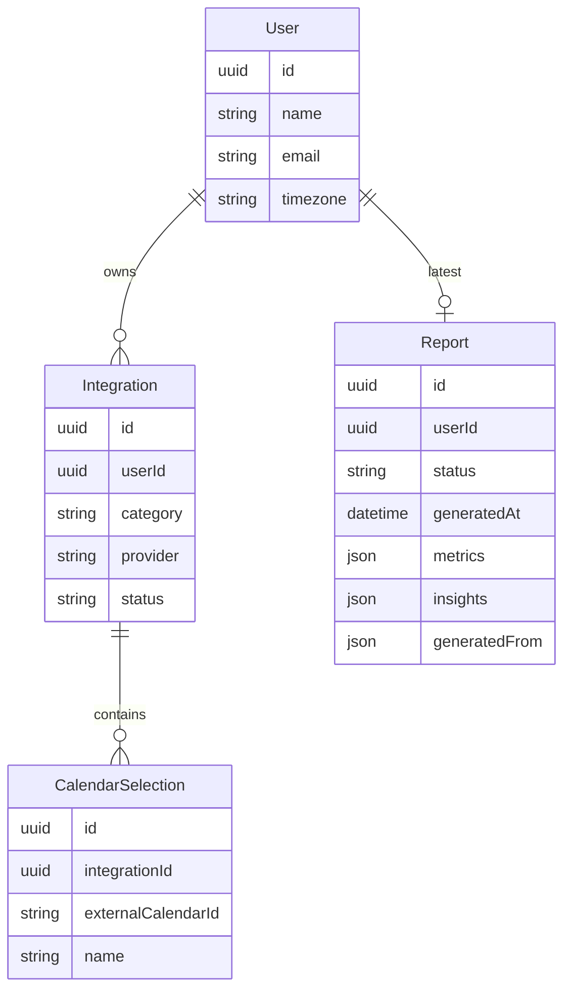
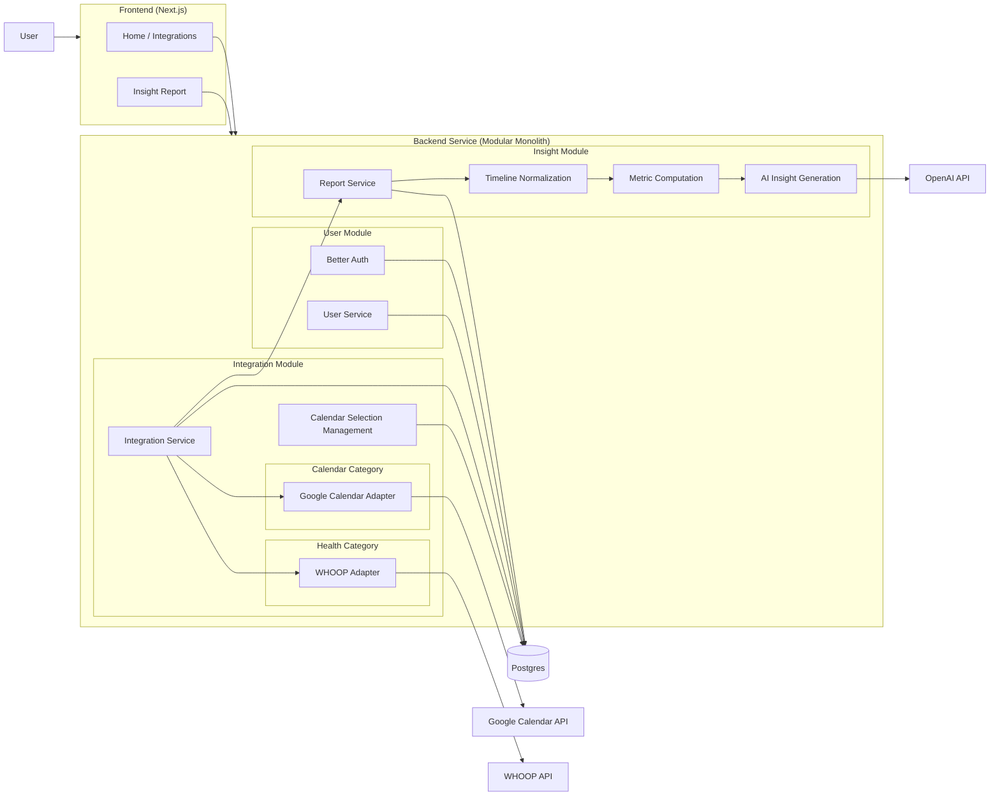

# My Subscriptions

## Setup steps (incl. .env.example)

### Google OAuth — one client for both sign-in and Calendar

Sign-in (Better Auth social login) and the Calendar integration share **a single
Google OAuth client**. In a Google Cloud project:

1. Enable the **Google Calendar API**.
2. Create one **OAuth client** (type: Web application).
3. Add **both** Authorized redirect URIs to that client:
   - `http://localhost:3000/api/auth/callback/google` — sign-in (Better Auth)
   - `http://localhost:3000/api/integrations/google-calendar/callback` — Calendar
   (add the production URLs too when deploying)
4. On the **OAuth consent screen**, add yourself as a **test user**. The Calendar
   integration requests `calendar.readonly` (a sensitive scope), so until the app is
   verified Google shows an "unverified app" warning to non-test users. Test users
   bypass it (up to 100). Scopes are requested per flow — `openid email profile` at
   sign-in, `calendar.readonly` + offline access for Calendar — not configured on the
   client, so the one client serves both.

```sh
# .env.example
# One Google OAuth client, used by both Better Auth sign-in and the Calendar integration
GOOGLE_CLIENT_ID=
GOOGLE_CLIENT_SECRET=

# WHOOP integration
WHOOP_CLIENT_ID=
WHOOP_CLIENT_SECRET=
```

## High-level architecture & design

### Core Entities

Entities split by **what owns the truth**. Two are the system of record; the rest are
**derived data** — pure functions of the source services plus our normalization rules,
so they are a cache we regenerate, never a record we patch.

| Entity | Treatment | Why |
|---|---|---|
| **User** | Persisted — source of record | The single connected identity, **created by Better Auth at sign-in** (Google social login) — there is no app-owned create-user route. Authoritative; can't be recomputed. Holds the canonical IANA `timezone` — captured from the browser at sign-in (`Intl`), Google primary-calendar zone as fallback — the single spine for day-bucketing and the rolling-window math (report generation runs server-side with no browser, so this must be persisted). |
| **Integration** | Persisted — source of record | One linked service, modeled by **category** (`calendar` \| `health`) + provider id, holding OAuth tokens, refresh expiry, and the sync cursor. A category-tagged row, not a provider registry. |
| **CalendarSelection** | Persisted — source of record | One **owned** calendar the user has included (primary pre-selected). **Presence = included** — we persist only the user's choice, never a mirror of every calendar; the available list is fetched live from the provider, so there is no `selected` flag. `name` is a cached label for display. Belongs to a calendar Integration. |
| **Report** | Persisted — derived snapshot | The output of one generation run: the fused daily timeline + computed metrics/correlations that back its charts, plus the AI Insights. Carries a `status` (`pending` \| `ready` \| `error`) and a `generatedFrom` fingerprint (sources + window + `generatedAt`). **Latest-only for the MVP; regenerated wholesale, never patched.** |

Computed during a run, never stored. A generation run is a pipeline — fetch from the providers, reduce to metrics, hand those to the AI — and its intermediate values live only in
memory. None are database tables: the raw events and cycles pulled from Google and WHOOP; the evidence packet, the deterministic metrics derived from them and the only thing the AI
sees (never the raw data); and the draft insights while the AI is still producing them. We don't persist these — the providers are the record for the raw facts, so every run just
re-fetches and re-derives them. Only the finished Report is saved.



### APIs

Sign-in and OAuth login are Better Auth's `/api/auth/*` handler; the user's timezone
is captured at sign-in by a server action, not a REST route. The app's own surface:

```
GET    /api/integrations                              # connected services + status (drives tiers UI)

POST   /api/integrations/google-calendar/connect      # begin OAuth
GET    /api/integrations/google-calendar/callback

POST   /api/integrations/whoop/connect
GET    /api/integrations/whoop/callback

GET    /api/calendars                                 # owned calendars, for selection
PUT    /api/calendars                                 # change selection → triggers regeneration

GET    /api/report                                    # report + status; regenerates if missing / stale / errored
```

Generation is never user-initiated, and runs synchronously.
It is triggered automatically: when an integration changes (connect, calendar
selection), and when `GET /api/report` detects a missing, drifted, or errored report.
There is no manual generation endpoint by design.

### High Level Designs



## Brief on your AI implementation


## Any limitations or next steps


## (Optional) Screenshots or a short demo video