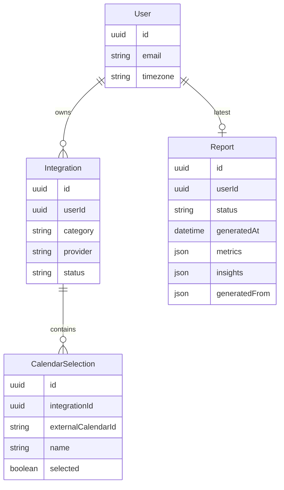

# My Subscriptions

## Setup steps (incl. .env.example)

## High-level architecture & design

### Core Entities

Entities split by **what owns the truth**. Two are the system of record; the rest are
**derived data** — pure functions of the source services plus our normalization rules,
so they are a cache we regenerate, never a record we patch.

| Entity | Treatment | Why |
|---|---|---|
| **User** | Persisted — source of record | The single connected identity (Better Auth). Authoritative; can't be recomputed. Holds the canonical IANA `timezone` — captured from the browser at sign-in (`Intl`), Google primary-calendar zone as fallback — the single spine for day-bucketing and the rolling-window math (the background job has no browser, so this must be persisted). |
| **Integration** | Persisted — source of record | One linked service, modeled by **category** (`calendar` \| `health`) + provider id, holding OAuth tokens, refresh expiry, and the sync cursor. A category-tagged row, not a provider registry. |
| **CalendarSelection** | Persisted — source of record | Which **owned** calendars are included (primary pre-selected). Belongs to a calendar Integration. |
| **Report** | Persisted — derived snapshot | The output of one generation run: the fused daily timeline + computed metrics/correlations that back its charts, plus the AI Insights. Carries a `status` (`pending` \| `ready` \| `error`) and a `generatedFrom` fingerprint (sources + window + `generatedAt`). **Latest-only for the MVP; regenerated wholesale, never patched.** |

Computed during a run, never stored. A generation run is a pipeline — fetch from the providers, reduce to metrics, hand those to the AI — and its intermediate values live only in
memory. None are database tables: the raw events and cycles pulled from Google and WHOOP; the evidence packet, the deterministic metrics derived from them and the only thing the AI
sees (never the raw data); and the draft insights while the AI is still producing them. We don't persist these — the providers are the record for the raw facts, so every run just
re-fetches and re-derives them. Only the finished Report is saved.

## Brief on your AI implementation

## Any limitations or next steps

## (Optional) Screenshots or a short demo video