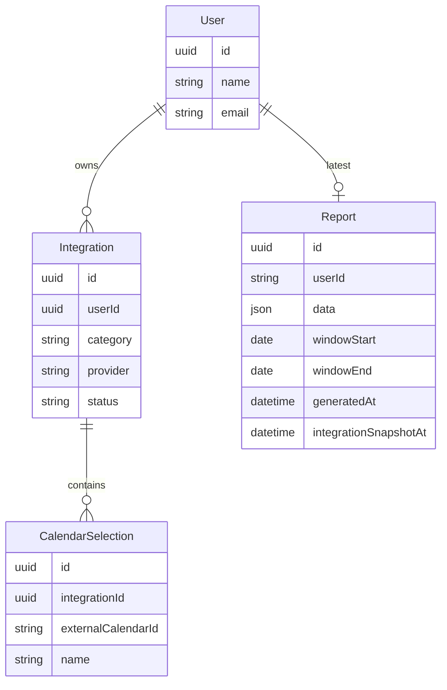
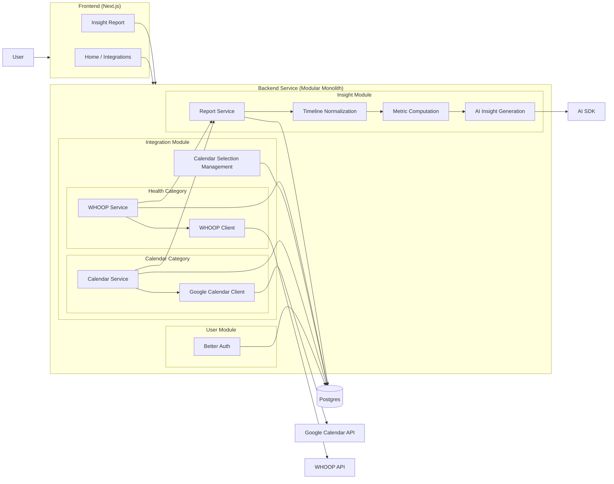

# My Subscriptions

MySubscriptions connects a user's online services, normalizes their activity into a common timeline, and uses AI to surface insights.

## Setup steps

### Google OAuth — one client for both sign-in and Calendar

Sign-in (Better Auth social login) and the Calendar integration share **a single
Google OAuth client**. In a Google Cloud project:

1. Enable the **Google Calendar API**.
2. Create one **OAuth client** (type: Web application).
3. Add **both** Authorized redirect URIs to that client:
   - `http://localhost:3000/api/auth/callback/google` — sign-in (Better Auth)
   - `http://localhost:3000/api/integrations/google-calendar/callback` — Calendar
   (add the production URLs too when deploying)
4. On the **OAuth consent screen**, add yourself as a **test user**. The Calendar
   integration requests `calendar.readonly` (a sensitive scope), so until the app is
   verified Google shows an "unverified app" warning to non-test users. Test users
   bypass it (up to 100). Scopes are requested per flow — `openid email profile` at
   sign-in, `calendar.readonly` + offline access for Calendar — not configured on the
   client, so the one client serves both.

Reference: [Google OAuth overview](https://developers.google.com/workspace/guides/auth-overview)

### WHOOP

Register a developer app at [developer.whoop.com](https://developer.whoop.com/docs/developing/overview),
set the redirect URI to `http://localhost:3000/api/integrations/whoop/callback`, and
copy the client credentials into `.env.local`.

```sh
# .env.example
# One Google OAuth client, used by both Better Auth sign-in and the Calendar integration
GOOGLE_CLIENT_ID=
GOOGLE_CLIENT_SECRET=

# WHOOP integration
WHOOP_CLIENT_ID=
WHOOP_CLIENT_SECRET=
```

### Local Development

#### Prerequisites
- [Node.js](https://nodejs.org/en/download) installed
- [Docker Desktop](https://www.docker.com/products/docker-desktop) running
- [Supabase CLI](https://supabase.com/docs/guides/cli/getting-started) installed

```bash
node --version       # confirm install
supabase --version   # confirm install
docker info          # confirm Docker is running
```

#### First-time setup

```bash
supabase init        # creates supabase/ config folder — commit this
supabase start       # pulls images (~1.5 GB), starts full local stack
```

`supabase start` prints your local keys — paste the `publishable key` and
`secret key` into `.env.local`. The URLs and DB credentials are
already pre-filled with the correct local defaults.

#### Apply schema

```bash
npm install
npm run db:migrate      # applies migrations to the local Supabase instance
```

#### Start the app

```bash
npm run dev             # → http://localhost:3000
```

## High-level architecture & design

### Core Entities

Entities split by **what owns the truth**. Two are the system of record; the rest are
**derived data** — pure functions of the source services plus our normalization rules,
so they are a cache we regenerate, never a record we patch.

| Entity | Treatment | Why |
|---|---|---|
| **User** | Persisted — source of record | The single connected identity, **created by Better Auth at sign-in** (Google social login) — there is no app-owned create-user route. Authoritative; can't be recomputed. |
| **Integration** | Persisted — source of record | One linked service, modeled by **category** (`calendar` \| `health`) + provider id, holding OAuth tokens and refresh expiry. A category-tagged row, not a provider registry. |
| **CalendarSelection** | Persisted — source of record | One **owned** calendar the user has included (primary pre-selected). **Presence = included** — we persist only the user's choice, never a mirror of every calendar; the available list is fetched live from the provider, so there is no `selected` flag. `name` is a cached label for display. Belongs to a calendar Integration. |
| **Report** | Persisted — derived snapshot | The output of one generation run: the fused daily timeline + computed metrics/correlations that back its charts, plus the AI Insights. Stored as a single `data` JSON blob alongside `windowStart`/`windowEnd` and an `integrationSnapshotAt` timestamp — the fingerprint used to detect staleness at read time. **Latest-only for the MVP; regenerated wholesale, never patched.** |

Computed during a run, never stored. A generation run is a pipeline — fetch from the providers, reduce to metrics, hand those to the AI — and its intermediate values live only in
memory. None are database tables: the raw events and cycles pulled from Google and WHOOP; the evidence packet, the deterministic metrics derived from them and the only thing the AI
sees (never the raw data); and the draft insights while the AI is still producing them. We don't persist these — the providers are the record for the raw facts, so every run just
re-fetches and re-derives them. Only the finished Report is saved.



### APIs

Sign-in is handled by Better Auth's `/api/auth/*` handler. Integration status and
the calendar list are read directly in Server Components — no REST route needed.
The app's own REST surface:

```
GET    /api/integrations/google-calendar/connect      # begin OAuth (redirects to Google)
GET    /api/integrations/google-calendar/callback

POST   /api/integrations/google-calendar/selections   # update calendar selection → triggers regeneration

GET    /api/integrations/whoop/connect                # begin OAuth (redirects to WHOOP)
GET    /api/integrations/whoop/callback

GET    /api/report                                    # report + status; regenerates if missing / stale / errored
```

Generation is never user-initiated, and runs synchronously.
It is triggered automatically: when an integration changes (connect, calendar
selection), and when `GET /api/report` detects a missing, drifted, or errored report.
There is no manual generation endpoint by design.

### High Level Designs



## Brief on your AI implementation

AI is the final step in a deterministic pipeline — it interprets, it does not
calculate. The pipeline runs synchronously on every report generation:

```
fetch providers → normalize → DaySummary[] → compute metrics → evidence packet → AI → validate → store
```

The model receives a compact **evidence packet**: pre-computed metrics (activity
allocation, recovery averages, activity↔recovery deltas with sample size `n` and
a confidence signal), a handful of named exemplar days (best/worst), and candidate
signals the deterministic layer already identified. It never sees raw events or
health cycles.

Five techniques push the AI toward honest interpretation under the inherent
small-sample uncertainty (~30 days, n ≈ 26):

1. **Competing hypotheses** — for each notable delta, generate 2–3 candidate
   explanations including at least one confound or reverse-causation account.
2. **Skeptical self-critique** — inline critic pass: each claim must survive "is
   this distinguishable from noise at this n?" Claims that don't are downgraded or cut.
3. **Recommendation** — practical recommendation
4. **License to find nothing** — the prompt explicitly permits the conclusion
   "nothing here is distinguishable from noise yet," rewarding restraint over
   manufactured insight.
5. **Calibrated confidence** — each finding carries a confidence level
   (`high` / `medium` / `low`) and a "what would change my mind" line.

AI output is validated against a narrow Zod sub-schema before being merged with
the deterministic fields and persisted — it never becomes the system of record
without passing that gate.

## Any limitations or next steps

**Current limitations:**

- **UTC timezone only.** Day bucketing uses UTC throughout. A user whose midnight
  falls far from UTC will occasionally see a cycle or event on the "wrong" calendar
  date. Low impact at 30-day granularity but not correct.
- **Synchronous pipeline.** Retrieve + normalize + AI runs in one request. Fine for
  an MVP; latency could exceed Vercel's function timeout with slow provider
  responses or large data windows — not yet measured.
- **Rule-based categorization.** Calendar events are categorized by keyword
  matching on the title. Miscategorization is common and there is no user
  correction mechanism.
- **Small sample by design.** The 30-day rolling window means `n` is genuinely
  small (~26 usable days). The AI is instructed to reason honestly about this, but
  findings will often be low confidence.
- **No report history.** One visible report per user; the `reports` table grows
  one row per generation (latest is always read). No versioning, no trend across reports.
- **Concurrent tab generation.** If two browser tabs open simultaneously on a day when
  the report needs regenerating, both trigger independent AI calls. The second call's
  result just becomes the next "latest" row. Impact: wasted AI compute; users see
  identical reports. A `BroadcastChannel` lock would fix this but isn't implemented.
- **Google OAuth unverified.** Until the app passes Google's OAuth verification,
  non-test users see an "unverified app" warning and refresh tokens expire after
  7 days.

**Logical next steps (roughly ordered):**

- Per-user timezone (store IANA zone at sign-in, use for all date bucketing)
- User-correctable event categorization
- Report history and week-over-week trend view
- Async pipeline with a loading/polling pattern to remove the timeout risk
- Additional providers (Strava, Oura, GitHub, Spotify)
- Google OAuth app verification to remove the 7-day re-consent loop for real users


## (Optional) Screenshots or a short demo video


## Future Enhancements

- **~1 day:**
    - basic app functionality (e.g. log out, better navigation)
    - improved calendar categorization
    - weekly reports or selectable time ranges (e.g. last 7/14/30/60 days)
    - prevent concurrent tab report generation
- **~5 days:**
    - async report pipeline
    - insight history
    - multi-calendar selection across multiple Google accounts
- **~20 days:**
    - trend analysis (e.g. last 30 days vs previous 30 days)
    - correlation visualizations
    - productionize OAuth apps (Google verification, WHOOP developer review)
    - consider additional integrations of existing categories (e.g. health: Strava)
    - consider additional integration categories (e.g. time tracker: Toggl)
    - consider additional sign in providers