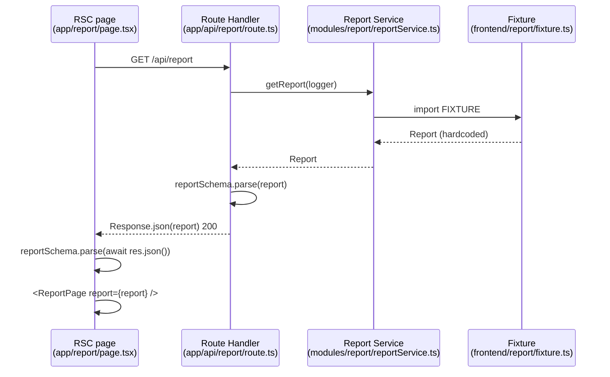

# feat: S3 — Report API seam

## Summary

Establishes the API seam between the report frontend and backend by replacing the
direct fixture import in the report route with a `GET /api/report` handler backed by
a thin service module. The backend still returns the hardcoded fixture; the service
layer is the placeholder that S5–S8 will fill with real data. The `Report` Zod
schema (authored in S2) is validated at the route boundary, locking the contract for
all subsequent slices.

**Demo milestone (S3):** report served over the API, contract locked.

---

## Problem Frame

S2 delivered the report UI against a fixture imported directly into the page route.
This works for the frontend demo but leaves no backend boundary — there is no layer
that S4 auth, S5–S7 real data, and S8 AI can slot behind without reshaping the UI.

S3 draws that line. The route handler is the seam: fixture out, service call in, Zod
validates the response. Once this lands, every subsequent slice replaces one layer
behind this boundary, never the boundary itself.

---

## Requirements

Drawn from S3 in the build sequence plan (see origin):

- R1: `GET /api/report` exists, returns fixture JSON with `Content-Type: application/json`.
- R2: The response body is validated against `reportSchema` at the route boundary before returning.
- R3: A report service in `modules/report/` exposes `getReport(logger)` with `Logger` injected explicitly; it returns the S2 fixture.
- R4: `app/report/page.tsx` fetches from the route handler instead of importing the fixture directly.
- R5: `Logger` is imported from `infrastructure/logger` at the edge (route); the service never constructs its own infra.
- R6: Tenancy cross-slice decision (scope every query by `user_id`) is confirmed N/A for S3 — no DB access, no migration.

---

## Key Technical Decisions

**KTD1 — Route Handler as the seam.**
`GET /api/report` at `app/api/report/route.ts` is the explicit contract surface —
curl-testable and the shape that S4 auth middleware will wrap. The RSC page uses
`fetch` to call it rather than importing the service directly. Internal RSC-to-route
fetch in Next.js 16 may support relative URLs (`fetch('/api/report')`) without a
base-URL helper — the implementer must verify this first. If relative URLs are not
supported in server-side fetch, author `getInternalBaseUrl()` in `shared/` that
returns `https://${process.env.VERCEL_URL}` in production (Vercel sets this
automatically) and `http://localhost:3000` in development. Do not add a new
`SITE_URL` env var to `shared/env.ts` until the need is confirmed. See
`node_modules/next/dist/docs/01-app/01-getting-started/15-route-handlers.md` and
`06-fetching-data.md` before implementing.

**KTD2 — Zod output validation at the route boundary.**
The codebase validates inbound data at system boundaries (invariant #2). S3 extends
this to the outbound response: `reportSchema.parse(report)` runs inside the handler
before `Response.json(report)` is called. A schema violation here is a programming
error (a future service implementation broke the contract), not a user-input error —
use `.parse()` not `.safeParse()` and let the error propagate to the `try/catch` that
returns a 500. This catches S5–S8 contract violations at the seam instead of
surfacing them as UI rendering errors.

**KTD3 — No cache configuration needed.**
`next.config.ts` does not enable `cacheComponents`. Under this caching model, GET
Route Handlers are not cached by default. No `dynamic` export or cache headers are
needed in S3. When S4 adds per-user auth, caching would be wrong regardless — no
cache is the correct default for this route.

**KTD4 — Minimal error handling; defer structured error classes.**
`code-standards.md` mandates `throw new ValidationError(...)` but that class does
not yet exist in the codebase. S3's fixture cannot fail at runtime, so the only
error path is a Zod schema violation — a dev-time programming error. Use a bare
`try/catch` in the route handler that returns a 500 JSON response. Introduce
`shared/errors.ts` with `ValidationError` in S4 when real failure modes (auth
failures, provider errors) arrive.

**KTD5 — Tenancy deferred to S4.**
The build sequence plan flags "Tenancy — decide at Slice 3, before the first
migration." S3 has no DB access and no migration. This decision is confirmed N/A for
S3 and carried to S4, which owns the first migration and must scope every query by
`user_id` from that point forward.

---

## High-Level Technical Design

Data flow from RSC page through the route handler to the service and back:

The double parse (once in the route, once in the page) ensures the contract is
enforced at both ends of the wire boundary. In S3 both calls succeed trivially
(the fixture is already schema-valid); they become load-bearing when S5–S8 replace
the service implementation.

---

## Implementation Units

### U1. Report service module

**Goal:** Establish `modules/report/` with a `getReport` service that takes an
explicit `Logger` dependency and returns the S2 fixture.

**Requirements:** R3, R5

**Dependencies:** S2 must be complete — `frontend/report/fixture.ts`,
`shared/schemas/report.ts`, and `shared/types/report.ts` must exist. No
inter-unit dependencies within S3.

**Files:**
- `modules/report/reportService.ts` — service function
- `modules/index.ts` — add re-export for the report module's public surface
- `__tests__/reportService.test.ts` — unit tests

**Approach:** Signature: `getReport(logger: Logger): Promise<Report>`. Imports
`FIXTURE` from `@/frontend/report/fixture` and returns it. The function is `async`
even though the stub body is synchronous — later service implementations will be
async (real data retrieval), and making it sync now forces a signature change later.
A `logger.info('getReport called')` call proves injection works and gives S5–S8 a
place to add observability without touching tests. Update `modules/index.ts` to
re-export `getReport` so the route imports from `@/modules`, not an internal module
path — this keeps the module boundary explicit.

**Patterns to follow:** `context/examples.md` — service takes dependencies as
explicit parameters. `infrastructure/logger.ts` — singleton pattern for the concrete
instance the route will pass in. `shared/env.ts` — Zod schema-first, types derived
via `z.infer` (mirrors the contract approach used here).

**Test scenarios:**
- Happy path: `getReport({ info: () => {}, warn: () => {}, error: () => {} })`
  resolves to a value where `reportSchema.parse(result)` succeeds without throwing.
- Contract spot-checks: `result.findings.length > 0`,
  `result.daySummaries.length === result.coverageDays`, and
  `result.findings[0].alternativeExplanation` is a non-empty string.
- Logger injection: the stub logger's `info` method is called exactly once during
  `getReport` (use a counter or `vi.fn()` to assert).
- `npm run typecheck` exits 0 with the service's return type annotated as
  `Promise<Report>` (imported from `@/shared/types/report`).

**Verification:** `npm run typecheck` exits 0. Test scenarios pass. `import { getReport } from '@/modules'` resolves correctly in TypeScript.

---

### U2. GET /api/report route handler

**Goal:** A thin handler that imports the concrete logger, calls the service,
validates the response, and returns JSON. This is the API seam.

**Requirements:** R1, R2, R5

**Dependencies:** U1 (service), S2 (`shared/schemas/report.ts` must exist)

**Files:**
- `app/api/report/route.ts` — route handler

**Approach:** Export `async function GET()` with no request parameter — no query
params are needed in S3. Import `logger` from `@/infrastructure/logger` (the concrete
singleton). Import `getReport` from `@/modules`. Import `reportSchema` from
`@/shared/schemas/report` (the Zod schema object, not the inferred type — it's
needed for `.parse()`). Call order: `getReport(logger)` → `reportSchema.parse(report)`
→ `Response.json(report)`.

Wrap the body in `try/catch`. On any thrown error (Zod parse failure or future
service error), return `Response.json({ error: 'Internal error' }, { status: 500 })`.
In S3 this branch is unreachable but must be present as the foundation S4–S8 build on.

Use the Web API `Response.json()` — not `NextResponse.json()` from `next/server`.
The installed Next.js 16 Route Handler docs confirm `Response.json()` as the
documented API.

**Patterns to follow:** `context/examples.md` — route handler shape (thin: validate
/ call service / return). `node_modules/next/dist/docs/01-app/01-getting-started/15-route-handlers.md` — canonical handler form for this Next.js version.

**Test scenarios:**
- `GET /api/report` returns HTTP 200 (smoke: route exists and does not crash).
- Response `Content-Type` header contains `application/json`.
- Response body is valid JSON and `reportSchema.parse(JSON.parse(body))` succeeds
  without throwing.
- Route file contains no business logic beyond service call + schema validation
  (verifiable via code review).

Route-level integration tests require a running Next.js server — out of scope for
Vitest unit tests. Service is tested in U1; the route's thinness makes those tests
sufficient for behavioral correctness. The demo milestone verification
(`curl http://localhost:3000/api/report`) is the primary validation for this unit.

**Verification:** `npm run typecheck` exits 0. `npm run dev` → `curl http://localhost:3000/api/report` returns a 200 with JSON that `reportSchema.parse()` accepts.

---

### U3. Report page — replace fixture import with API fetch

**Goal:** `app/report/page.tsx` fetches its data from `GET /api/report` instead of
importing the fixture directly. The direct `FIXTURE` import is removed.

**Requirements:** R4

**Dependencies:** U2 (route handler must be live)

**Files:**
- `app/report/page.tsx` — remove fixture import; add `fetch` call and response parse
- `shared/` — add `getInternalBaseUrl()` only if relative URL fetch is confirmed
  unsupported in Next.js 16 RSC (implementer determines during execution)

**Approach:** The RSC page is `async`. Attempt `fetch('/api/report')` first; verify
in `npm run dev` that Next.js 16 resolves this relative URL for a server-side fetch.
If it does not, author `getInternalBaseUrl()` in `shared/` returning
`https://${process.env.VERCEL_URL}` in production or `http://localhost:3000` in
development, and use that to construct the full URL. After the fetch, validate with
`reportSchema.parse(await res.json())` — a Zod error here is a programming error
(service violated the contract) and should surface as an uncaught exception for
Next.js's error boundary to catch rather than being swallowed. Pass the validated
`Report` prop to `<ReportPage report={report} />` unchanged. Remove the
`import { FIXTURE } from '@/frontend/report/fixture'` line — after S3, the fixture
is accessed only through the service.

Read `node_modules/next/dist/docs/01-app/01-getting-started/06-fetching-data.md`
for the RSC data-fetching pattern to follow for this Next.js version.

**Patterns to follow:** RSC data-fetching pattern from the installed Next.js 16 docs.
The page component structure from S2's U3 (`ReportPage` receives a `Report` prop)
is unchanged — only the source of that prop changes.

**Test scenarios:**
- `GET /report` returns HTTP 200 (smoke: page renders without crashing after the
  fixture import is removed).
- The report page renders the same three sections — Summary, Analysis, Insights —
  with fixture data (visual verification: same content as S2).
- No `FIXTURE` import remains anywhere in `app/report/page.tsx`.
- `npm run typecheck` exits 0.

**Verification:** `npm run dev` → browser opens `http://localhost:3000/report`; all
three sections render with fixture data; no console errors or hydration warnings;
no direct `FIXTURE` import in `app/report/page.tsx`.

---

## Scope Boundaries

### In scope
- `modules/report/reportService.ts` with `getReport(logger)` returning the S2 fixture
- `app/api/report/route.ts` — GET route handler with Zod output validation
- `app/report/page.tsx` — fetches from route handler instead of importing fixture
- `modules/index.ts` — barrel update for the report service export
- `shared/getInternalBaseUrl` — only if relative URL fetch is unsupported (implementer confirms)

### Out of scope
- Auth / session gating — S4
- Real data from Calendar or WHOOP — S5–S7
- Per-user report differentiation — S4 and beyond
- `ValidationError` class — S4, when real failure modes exist
- Loading state / Suspense for the report fetch — S9 handles generation loading states
- Playwright e2e tests — no auth flow until S4

### Deferred to follow-up work
- Structured error classes (`shared/errors.ts`, `ValidationError`) — S4
- Tenancy enforcement at the repository layer — S4 (first migration, confirmed N/A here per KTD5)
- Response caching / revalidation strategy — revisit when S7 makes responses expensive to compute

---

## Risks & Dependencies

**Hard dependency on S2.** `shared/schemas/report.ts`, `shared/types/report.ts`, and
`frontend/report/fixture.ts` must exist before S3 can begin. Do not start S3 until
S2 is complete and `npm run typecheck` passes cleanly.

**RSC-to-route-handler fetch URL.** Next.js 16 relative URL resolution for
server-side `fetch` is unverified in this repo (first Route Handler). If
`fetch('/api/report')` does not resolve, the fix is a small `getInternalBaseUrl()`
utility — the implementer should test this explicitly rather than assuming.

**Contract lock.** Once S3 lands, `shared/schemas/report.ts` is a locked API
contract. Any change to it is a breaking change that propagates through S4–S8.
Treat post-S3 schema changes with the same discipline as a public API change.

**Next.js 16 specifics.** This is the first Route Handler in the codebase. Read
`node_modules/next/dist/docs/01-app/01-getting-started/15-route-handlers.md` before
writing any handler code — the installed version is 16.2.9, not 15.
