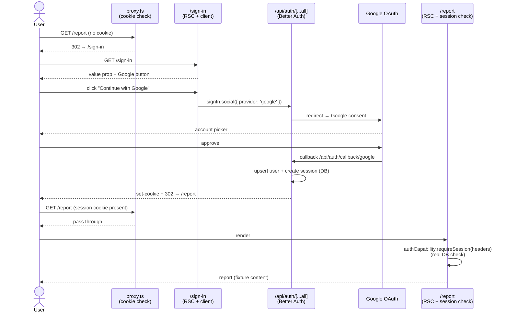

# feat: S4 — Auth foundation (Supabase + Better Auth + Google social login)

## Summary

Wires the full auth stack for MySubscriptions: Supabase Postgres as the data store,
Drizzle ORM for schema management, Better Auth as the auth provider behind a
capability interface, and Google social login as the sole sign-in method (identity
only — no Calendar data connection). Every route except `/sign-in` is protected by
a `proxy.ts` that performs a fast cookie-presence check for UX redirects; route
handlers and RSC pages add a real DB-verified session check for security. The first
migration lands the Better Auth schema tables (`user`, `session`, `account`,
`verification`), establishing `user.id` as the tenancy anchor all future domain
tables will FK to.

**Demo milestone (S4):** sign in with Google → see the (still-fixture) report.

---

## Problem Frame

S3 delivers the report served from an API seam, but any URL is accessible without
authentication. S4 draws the identity boundary: only a user with an active session
can reach `/report`; everyone else is redirected to `/sign-in`.

This slice also resolves the build-sequence plan's "tenancy — decide at Slice 3,
before the first migration" cross-slice decision: every future domain table will
scope queries by `user_id` at the repository layer, never trusting the caller. S4
establishes the migration and the pattern; S5–S9 enforce it by following the
established FK convention.

---

## Requirements

- **R1** — `shared/env.ts` validates `DATABASE_URL`, `DATABASE_URL_DIRECT`, `BETTER_AUTH_SECRET`, `BETTER_AUTH_URL`, `GOOGLE_CLIENT_ID`, and `GOOGLE_CLIENT_SECRET` using the existing Zod schema pattern.
- **R2** — `infrastructure/db/client.ts` exports a Drizzle Postgres client using `DATABASE_URL`.
- **R3** — Better Auth's generated tables (`user`, `session`, `account`, `verification`) are applied to the local Supabase DB in a single Drizzle migration.
- **R4** — `shared/capabilities/auth.ts` defines `AuthCapability` (server-side: `getSession`, `requireSession`, `signOut`) and the `AuthSession`/`AuthUser` types.
- **R5** — `infrastructure/auth.ts` exports `auth` (Better Auth instance, used only in edge-of-system files) and `authCapability` (satisfies `AuthCapability`, used in all other server-side code).
- **R6** — `app/api/auth/[...all]/route.ts` mounts the Better Auth catch-all handler.
- **R7** — `frontend/auth/auth-client.ts` exports the browser-facing Better Auth client for use in client components.
- **R8** — `app/sign-in/page.tsx` renders the Google-only sign-in UI matching the wireframe: value proposition, "Continue with Google" button (white background per Google brand guidelines), and Terms/Privacy link. No email/password fields.
- **R9** — `proxy.ts` protects all routes except `/sign-in` and `/api/*`; unauthenticated requests redirect to `/sign-in`; authenticated users visiting `/sign-in` redirect to `/report`.
- **R10** — `app/report/page.tsx` (from S3) and `app/api/report/route.ts` (from S3) both add a real `authCapability.requireSession()` / `authCapability.getSession()` check as a second defense layer.
- **R11** — Tenancy decision recorded: `user.id` from Better Auth's `user` table is the FK anchor for all future domain tables. No domain tables are created in S4.
- **R12** — Post-sign-in, the user lands on `/report` (fixture content). The "Connect your first service" welcome state is deferred to S5.

---

## Key Technical Decisions

**KTD1 — `infrastructure/auth.ts` as the Better Auth home.**
Better Auth's docs suggest `@/lib/auth`, but this project uses `infrastructure/` for
all vendor implementations (see architecture-context.md — "infrastructure provides
the implementation"). `infrastructure/auth.ts` creates the `auth` instance and wraps
it in `authCapability`. Edge-of-system files (`app/api/auth/[...all]/route.ts`,
`proxy.ts`) are permitted to import vendor types directly — they are the wiring
layer, not feature code.

**KTD2 — AuthCapability surface: `getSession`, `requireSession`, `signOut`.**
User-specified: wider surface following Better Auth's own server-side API. Three
methods map directly:
- `getSession(headers)` → `auth.api.getSession()` — returns `AuthSession | null`
- `requireSession(headers)` → wraps `getSession`, calls `redirect('/sign-in')` if null
- `signOut(headers)` → `auth.api.signOut()`

This surface is intentionally thin — it covers S4's needs and S5–S9's likely needs
without speculating. Extend only when a concrete consumer requires it.

**KTD3 — Dual-layer session gating: proxy (optimistic, unauthenticated redirect only) + route/page (real).**
The `proxy.ts` performs one job: redirect unauthenticated requests (no session cookie)
away from protected routes to `/sign-in`. It does NOT redirect authenticated cookie
holders away from `/sign-in` — that redirect belongs to the real session check in
`app/sign-in/page.tsx`. This separation matters because a cookie can be present but
the DB session can be invalid (expired, DB reset during dev — guaranteed by the
7-day Google Testing-mode expiry noted in Risks). If the proxy also redirected
`cookie + /sign-in → /report`, it would trap stale-cookie users in an infinite loop:
`/report → requireSession null → /sign-in → proxy sees cookie → /report → …`.

The correct two layers:
1. **Proxy:** `!cookie && !publicRoute → /sign-in` (no DB call — optimistic).
2. **Sign-in RSC page:** `real getSession()` — if valid session, `redirect('/report')`; if null (stale cookie or no cookie), render the sign-in UI.
3. **Report RSC + API route:** `requireSession()` / `getSession()` — authoritative DB check before any data access.

**KTD4 — `proxy.ts` at root; Node.js runtime; matcher excludes `/api/*` and static files.**
In Next.js 16, `middleware.ts` is renamed `proxy.ts` and the exported function to
`proxy`. The runtime is always Node.js (not configurable, not edge) — an advantage
for Better Auth which requires Node.js APIs. The matcher
`/((?!api|_next/static|_next/image|favicon\\.ico|sitemap\\.xml|robots\\.txt|.*\\.png$).*)` excludes
all `/api/*` paths (Better Auth routes + future API routes), Next.js build assets,
and common public static files. `favicon.ico` must be excluded explicitly — it is
served directly by Next.js and does not match the `_next/static` prefix, so without
this exclusion the proxy redirects unauthenticated favicon requests to `/sign-in`,
breaking the browser tab icon on every unauthenticated page load.

**KTD5 — Better Auth schema tables ARE the first migration; no separate domain `users` table.**
Better Auth generates `user`, `session`, `account`, `verification`. The `user.id`
field is the tenancy anchor. From S5, every domain table (reports, integrations)
carries a `user_id` column FK-ing to `user.id`, enforced at the repository layer.
This is the "decide tenancy before the first migration" resolution from the build
sequence plan. S4's migration contains only Better Auth's generated tables.

**KTD6 — `DATABASE_URL_DIRECT` for migrations; `DATABASE_URL` for runtime.**
Supabase's PgBouncer connection pooler blocks DDL. `drizzle.config.ts` uses
`DATABASE_URL_DIRECT` (direct Postgres port) for migration execution.
`infrastructure/db/client.ts` uses `DATABASE_URL` (pooler) for runtime queries.
Both are already populated in `.env.local`.

**KTD7 — Google social login: identity-only scopes in S4; no `access_type=offline`.**
The build sequence plan explicitly separates "sign in with Google" (identity only)
from "connect Google Calendar" (data connection, S5). S4 requests only the default
Google OAuth scopes (`openid`, `email`, `profile`). The `access_type=offline` and
Calendar scopes are added in S5's dedicated Calendar OAuth flow via `linkSocial()`.

**KTD8 — Post-sign-in redirect to `/report`; account-created welcome state deferred.**
The wireframe shows a "Connect your first service" state after account creation. S4
redirects directly to `/report` on successful sign-in. The connection UI arrives in
S5 when the Calendar integration is planned.

**KTD9 — `nextCookies()` plugin required; listed last in plugins array.**
Better Auth's `nextCookies` plugin (from `better-auth/next-js`) ensures session
cookies are set correctly in the Next.js server context. It must be the last entry
in the `plugins` array. Omitting it causes silent cookie failures in Server Actions.

---

## High-Level Technical Design

### Auth flow



### Auth capability layering

```mermaid
graph LR
    BA["better-auth<br/>(vendor package)"]

    subgraph infrastructure
        IA["infrastructure/auth.ts<br/>auth instance + authCapability wrapper"]
        DB["infrastructure/db/client.ts<br/>Drizzle db"]
    end

    subgraph shared
        SC["shared/capabilities/auth.ts<br/>AuthCapability interface"]
    end

    subgraph edge["Edge-of-system (wiring layer — vendor import OK)"]
        CR["app/api/auth/[...all]/route.ts"]
        PX["proxy.ts"]
        AC["frontend/auth/auth-client.ts"]
    end

    subgraph app["app/ routes & RSC pages"]
        RP["app/report/page.tsx"]
        RR["app/api/report/route.ts"]
    end

    BA -->|betterAuth()| IA
    BA -->|toNextJsHandler| CR
    BA -->|getSessionCookie| PX
    BA -->|createAuthClient| AC
    DB --> IA
    IA -->|satisfies| SC
    SC -->|authCapability| RP
    SC -->|authCapability| RR
```

---

## Output Structure

New files and directories created by S4:

```
infrastructure/
  auth.ts                          # Better Auth instance + authCapability
  db/
    client.ts                      # Drizzle Postgres client
    schema.ts                      # Better Auth generated schema (4 tables)
shared/
  capabilities/
    auth.ts                        # AuthCapability interface + AuthSession/AuthUser types
  env.ts                           # updated — S4 env vars added
frontend/
  auth/
    auth-client.ts                 # Better Auth browser client (createAuthClient)
    SignInPage.tsx                  # Google-only sign-in UI ("use client")
app/
  sign-in/
    page.tsx                       # RSC wrapper for sign-in
  api/
    auth/
      [...all]/
        route.ts                   # Better Auth catch-all handler
drizzle.config.ts                  # Drizzle Kit config (uses DATABASE_URL_DIRECT)
proxy.ts                           # Route protection (Next.js 16 proxy)
```

Modified by S4:
```
infrastructure/index.ts            # re-export authCapability, db
shared/index.ts                    # re-export AuthCapability, AuthSession, AuthUser
app/report/page.tsx                # add requireSession() check (from S3 baseline)
app/api/report/route.ts            # add getSession() check returning 401 (from S3 baseline)
package.json                       # add better-auth, drizzle-orm, drizzle-kit, postgres
```

---

## Implementation Units

### U1. Packages, env vars, and Drizzle config

**Goal:** Install all S4 dependencies and add validated env vars so subsequent units
have their required runtime config.

**Requirements:** R1, R2 (partial — config only)

**Dependencies:** None

**Files:**
- `package.json` — add dependencies
- `shared/env.ts` — add S4 server-side vars to the existing Zod schema
- `drizzle.config.ts` — Drizzle Kit config at project root
- `__tests__/env-s4.test.ts` — env schema tests (pattern from `__tests__/env.test.ts`)

**Approach:**
Install packages:
- `better-auth` — auth library
- `drizzle-orm` and `postgres` — ORM and Postgres driver
- `drizzle-kit` (devDependency) — migration CLI
- `dotenv` (devDependency) — required for `drizzle.config.ts` to load `.env.local` (Drizzle Kit runs as a standalone CLI and does not auto-load `.env.local` the way Next.js does)

Note: confirm whether `drizzleAdapter` is imported from `better-auth/adapters/drizzle`
(v1.x) or requires a separate package by checking the installed Better Auth package at
implementation time.

`drizzle.config.ts` must load `.env.local` before reading `process.env`. Add
`import 'dotenv/config'` (or `config({ path: '.env.local' })`) as the first line —
without this, `process.env.DATABASE_URL_DIRECT` will be `undefined` when running
`npx drizzle-kit generate` or `migrate`, producing a confusing error.

Env vars to add to the **server schema** in `shared/env.ts`:
- `DATABASE_URL: z.string().url()`
- `DATABASE_URL_DIRECT: z.string().url()`
- `BETTER_AUTH_SECRET: z.string().min(32)` — enforce minimum entropy
- `BETTER_AUTH_URL: z.string().url()`
- `GOOGLE_CLIENT_ID: z.string().min(1)`
- `GOOGLE_CLIENT_SECRET: z.string().min(1)`

`drizzle.config.ts` reads `process.env.DATABASE_URL_DIRECT` directly (not via the
`env` module — Drizzle Kit runs as a CLI tool outside Next.js, so `shared/env.ts`
is not available). Use a local `z.string().url().parse(process.env.DATABASE_URL_DIRECT)`
guard at the top of the config file to fail fast on misconfiguration.

`drizzle.config.ts` must point `schema` at `infrastructure/db/schema.ts` and `out`
at `infrastructure/db/migrations/`.

**Patterns to follow:** `shared/env.ts` — existing Zod schema pattern; `__tests__/env.test.ts` — replicate the schema locally in tests to avoid import-time side effects.

**Test scenarios:**
- Schema rejects `DATABASE_URL` when absent → `ZodError` naming `DATABASE_URL` in issues
- Schema rejects `BETTER_AUTH_SECRET` shorter than 32 chars → `ZodError`
- Schema rejects `BETTER_AUTH_URL` that is not a valid URL → `ZodError`
- Schema rejects `GOOGLE_CLIENT_ID` as empty string → `ZodError`
- Schema accepts a valid set of all S4 env vars → no throw

**Verification:** `npm run typecheck` exits 0. `npm test` passes including env tests. `npx drizzle-kit --help` executes without config errors.

---

### U2. Better Auth instance + AuthCapability interface + catch-all route

**Goal:** Define the `AuthCapability` interface, create the Better Auth instance in
`infrastructure/auth.ts` that satisfies it, and mount the catch-all route handler.
This unit establishes the single boundary between Better Auth and the rest of the app.

**Requirements:** R4, R5, R6

**Dependencies:** U1 (packages and env vars must be installed)

**Files:**
- `shared/capabilities/auth.ts` — `AuthCapability` interface, `AuthSession`, `AuthUser` types
- `infrastructure/auth.ts` — Better Auth instance (`auth`) + `authCapability` wrapper
- `infrastructure/db/client.ts` — Drizzle Postgres client (needed by `infrastructure/auth.ts`)
- `infrastructure/db/schema.ts` — Better Auth generated schema (created by running `npx auth@latest generate` before this unit)
- `infrastructure/index.ts` — re-export `authCapability` and `db`
- `shared/index.ts` — re-export `AuthCapability`, `AuthSession`, `AuthUser`
- `app/api/auth/[...all]/route.ts` — catch-all handler
- `__tests__/authCapability.test.ts` — unit tests with stubbed Better Auth responses

**Approach:**

`shared/capabilities/auth.ts` defines:
```ts
// directional sketch — not implementation specification
export type AuthUser = { id: string; name: string; email: string; image?: string | null }
export type AuthSession = { user: AuthUser; session: { id: string; expiresAt: Date; userId: string } }
export interface AuthCapability {
  getSession(headers: Headers): Promise<AuthSession | null>
  requireSession(headers: Headers): Promise<AuthSession>
  signOut(headers: Headers): Promise<void>
}
```

`infrastructure/db/client.ts` creates a Drizzle client using the `postgres` driver
and `DATABASE_URL` from `env`. Export as `db`.

**Schema bootstrapping order:** `npx auth@latest generate` (or `npx @better-auth/cli generate`
— confirm the CLI package name at implementation time) needs to read the Better Auth
config to know which tables to emit. But the config at `infrastructure/auth.ts` will
import `schema.ts` — which doesn't exist yet. Resolve the circle by writing a minimal
`infrastructure/auth.ts` first (with `betterAuth({})` containing only `secret`,
`baseURL`, and `socialProviders` — no `database` adapter), running `generate` to
produce `schema.ts`, then wiring the full `drizzleAdapter` into `infrastructure/auth.ts`.
Some versions of the Better Auth CLI accept a `--config` flag pointing to a minimal
config file; check the installed CLI's help output.

Produces `infrastructure/db/schema.ts` with the Better Auth table definitions
(`user`, `session`, `account`, `verification`) as Drizzle schema objects.

`infrastructure/auth.ts` creates `auth` with:
- `database: drizzleAdapter(db, { provider: "pg", schema })` — wire the Drizzle adapter
- `baseURL: env.BETTER_AUTH_URL`
- `secret: env.BETTER_AUTH_SECRET`
- `socialProviders: { google: { clientId, clientSecret } }` — identity scopes only (no extra config)
- `plugins: [nextCookies()]` — must be last

Also exports `authCapability: AuthCapability` — a plain object that wraps `auth.api.getSession()`,
`auth.api.signOut()`, and adds redirect logic to `requireSession`.

**NEXT_REDIRECT propagation:** Next.js `redirect()` works by throwing a special
`NEXT_REDIRECT` error internally. `requireSession` must call `redirect('/sign-in')`
outside of any `try/catch` — or, if error handling is needed, catch only non-redirect
errors with an `instanceof` guard. A generic `catch` block will swallow the redirect
error, causing `requireSession` to return normally with no session and no redirect,
silently bypassing the auth gate. The same rule applies at call sites: do not wrap
`requireSession()` in a `try/catch` unless you re-throw NEXT_REDIRECT errors.

Also add `errorCallbackURL: '/sign-in?error=auth_failed'` to the auth config so that
if the Google OAuth callback DB-write fails (DB unreachable, migration not applied),
Better Auth redirects the user back to the sign-in page with an error param rather
than leaving them in an ambiguous state. The sign-in page can read the `error` query
param to show a brief error message.

`app/api/auth/[...all]/route.ts` uses `toNextJsHandler(auth)` to mount the Better
Auth request handler. Import `auth` directly from `@/infrastructure/auth` — this
is an edge-of-system file and the only route that imports `auth` (not `authCapability`).

**Patterns to follow:** `shared/capabilities/logger.ts` and `infrastructure/logger.ts`
for the interface + implementation split. `context/examples.md` — infrastructure
exports a configured concrete instance.

**Test scenarios:**
- `authCapability.getSession(headers)` returns `null` when `auth.api.getSession` resolves null (stub `auth.api` in tests)
- `authCapability.getSession(headers)` returns an `AuthSession` object when Better Auth returns a valid session (verify shape matches `AuthSession` type)
- `authCapability.requireSession(headers)` throws / calls `redirect('/sign-in')` when session is null (test that `redirect` is called with `'/sign-in'`)
- `authCapability.requireSession(headers)` returns the session when authenticated
- `authCapability.signOut(headers)` calls `auth.api.signOut` with the provided headers
- `npm run typecheck` exits 0 with `authCapability` typed as `AuthCapability` (structural check)

**Verification:** `npm run typecheck` exits 0. `import { authCapability } from '@/infrastructure'` resolves. `import { AuthCapability } from '@/shared'` resolves.

---

### U3. First DB migration

**Goal:** Apply Better Auth's generated schema to the local Supabase Postgres instance
as the first Drizzle migration. This is the tenancy decision point — the `user.id`
field established here is the FK anchor for all future domain tables.

**Requirements:** R3, R11

**Dependencies:** U2 (schema must be generated before migration can be produced)

**Files:**
- `infrastructure/db/migrations/0001_auth_schema.sql` — generated by drizzle-kit
- `infrastructure/db/migrations/meta/` — drizzle-kit metadata (generated)

**Approach:**
Two steps, run in sequence at the terminal:

1. `npx drizzle-kit generate` — reads `infrastructure/db/schema.ts` (produced by U2's
   `npx auth@latest generate`) and writes the SQL migration file.
2. `npx drizzle-kit migrate` — applies the migration to the local Supabase DB using
   `DATABASE_URL_DIRECT`.

Requires the local Supabase instance to be running (`supabase start`). If Supabase
CLI is not installed, install it first (see `context/project-setup.md` or Supabase
CLI docs).

Verify the migration produced four tables: `user`, `session`, `account`, `verification`.
Better Auth will create and manage records in all four during the OAuth flow.

Commit the generated migration file to source control. The `meta/` directory must
also be committed — drizzle-kit uses it to track which migrations have been applied.

**Test expectation:** none for unit tests — this unit produces generated SQL, not
behavioral code. Verification is via the DB directly.

**Verification:** `npx drizzle-kit migrate` exits 0. Running `SELECT table_name FROM information_schema.tables WHERE table_schema = 'public'` against the local Supabase DB returns rows for `user`, `session`, `account`, and `verification`.

---

### U4. Browser auth client

**Goal:** Provide a browser-facing Better Auth client for use in client components
(sign-in trigger, sign-out, session hooks). This is the one place in `frontend/`
that imports directly from `better-auth/react` — it is an edge-of-system file,
analogous to the catch-all route.

**Requirements:** R7

**Dependencies:** U2 (Better Auth package must be installed)

**Files:**
- `frontend/auth/auth-client.ts` — `createAuthClient()` export
- `__tests__/auth-client.test.ts` — type-level smoke test

**Approach:**
`frontend/auth/auth-client.ts` calls `createAuthClient()` from `better-auth/react`
with no extra config needed for S4 (the client infers the base URL from the window
location, which matches `BETTER_AUTH_URL` in all environments). Export as `authClient`.

The `authClient` exposes:
- `authClient.signIn.social({ provider: 'google' })` — used in the sign-in page button
- `authClient.signOut()` — for a future sign-out button (S5+)
- `authClient.useSession()` — React hook for client components that need session state (not needed in S4 but available)

**Patterns to follow:** `frontend/` is for browser-side code. `"use client"` is not
needed in `auth-client.ts` itself (it's not a component); it's needed in any component
that imports and uses the React hooks from it.

**Test scenarios:**
- `authClient` is defined and not null when `createAuthClient()` is called (smoke import test)
- `authClient.signIn.social` is a function (type-level assertion)
- `npm run typecheck` exits 0

**Verification:** `npm run typecheck` exits 0. The `authClient` export is importable from `@/frontend/auth/auth-client`.

---

### U5. Sign-in page UI

**Goal:** The public `/sign-in` route renders a Google-only CTA matching the wireframe:
value proposition above the button, "Continue with Google" (white background per Google
brand guidelines), terms below. Three behavioral states: initial, loading (while OAuth
redirect is in progress), error (if Better Auth returns an error).

**Requirements:** R8, R12 (partial — post-sign-in redirect to /report)

**Dependencies:** U4 (browser auth client must be available)

**Files:**
- `app/sign-in/page.tsx` — RSC wrapper; redirects authenticated users to `/report`
- `frontend/auth/SignInPage.tsx` — `"use client"` component with Google button logic
- `__tests__/SignInPage.test.tsx` — rendering tests

**Approach:**

`app/sign-in/page.tsx` is an async RSC. It performs the real DB session check that
the proxy cannot: `authCapability.getSession(await headers())`. If valid session →
`redirect('/report')`. If null (no cookie, or stale cookie with expired DB session)
→ render the sign-in UI. This is the second layer of the two-layer pattern:
the proxy redirected unauthenticated requests away from protected routes, and
this page correctly handles the authenticated-user-on-sign-in case with a real check. If not, it renders `<SignInPage />`.

`frontend/auth/SignInPage.tsx` (`"use client"`):
- Renders the app logo + "MySubscriptions" wordmark at top
- Value proposition copy: "Your life, decoded. Connect your calendar and health data to unlock monthly insights that actually mean something."
- "Continue with Google" button: white background (`bg-white`), border, Google `G` icon (SVG inline or `next/image`), label text. This is a custom variant — the existing shadcn `Button` variants (`default`, `outline`, etc.) do not match the Google brand spec. Use a styled button element or extend the button with a `google` variant.
- Terms copy below: "By continuing you agree to our Terms & Privacy Policy." (links can be `#` placeholders for S4)
- On button click: set local `isLoading` state, call `authClient.signIn.social({ provider: 'google', callbackURL: '/report' })`. The explicit `callbackURL: '/report'` is required — without it, Better Auth may default to redirecting back to the page that triggered sign-in (`/sign-in`), which adds an unnecessary redirect hop. While loading, disable the button and show a spinner or loading label.
- If the URL contains `?error=auth_failed` (set by `errorCallbackURL` in the auth config when the OAuth callback DB-write fails), show a brief error message above the button. Read `window.location.search` or accept the param as a page prop.

Better Auth handles the redirect to Google and the callback. After the callback, Better
Auth sets the session cookie and redirects the browser to `/report`.

**Patterns to follow:** `app/report/ReportPage.tsx` — RSC page delegates to a
client-presentational component in `frontend/`. `context/ui-context.md` — mobile-first,
light mode, shadcn/ui components. Wireframe Section 01 — ACCOUNT CREATION for the
exact copy and layout.

**Test scenarios:**
- `GET /sign-in` returns 200 with a rendered page
- Sign-in page renders a button containing "Continue with Google"
- Sign-in page does NOT render any `<input type="email">` or `<input type="password">` elements
- Value proposition text is present in the rendered output
- Terms copy ("Terms" and "Privacy Policy") is present below the button
- Button has `type="button"` (not submit) — the sign-in is triggered via the JS client, not form submission
- When `authClient.signIn.social` is called, the button enters a disabled/loading state (test with mock)
- Sign-in page with `?error=auth_failed` in the URL renders an error message above the button
- `GET /sign-in` when authenticated (mock `authCapability.getSession` returns a valid session) → RSC redirects to `/report` (proxy allows through; RSC does the redirect)
- `GET /sign-in` with a stale cookie (mock `authCapability.getSession` returns null) → renders sign-in UI (does NOT redirect)
- `npm run typecheck` exits 0

**Verification:** `npm run dev` → `http://localhost:3000/sign-in` renders the sign-in page. All three UI elements visible (value prop, Google button, terms). Visiting `/sign-in` while authenticated (manually set a test cookie or sign in) redirects to `/report`.

---

### U6. Proxy — route protection

**Goal:** `proxy.ts` at the project root protects all page routes (excluding `/sign-in`
and `/api/*`) with an optimistic cookie-presence check. Unauthenticated users are
redirected to `/sign-in`; authenticated users visiting `/sign-in` are redirected to
`/report`.

**Requirements:** R9

**Dependencies:** U2 (Better Auth package installed, `getSessionCookie` available)

**Files:**
- `proxy.ts` — Next.js 16 proxy at project root
- `__tests__/proxy.test.ts` — unit tests for the redirect logic

**Technical design (directional):**
```ts
// proxy.ts — directional sketch only, not implementation specification
import { NextRequest, NextResponse } from 'next/server'
import { getSessionCookie } from 'better-auth/cookies'

export async function proxy(request: NextRequest) {
  const sessionCookie = getSessionCookie(request)
  const isSignIn = request.nextUrl.pathname.startsWith('/sign-in')

  // Proxy only redirects unauthenticated requests away from protected routes.
  // It does NOT redirect authenticated cookie holders away from /sign-in —
  // that redirect requires a real DB session check (done in app/sign-in/page.tsx).
  // If the proxy also did cookie+/sign-in→/report, a stale cookie (present but
  // DB-expired) would create an infinite loop between the proxy and requireSession.
  if (!sessionCookie && !isSignIn) {
    return NextResponse.redirect(new URL('/sign-in', request.url))
  }
  return NextResponse.next()
}

export const config = {
  matcher: ['/((?!api|_next/static|_next/image|favicon\\.ico|sitemap\\.xml|robots\\.txt|.*\\.png$).*)'],
}
```

`getSessionCookie(request)` returns the session token string from the cookie, or null.
It does NOT validate the session against the DB — that is intentional for the proxy
(no DB calls on every prefetch). The actual validation happens in U5 (sign-in RSC)
and U7 (report RSC + route handler).

The `favicon.ico` exclusion is required: Next.js serves it directly without a `/public/`
prefix, and without this exclusion an unauthenticated browser request for the favicon
gets 302'd to `/sign-in`, breaking the tab icon.

**Patterns to follow:** `node_modules/next/dist/docs/01-app/02-guides/authentication.md` —
proxy pattern for optimistic checks. `node_modules/next/dist/docs/01-app/03-api-reference/03-file-conventions/proxy.md` — Next.js 16 proxy API.

**Test scenarios:**
- Request to `/report` with no session cookie → `NextResponse.redirect` called with URL containing `/sign-in`
- Request to `/report` with a session cookie present → `NextResponse.next()` returned
- Request to `/sign-in` with no session cookie → `NextResponse.next()` returned (allowed through to sign-in page)
- Request to `/sign-in` with a valid session cookie → `NextResponse.next()` returned (proxy passes through; the RSC page's real `getSession()` handles the `/report` redirect)
- Request to `/sign-in` with a stale session cookie (cookie present, DB session expired) → `NextResponse.next()` returned (same as above — proxy cannot distinguish stale from valid; the RSC page returns null and renders sign-in UI, preventing the redirect loop)
- Request to `/api/report` — proxy does not run (excluded by matcher)
- Request to `/_next/static/main.js` — proxy does not run (excluded)
- Request to `/favicon.ico` — proxy does not run (excluded by matcher)
- Request to `/` with no session cookie → `NextResponse.redirect` to `/sign-in`

Note: the proxy `matcher` logic is a regex and can be tested as a pure function
separate from Next.js. For redirect logic, mock `getSessionCookie` to control cookie
presence in tests.

**Verification:** `npm run dev` → navigating to `http://localhost:3000/report` without a session redirects to `/sign-in`. Clicking through the Google OAuth and getting a session cookie allows `/report` to load. Visiting `/sign-in` while authenticated redirects to `/report`.

---

### U7. Session gating on /report routes

**Goal:** Add real DB-verified session checks to `app/report/page.tsx` and
`app/api/report/route.ts` (the S3 seam). These are the true security gates —
the proxy in U6 is a UX optimization, not the security layer.

**Requirements:** R10

**Dependencies:** U6 (proxy must be in place); S3 must be complete (the route
handler at `app/api/report/route.ts` must exist from S3).

**Files:**
- `app/report/page.tsx` — add `authCapability.requireSession(await headers())` before rendering
- `app/api/report/route.ts` — add `authCapability.getSession(await headers())` → 401 if null
- `__tests__/reportRoute-auth.test.ts` — tests for the auth layer in the route handler

**Approach:**

`app/report/page.tsx` (RSC, async): call `await authCapability.requireSession(await headers())`
at the top. `requireSession` redirects to `/sign-in` if no session is found —
the redirect happens server-side before any report data is fetched. On success,
proceed to fetch the report (existing S3 logic unchanged).

`app/api/report/route.ts`: add a session check at the start of the `GET` handler.
Use `authCapability.getSession(await headers())` (not `requireSession`, since API
routes should return 401 JSON rather than redirect to the sign-in HTML page):
```
if (!session) return Response.json({ error: 'Unauthorized' }, { status: 401 })
```
Place this before the `getReport(logger)` call. The `session.user.id` is available
here for future use (S5+ will pass it to `getReport`).

**Patterns to follow:** S3's route handler pattern in `app/api/report/route.ts`
(thin: validate → call service → return). Next.js auth guide — "Route Handlers:
treat with the same security considerations as public-facing API endpoints."

**Test scenarios:**
- `GET /api/report` without a session cookie → 401 JSON `{ error: 'Unauthorized' }`
- `GET /api/report` with a valid session (mock `authCapability.getSession` returning a session) → 200 with report JSON
- `GET /api/report` with a stale cookie (present but `getSession` returns null) → 401 (this is the stale-cookie case; proxy passes through; route handler catches it)
- `authCapability.requireSession` is called in `app/report/page.tsx` before any report fetch (verify call order in unit test)
- RSC page with stale cookie (mock `authCapability.requireSession` calling `redirect('/sign-in')`) → redirect is not caught by any try/catch in the page (the NEXT_REDIRECT error propagates)
- `npm run typecheck` exits 0 for both modified files

**Verification:** Full demo milestone — `npm run dev` → navigate to `http://localhost:3000` → proxy redirects to `/sign-in` → click "Continue with Google" → authenticate with Google → land on `/report` showing fixture content. In a separate window (or after clearing cookies), `curl http://localhost:3000/api/report` returns 401.

---

## Scope Boundaries

### In scope
- Packages: `better-auth`, `drizzle-orm`, `drizzle-kit`, `postgres`
- `shared/capabilities/auth.ts` — `AuthCapability` interface and auth types
- `infrastructure/auth.ts` — Better Auth instance + `authCapability` wrapper
- `infrastructure/db/client.ts` and `schema.ts` — Drizzle client + Better Auth schema
- `drizzle.config.ts` — Drizzle Kit config
- `app/api/auth/[...all]/route.ts` — catch-all handler
- `frontend/auth/auth-client.ts` — browser auth client
- `frontend/auth/SignInPage.tsx` and `app/sign-in/page.tsx` — sign-in UI
- `proxy.ts` — optimistic route protection
- `app/report/page.tsx` and `app/api/report/route.ts` — session gating (building on S3)
- First DB migration (Better Auth tables only)
- Env validation for all S4 vars

### Deferred to follow-up work
- **`withAuth` route wrapper for API routes** — the proxy matcher excludes all `/api/*` from proxy protection; each new API route handler must call `authCapability.getSession()` itself. This is a convention, not a structural guarantee. Before S5 adds more route handlers, introduce a thin `withAuth(handler)` wrapper (in `modules/` or `shared/`) that enforces session check as the first step — making the secure path the path of least resistance and preventing future routes from being accidentally left unauthenticated. Not needed in S4 (only `/api/report` exists and R10 covers it explicitly).
- **Sign-out button/flow** — no nav header exists in S4; deferred to S5 when the app shell adds persistent navigation.
- **Account-created / "Connect your first service" welcome state** — wireframe Section 01 state 3; lands in S5 when the connection flow is planned.
- **Session refresh / `nextCookies` cookie-cache refresh** — Better Auth docs note RSC cannot set cookies, so the cookie cache is not refreshed until a server action or route handler is called. Acceptable for S4 (no long-lived sessions in dev); revisit if session expiry becomes a UX problem before S9.
- **`shared/errors.ts` with `AuthError`** — the S3 plan deferred this; S4 adds `redirect` calls and `{ error: 'Unauthorized' }` JSON. Introduce structured error classes in S5 when provider error handling arrives.
- **Vercel deployment with S4 env vars** — S4 env vars must be added to Vercel project settings before the first deploy post-S4. Not a code change; operational note.

### Out of scope
- Email/password authentication
- Account linking / multi-provider sign-in
- Social login for any provider other than Google
- Per-user report data — fixture still returned for all authenticated users
- Service connection UI (S5)
- Session audit log / device management

---

## Risks & Dependencies

**Hard dependency on S3.** `app/api/report/route.ts` must exist before U7 can add the
session check to it. Do not begin U7 until S3 is complete and `npm run typecheck` passes.

**Google Cloud Console configuration.** The redirect URI
`http://localhost:3000/api/auth/callback/google` must be added to the Google OAuth app's
authorized redirect URIs in Google Cloud Console before local testing works. The production
URI (`https://<vercel-url>/api/auth/callback/google`) must be added before Vercel deploy.

**Local Supabase must be running for U3 and all local testing.** `supabase start` brings
up the local Postgres instance at `localhost:54322`. U3's migration and all auth-related
dev testing require it. Supabase CLI must be installed.

**`BETTER_AUTH_SECRET` entropy.** Must be at least 32 characters of cryptographically
random data. Use `openssl rand -base64 32` to generate. Already expected in `.env.local`.

**Proxy matcher must not redirect Better Auth API routes.** If the matcher accidentally
includes `/api/auth/*`, the OAuth callback will be redirected to `/sign-in` and auth
will fail in an infinite loop. The regex `/((?!api|...).*)/` prevents this — verify it
excludes `/api/auth/callback/google` when implementing.

**Better Auth drizzle adapter import path.** In Better Auth 1.x, the adapter may be at
`better-auth/adapters/drizzle` or `@better-auth/drizzle-adapter`. Confirm from the
installed package at implementation time before writing `infrastructure/auth.ts`.

**Google OAuth 7-day refresh token expiry in "Testing" mode.** The Google OAuth app is
not yet verified, so refresh tokens expire after 7 days (confirmed by S5 planning spike).
For S4's identity-only login, this means sign-in sessions created in dev need
re-authentication every 7 days. Acceptable for S4 dev testing; the verification track
(started at S1) mitigates for real users.

---

## Open Questions

- **`nextCookies()` plugin necessity in S4:** The plugin ensures cookies are set in Next.js
  Server Actions. S4's sign-in is triggered from the browser client (not a Server Action),
  so the plugin may not be strictly needed yet. Include it anyway — it's the recommended
  pattern and will be needed once any Server Action touches auth. Confirm at implementation.

- **Better Auth `auth.api.getSession()` `headers()` signature in Next.js 16:** The Next.js
  16 `headers()` API is async (returns `Promise<ReadonlyHeaders>`). The Better Auth docs show
  `headers: await headers()`. Verify this is the correct call pattern for Better Auth 1.6.x
  with Next.js 16.2.9 at implementation time.

- **`npx auth@latest generate` vs `npx @better-auth/cli generate`:** The correct CLI package
  name and command may differ across Better Auth 1.x versions. Check the installed Better
  Auth package's CLI documentation at implementation time. The schema bootstrapping order
  is documented in U2's approach section.
