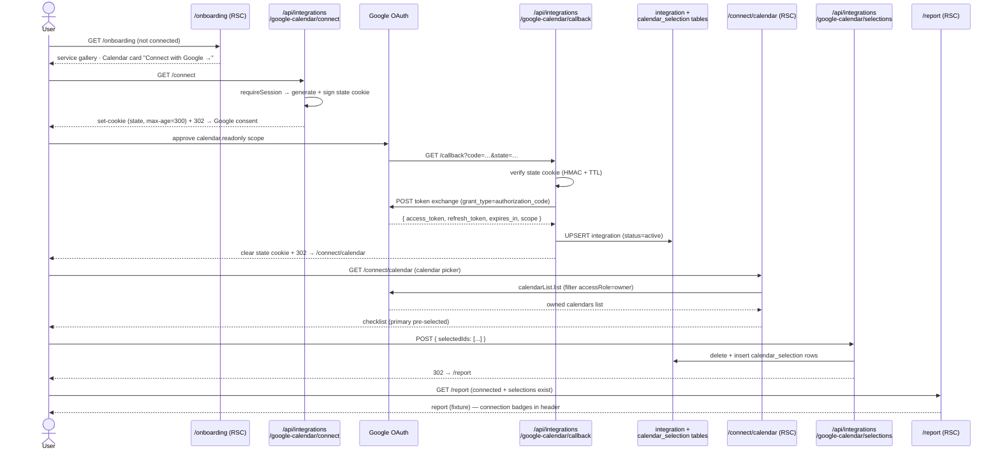
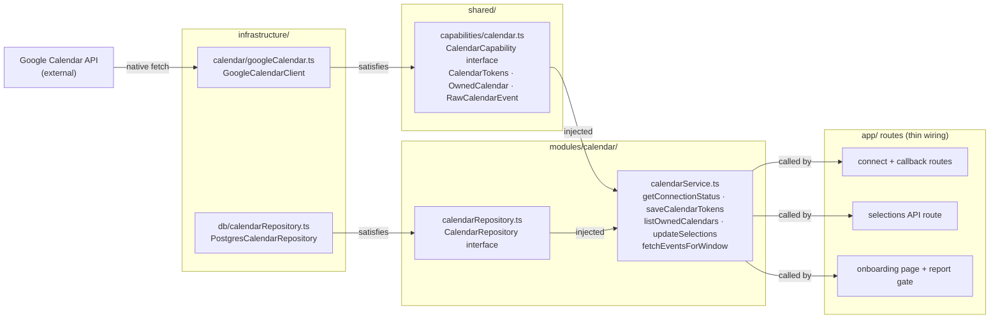

# feat: S5 — Calendar provider (Google OAuth + retrieval + calendar selection)

## Summary

Connects Google Calendar as the first data provider. S5 establishes the integration
capability pattern (reused in S6 for WHOOP), adds `integration` and
`calendar_selection` tables, wires a separate Google OAuth consent flow (distinct from
the identity login in S4), lets the user select which owned calendars reflect their
actual use of time, persists those selections, and retrieves raw events in memory.
The report page still shows the fixture — real calendar data flows into the analysis
pipeline in S7.

**Demo milestone (S5):** sign in → connect Google Calendar → select calendars →
real events retrieved, confirmed in server logs.

---

## Problem Frame

S4 delivered identity: users sign in with Google, a session exists, and the report
shows the fixture. The product separates *identity* (who you are) from *data
integrations* (what you consent to share) — connecting Calendar is a second, distinct
decision. S5 draws that line in code: a dedicated OAuth flow requests `calendar.readonly`
scope with `access_type=offline`, tokens land in an `integration` table the app owns,
and the user picks which of their owned calendars contribute to the analysis.

S5 also sets the integration pattern that S6 inherits. WHOOP has no Better Auth
provider at all — its credentials must live outside Better Auth's schema. Rather than
splitting into two storage strategies, S5 establishes one: a bespoke `integration`
table for all data-provider tokens, behind a CalendarCapability interface the
infrastructure layer satisfies. S6 conforms to this pattern, not a new one.

---

## Requirements

- **R1** — A dedicated `/onboarding` page (wireframe Screen 02 — "Connect your
  world.") shows Google Calendar and WHOOP as service cards. The Calendar card
  displays a "Connect with Google →" button that triggers the dedicated Google OAuth
  consent flow requesting `calendar.readonly` scope with `access_type=offline` and
  `prompt=consent`. S4's deferred R12 ("Connect your first service" welcome state)
  lands here.
- **R2** — The OAuth callback exchanges the authorization code for tokens, stores
  them in the `integration` table scoped by `user_id` with `status = 'active'`, and
  redirects to the calendar selection page.
- **R3** — The connect route issues a short-lived, signed state cookie; the callback
  verifies it before processing the code (CSRF protection).
- **R4** — When a refresh attempt fails with `invalid_grant` (e.g., the 7-day dev
  expiry confirmed in the spike), the integration row's `status` is set to
  `'needs_reconnect'` and the report page surfaces a "Reconnect Calendar" prompt.
- **R5** — After OAuth connects, a calendar selection page fetches the user's owned
  calendars (`calendarList.list`, filtered to `accessRole === 'owner'`) and presents
  them as a checklist with the primary calendar pre-selected.
- **R6** — Saving the selection persists the chosen calendar IDs (with name and
  `isPrimary` flag) to the `calendar_selection` table, scoped by `user_id`.
- **R7** — Events are retrieved from all selected calendars over the last 30 days
  using the spike's verified parameters (`singleEvents=true`, `orderBy=startTime`,
  filter `status !== 'cancelled'`) and held in memory — raw events are **not** stored
  in the database in S5.
- **R8** — `fetchEventsForWindow` logs a single line on success via the logger
  capability: event count and calendar IDs used. No dedicated debug route.
- **R9** — Report page access gate: if 0 services connected or `needs_reconnect` →
  redirect to `/onboarding`; if connected but no calendar selections saved → redirect
  to `/connect/calendar`; if connected with selections → render report (fixture in
  S5). The `/onboarding` page's Calendar card surfaces the "Reconnect" CTA when
  `needs_reconnect` so the user can re-authorize from there.
- **R10** — No new env vars. The existing `GOOGLE_CLIENT_ID`, `GOOGLE_CLIENT_SECRET`,
  and `BETTER_AUTH_URL` are sufficient; the callback URI is derived from
  `BETTER_AUTH_URL`.

---

## Key Technical Decisions

**KTD1 — Separate `integration` table, not Better Auth's `account` table, for data-provider tokens.**

S4's KTD7 anticipated adding calendar tokens "via `linkSocial()`" in S5. This plan
departs from that note. Three constraints settle it:

1. **Independent grantability.** The product requires sign-in without Calendar access —
   two separate decisions. A second `linkSocial()` to the same Google provider would
   conflict with or overwrite the existing identity `account` row (same `accountId`,
   same `providerId`).
2. **S6 forces the issue.** WHOOP has no Better Auth provider; its credentials must
   live outside Better Auth's schema. Splitting into Better Auth tokens for calendar and
   a bespoke store for WHOOP creates two patterns where one suffices. A single
   `integration` table models all data-provider credentials uniformly.
3. **Refresh control.** Better Auth's internal refresh is tied to its session lifecycle.
   Explicit `invalid_grant` detection (for the 7-day dev expiry) and a `needs_reconnect`
   status flag require owning the token row.

The `integration` table holds `(id, userId FK, provider, accessToken, refreshToken,
expiresAt, scope, status, createdAt, updatedAt)`. `provider = 'google_calendar'` in
S5; `provider = 'whoop'` in S6.

**KTD2 — Custom OAuth routes for the Calendar data connection, not Better Auth `linkSocial()`.**

Calendar data OAuth routes through `/api/integrations/google-calendar/connect` (initiator)
and `/api/integrations/google-calendar/callback` (receiver). This keeps the Calendar
data flow separate from Better Auth's machinery, lets us add a custom state cookie for
CSRF, and handles `invalid_grant` exactly as needed. Cost: hand-rolling the state cookie
and token exchange (small, well-understood functions). Benefit: clean seam, S6 conforms.

**KTD3 — `calendar.readonly` scope, not `calendar.events.readonly`.**

`calendar.events.readonly` does not grant `calendarList.list`. Enumerating owned
calendars (R5) requires `calendar.readonly`, which is the superset. The spike confirmed
this scope. Future hardening: narrow to `calendar.calendarlist.readonly` +
`calendar.events.readonly` once the exact required surface is confirmed — no behavior
change, just scope reduction.

**KTD4 — Signed state cookie for CSRF on the calendar OAuth callback.**

The state value is HMAC-SHA256 signed using `BETTER_AUTH_SECRET` (already in env) and
embeds `userId` + a short TTL. Cookie format: `base64(JSON payload).hmac-hex`. Set as
HTTP-only, `SameSite=Lax`, `max-age=300` on the `/connect` redirect; verified on
`/callback` before processing the code using `crypto.timingSafeEqual` — never string
`===` (timing side-channel). No additional env var needed.

Embedding `userId` in the state means the callback can identify which user is connecting
even if the session cookie doesn't survive the Google redirect (some browsers block
`SameSite=Lax` cookies on cross-site top-level redirects under ITP/ETP). If the state
cookie itself is absent on callback (same browser restriction), redirect to
`/onboarding?error=session_lost`. Test in Safari before shipping. If `SameSite=Lax` is
insufficient, use `SameSite=None; Secure` or store state in the existing Better Auth
session.

The callback also re-verifies that an active session exists for the extracted `userId`
before proceeding — the state cookie verifies the flow's origin; the session check
verifies the user is still authenticated.

**KTD5 — Owned-calendar filter: `accessRole === 'owner'`; primary pre-selected.**

`calendarList.list` returns all calendars the user has access to, including shared and
subscribed ones. Filtering by `accessRole === 'owner'` isolates the calendars the user
controls — the behavioral signal source. The primary calendar (`primary: true` on the
Google response) is pre-selected.

**KTD6 — S7 boundary: defer all-day event handling, recurring expansion, and date bucketing.**

S5's retrieval layer fetches raw events and holds them in memory. Three spike open-questions
are explicitly deferred to S7 (deterministic normalization layer):
- All-day vs. timed event handling (`start.date` vs `start.dateTime`) — not exercised
  in the spike; the normalization rule belongs in S7.
- Recurring-series expansion validation — `singleEvents=true` was accepted but not
  tested against actual recurring events; confirm in S7.
- Calendar-day bucketing of timed events — S7's concern.

S5's event retrieval logs raw event counts on success (R8); normalization of raw event shapes is deferred to S7.

---

## High-Level Technical Design

### Calendar connection and selection flow



### Capability and repository layering



---

## Output Structure

New files created by S5:

```
shared/
  capabilities/
    calendar.ts                    # CalendarCapability + CalendarTokens, OwnedCalendar, RawCalendarEvent

infrastructure/
  calendar/
    googleCalendar.ts              # GoogleCalendarClient (CalendarCapability impl)
  db/
    calendarRepository.ts          # PostgresCalendarRepository
    migrations/
      <timestamp>_s5_integration_calendar_selection.sql

modules/
  calendar/
    calendarRepository.ts          # CalendarRepository interface
    calendarService.ts             # calendar service functions

app/
  api/
    integrations/
      google-calendar/
        connect/
          route.ts                 # OAuth initiator
        callback/
          route.ts                 # OAuth receiver + token storage
        selections/
          route.ts                 # POST — persist calendar selection
  onboarding/
    page.tsx                       # RSC — service gallery (wireframe Screen 02)
  connect/
    calendar/
      page.tsx                     # RSC — calendar selection page (post-OAuth picker)

frontend/
  onboarding/
    OnboardingPage.tsx             # client component — service cards, CTAs
  calendar/
    CalendarSelectionPage.tsx      # client component (checklist + submit)

__tests__/
  calendarService.test.ts          # service tests (stub repo + stub capability)
```

Modified by S5:

```
infrastructure/db/schema.ts        # + integration, calendar_selection tables
infrastructure/index.ts            # re-export googleCalendarClient, postgresCalendarRepository
modules/index.ts                   # re-export calendarService
shared/index.ts                    # re-export CalendarCapability + types
app/report/page.tsx                # add access gate (redirect to /onboarding when 0 services or needs_reconnect)
```

---

## Implementation Units

### U1. DB schema — integration + calendar_selection tables

**Goal:** Add the two S5 tables to the Drizzle schema and apply the migration.

**Requirements:** R2 (token storage prerequisite), R6 (selection storage prerequisite)

**Dependencies:** None

**Files:**
- `infrastructure/db/schema.ts` — add `integration` and `calendar_selection` tables
- `infrastructure/db/migrations/<timestamp>_s5_integration_calendar_selection.sql` — generated migration

**Approach:**

`integration` table — one row per user per data provider:
- `id` — text primary key (`crypto.randomUUID()`)
- `userId` — text NOT NULL, FK → `user.id` CASCADE DELETE
- `category` — text NOT NULL (values: `'calendar'` | `'health'`) — provider group; matches README entity model
- `provider` — text NOT NULL (value `'google_calendar'` in S5; `'whoop'` in S6) — specific provider within category
- `accessToken` — text NOT NULL
- `refreshToken` — text (nullable)
- `expiresAt` — timestamp NOT NULL
- `scope` — text
- `status` — text NOT NULL DEFAULT `'active'` (values: `'active'` | `'needs_reconnect'`)
- `createdAt` / `updatedAt` — timestamps

Unique constraint on `(userId, provider)` — one row per user per provider. Re-connecting (new consent) upserts on this constraint, replacing tokens in place.

**Token storage note:** Access and refresh tokens are stored as plaintext in MVP. Supabase RLS must restrict `integration` row access to `auth.uid() = userId` to prevent cross-user reads. Token encryption at rest is targeted for a pre-production slice (before non-dev users connect).

`calendar_selection` table — stores which calendars each user has selected:
- `id` — text primary key
- `integrationId` — text NOT NULL, FK → `integration.id` CASCADE DELETE (matches README entity model: CalendarSelection belongs to an Integration, not directly to a User)
- `externalCalendarId` — text NOT NULL (Google's calendar ID string; named `externalCalendarId` per README to distinguish from internal IDs)
- `name` — text NOT NULL (human-readable name from Google, stored for display)
- `createdAt` — timestamp

Unique constraint on `(integrationId, externalCalendarId)`. Updating selections: delete all rows for the integration, then insert the new set — wrapped in a Drizzle transaction (`db.transaction`) to prevent partial-delete leaving the user with 0 selections.

`CalendarRepository` queries that previously scoped by `userId` must now resolve `integrationId` first (via `getIntegration(userId, 'google_calendar')`) then use it to scope `calendar_selection` queries.

Generate migration: `npx drizzle-kit generate`. Apply: `npx drizzle-kit migrate` (uses `DATABASE_URL_DIRECT`).

**Patterns to follow:** `infrastructure/db/schema.ts` — existing table definitions (`pgTable`, `text`, `timestamp`, `boolean`).

**Test scenarios:**
- `Test expectation: none` — schema migration; correctness verified by inspection after `drizzle-kit migrate` (tables present, constraints visible in Supabase Studio or `psql`). Manual smoke: insert a duplicate `(userId, provider)` row and observe a unique-constraint error.

**Verification:** Migration runs cleanly; both tables visible; `integration` has FK to `user.id` and `calendar_selection` has FK to `integration.id`; unique constraints present; RLS policies applied restricting `integration` reads to `auth.uid() = userId`.

---

### U2. Calendar capability interface + Google Calendar implementation

**Goal:** Define the CalendarCapability interface (owned by the application) and implement it against the Google Calendar API using native `fetch`.

**Requirements:** R5 (calendar listing), R7 (event retrieval), R4 (refresh + `invalid_grant`)

**Dependencies:** U1 (schema exists, but this unit does not touch the DB)

**Files:**
- `shared/capabilities/calendar.ts` — interface + types
- `infrastructure/calendar/googleCalendar.ts` — `GoogleCalendarClient`
- `infrastructure/index.ts` — export `googleCalendarClient` singleton

**Approach:**

`shared/capabilities/calendar.ts` exports:
- `CalendarTokens`: `{ accessToken: string; refreshToken: string; expiresAt: Date }`
- `OwnedCalendar`: `{ id: string; name: string; isPrimary: boolean }`
- `RawCalendarEvent`: mirrors the Google API shape — `{ id, summary?, status?, start: { date?: string; dateTime?: string; timeZone?: string }, end: { date?: string; dateTime?: string }, recurringEventId? }`
- `CalendarCapability` interface:
  - `exchangeCode(code: string, redirectUri: string): Promise<CalendarTokens>` — authorization code → tokens (keeps all Google token endpoint calls inside the capability boundary)
  - `listOwnedCalendars(tokens: CalendarTokens): Promise<OwnedCalendar[]>`
  - `fetchEvents(calendarId: string, tokens: CalendarTokens, window: { timeMin: string; timeMax: string }): Promise<RawCalendarEvent[]>`
  - `refreshTokens(refreshToken: string): Promise<CalendarTokens>`

`GoogleCalendarClient` (`infrastructure/calendar/googleCalendar.ts`):
- No SDK — native `fetch` only (pillar 2; consistent with the spike)
- Constants: `GOOGLE_TOKEN_URL = 'https://oauth2.googleapis.com/token'`, `GCAL_API_BASE = 'https://www.googleapis.com/calendar/v3'`
- `exchangeCode`: POST to `GOOGLE_TOKEN_URL` with `grant_type=authorization_code`, `code`, `client_id`, `client_secret`, `redirect_uri`; on 200 return `CalendarTokens`; on non-200 throw structured error
- `listOwnedCalendars`: GET `calendarList?minAccessRole=owner`; follow `nextPageToken` with a 10-page cap (10 × 250 = 2,500 max); filter all collected results to `accessRole === 'owner'`; map to `OwnedCalendar[]` with `primary: true` detection; on non-200 throw structured error with status code
- `fetchEvents`: loop `nextPageToken`; params `singleEvents=true`, `orderBy=startTime`, `maxResults=2500`; filter `status !== 'cancelled'` on results client-side; safety cap at 100 pages; if cap reached, log `logger.warn('fetchEvents pagination cap reached', { calendarId, pages: 100 })` and return accumulated results; on non-200 throw structured error
- `refreshTokens`: POST to `GOOGLE_TOKEN_URL` with `grant_type=refresh_token`, `refresh_token`, `client_id`, `client_secret`; on HTTP 200 return new `CalendarTokens` (compute `expiresAt = now + expires_in seconds`); on response body `{ error: 'invalid_grant' }` throw a structured `OAuthError` with `code: 'invalid_grant'`; on other non-200 throw a generic error
- Constructed in `infrastructure/index.ts` with `clientId` and `clientSecret` from `env`; exported as `googleCalendarClient`

The capability does not auto-refresh tokens — the service layer (U3) decides when to refresh before calling.

**Patterns to follow:** `shared/capabilities/auth.ts` — interface + types in shared; `infrastructure/auth.ts` — vendor implementation in infrastructure; native fetch pattern from the spike.

**Test scenarios:**
- `exchangeCode`: returns `CalendarTokens` on 200; throws structured error on non-200
- `listOwnedCalendars`: includes only calendars with `accessRole === 'owner'`; marks `isPrimary: true` for the primary calendar; excludes calendars with reader/freeBusyReader access; follows `nextPageToken` across pages before applying the owner filter; on non-200 response throws with status code
- `fetchEvents`: request includes `singleEvents=true` and `orderBy=startTime`; events with `status === 'cancelled'` are filtered from results; follows `nextPageToken` until exhausted; stops at 100 pages (safety cap) and logs a warning when cap is reached
- `refreshTokens`: returns new `CalendarTokens` with updated `accessToken` and `expiresAt` on success; throws `OAuthError` with `code === 'invalid_grant'` when Google responds with that error; throws generic error on other failures

Stub `fetch` via `vi.fn()` on the global; no HTTP calls in tests.

**Verification:** TypeScript accepts `GoogleCalendarClient as CalendarCapability`; unit tests pass.

---

### U3. CalendarRepository interface, Postgres implementation, and service

**Goal:** Define the persistence interface for integration tokens and calendar selections, implement it with Drizzle, and build the service that orchestrates calendar operations.

**Requirements:** R2, R4, R6, R7 (all persistence + service requirements)

**Dependencies:** U1 (tables), U2 (CalendarCapability types used by service)

**Files:**
- `modules/calendar/calendarRepository.ts` — `CalendarRepository` interface
- `infrastructure/db/calendarRepository.ts` — `PostgresCalendarRepository`
- `modules/calendar/calendarService.ts` — service functions
- `modules/index.ts` — re-export service
- `shared/capabilities/logger.ts` — already exists; `fetchEventsForWindow` takes `logger: Logger` as a parameter
- `__tests__/calendarService.test.ts` — service tests with stubs

**Approach:**

`CalendarRepository` interface (`modules/calendar/calendarRepository.ts`):
- `getIntegration(userId: string): Promise<IntegrationRow | null>`
- `saveIntegration(userId: string, tokens: CalendarTokens, scope: string, category: string): Promise<void>` — upsert on `(userId, provider = 'google_calendar')`; returns the integration `id`
- `markNeedsReconnect(userId: string): Promise<void>` — set `status = 'needs_reconnect'` for the user's google_calendar row
- `updateTokens(userId: string, tokens: CalendarTokens): Promise<void>` — update `accessToken` + `expiresAt` after a successful refresh
- `getSelections(userId: string): Promise<CalendarSelectionRow[]>` — joins through `integration` to scope by `userId`
- `saveSelections(integrationId: string, selections: Array<{ externalCalendarId: string; name: string }>): Promise<void>` — delete-then-insert wrapped in a Drizzle transaction

`PostgresCalendarRepository`: implements the interface using Drizzle. `saveIntegration` uses Drizzle's `.onConflictDoUpdate` on `(userId, provider)`. `saveSelections` wraps DELETE + INSERT in `db.transaction(async (tx) => { ... })` to prevent partial-delete corruption. Export `postgresCalendarRepository` from `infrastructure/index.ts` alongside `googleCalendarClient` and `authCapability` — route handlers import it from `infrastructure/` and pass it to service functions as an explicit parameter.

`calendarService.ts` (pure functions; dependencies as explicit parameters — architecture-context.md Wiring):
- `getConnectionStatus(userId, repo)` → `'not_connected' | 'needs_reconnect' | 'connected'`
- `saveCalendarTokens(userId, tokens, scope, repo)` → calls `repo.saveIntegration(userId, tokens, scope, 'calendar')`
- `listOwnedCalendars(userId, repo, client)` → gets integration row; calls `refreshTokensIfNeeded`; calls `client.listOwnedCalendars`; on `OAuthError('invalid_grant')` calls `repo.markNeedsReconnect` then rethrows
- `updateSelections(userId, selections, repo)` → resolves `integrationId` via `repo.getIntegration(userId)`, then calls `repo.saveSelections(integrationId, selections)`
- `fetchEventsForWindow(userId, window, repo, client, logger)` → gets integration + selections; calls `refreshTokensIfNeeded`; calls `client.fetchEvents` per selected calendar; concatenates results; on success logs `logger.info('calendar events retrieved', { calendarCount, totalEvents })`; on `invalid_grant` marks needs_reconnect and rethrows; throws `IntegrationNotFoundError` when no row; throws `NoSelectionsError` when no calendars selected

**Token refresh logic** — extracted to a private `refreshTokensIfNeeded(userId, integration, repo, client): Promise<string>` helper (returns a fresh `accessToken`):
1. If `integration.expiresAt - now ≥ 5 minutes`: return `integration.accessToken` immediately.
2. If `< 5 minutes`: call `client.refreshTokens(integration.refreshToken)`.
   - On success: call `repo.updateTokens(userId, newTokens)`, return `newTokens.accessToken`.
   - On `OAuthError('invalid_grant')`: re-read the integration row from the DB; if `expiresAt` is now in the future (a concurrent request already refreshed it), return the stored `accessToken` (optimistic concurrency — avoids a false `needs_reconnect` under parallel RSC renders). If `expiresAt` is still in the past, call `repo.markNeedsReconnect(userId)` and rethrow.
Both `listOwnedCalendars` and `fetchEventsForWindow` call this helper.

**Patterns to follow:** `modules/report/reportService.ts` — function exports with injected dependencies; `examples.md` — repository interface + stub testing pattern.

**Test scenarios:**
- `getConnectionStatus`: `'not_connected'` when no integration row; `'needs_reconnect'` when `status = 'needs_reconnect'`; `'connected'` when `status = 'active'`
- `saveCalendarTokens`: calls `repo.saveIntegration` with the correct userId, tokens, scope
- `listOwnedCalendars` (happy path): gets integration, calls `client.listOwnedCalendars` with the stored tokens; returns the capability's result
- `listOwnedCalendars` (token near expiry): calls `client.refreshTokens`, then `repo.updateTokens`, then `client.listOwnedCalendars` with the refreshed token
- `listOwnedCalendars` (invalid_grant on refresh): calls `repo.markNeedsReconnect`; rethrows `OAuthError`
- `fetchEventsForWindow` (token near expiry): calls `client.refreshTokens`, then `repo.updateTokens`, then `client.fetchEvents` with the refreshed token
- `fetchEventsForWindow` (happy path): fetches events per selected calendar; concatenates multi-calendar results
- `fetchEventsForWindow` (no integration row): throws `IntegrationNotFoundError`
- `fetchEventsForWindow` (no selections): throws `NoSelectionsError`
- `fetchEventsForWindow` (invalid_grant during refresh): calls `repo.markNeedsReconnect`; rethrows
- `fetchEventsForWindow` (concurrent refresh — invalid_grant but row already refreshed): re-reads integration row; uses stored accessToken if expiresAt is future; does NOT call markNeedsReconnect
- `updateSelections`: calls `repo.saveSelections` with the integrationId and the provided selections

**Verification:** All tests pass; TypeScript enforces no direct DB imports in the service module.

---

### U4. Google Calendar OAuth routes — connect + callback

**Goal:** Implement the two thin route handlers that initiate and receive the Google Calendar data OAuth consent flow.

**Requirements:** R1, R2, R3

**Dependencies:** U3 (`calendarService.saveCalendarTokens` used by callback)

**Files:**
- `app/api/integrations/google-calendar/connect/route.ts`
- `app/api/integrations/google-calendar/callback/route.ts`

**Approach:**

**`/connect` GET handler** (exports `GET`; the "Connect with Google →" button is an anchor link or `router.push()`, not a form POST):
1. `authCapability.requireSession(headers)` — unauthenticated → 401/redirect
2. Serialize state payload as JSON bytes: `payload = JSON.stringify({ userId, exp: Date.now() + 300_000 })`; compute `hmac = HMAC-SHA256(payload, BETTER_AUTH_SECRET)` using Node.js `crypto.createHmac`. Store cookie value as `base64(payload).hmac`.
3. Set state cookie as HTTP-only, `SameSite=Lax`, `Secure` (production), `max-age=300`
4. Build Google authorization URL with `response_type=code`, `client_id`, `redirect_uri` (hardcoded from `${env.BETTER_AUTH_URL}/api/integrations/google-calendar/callback` — never derived from request headers), `scope=https://www.googleapis.com/auth/calendar.readonly`, `access_type=offline`, `prompt=consent`, `state`
5. Return `NextResponse.redirect(authorizationUrl)`

**`/callback` GET handler:**
1. Read `code` and `state` from `request.nextUrl.searchParams`; if `error=access_denied` → redirect to `/onboarding?calendar_error=denied`; if missing `code` → 400
2. Read state cookie; if cookie is absent (browser may have blocked it on the cross-site redirect — Safari ITP, Firefox ETP): redirect to `/onboarding?error=session_lost`. If present, verify HMAC using `crypto.timingSafeEqual(Buffer.from(receivedHmac), Buffer.from(expectedHmac))` — never string `===`. Verify `exp` TTL. On failure → 403.
3. Extract `userId` from verified state payload
4. Verify active session for `userId`: call `auth.api.getSession` or read the session table — if no active session exists, return 401 and redirect to `/sign-in`. This closes the TOCTOU gap (session may have been revoked between connect and callback).
5. Call `googleCalendarClient.exchangeCode(code, redirectUri)` — uses the same hardcoded `redirect_uri` as step 4 of the connect handler. On failure throw structured error → log + redirect to `/onboarding?calendar_error=failed`.
6. If `refresh_token` is absent in the response (should not happen with `access_type=offline` + `prompt=consent` — indicates OAuth client misconfiguration): log at **error** level with full OAuth response for debugging; redirect to `/onboarding?calendar_error=config_error` without saving tokens. Do NOT set `needs_reconnect` — this is a configuration error, not a user-recoverable state.
7. `calendarService.saveCalendarTokens(userId, tokens, scope, postgresCalendarRepository)`
8. Clear the state cookie (`max-age=0`)
9. Redirect to `/connect/calendar`

**External config note:** Add `/api/integrations/google-calendar/callback` to authorized redirect URIs in Google Cloud Console before end-to-end testing. The existing Better Auth callback (`/api/auth/callback/google`) is already registered; this is a second entry on the same client.

**Preview deployment note:** OAuth only works in environments whose URL is registered in Google Cloud Console. Vercel preview deployments get dynamic URLs that will not match the registered `BETTER_AUTH_URL` callback. Either (a) accept that OAuth testing requires the production URL, or (b) add a `NEXT_PUBLIC_APP_URL` env var that can be set per-deployment and use it for `redirect_uri` derivation instead of `BETTER_AUTH_URL`.

**Patterns to follow:** `app/api/report/route.ts` — thin route handler importing infra; `infrastructure/auth.ts` — `authCapability` import pattern.

**Test scenarios:**
- `/connect` (GET): returns 302 with Location containing `accounts.google.com`; includes `access_type=offline`, `prompt=consent`, `calendar.readonly` scope in redirect URL; sets state cookie with `base64(payload).hmac` format; returns 401 without a session
- `/callback` (valid): verifies state cookie with `timingSafeEqual`, verifies active session for userId, calls `googleCalendarClient.exchangeCode`, calls `saveCalendarTokens`, clears cookie, redirects to `/connect/calendar`
- `/callback` (access_denied error param): redirects to `/onboarding?calendar_error=denied`
- `/callback` (tampered state): returns 403 without calling token exchange
- `/callback` (expired state TTL): returns 403
- `/callback` (missing state cookie — blocked by browser): redirects to `/onboarding?error=session_lost`
- `/callback` (session revoked between connect and callback): returns 401, redirects to `/sign-in`
- `/callback` (no refresh_token in response): logs at error level with full OAuth response; redirects to `/onboarding?calendar_error=config_error` without saving tokens

**Verification:** End-to-end manual test: complete OAuth flow → `integration` row visible in Supabase Studio with `status = 'active'` and a non-null `refreshToken` → redirected to `/connect/calendar`.

---

### U5. Calendar selection page + selections API

**Goal:** After the OAuth callback, present owned calendars as a selectable list and persist the user's selection.

**Requirements:** R5, R6

**Dependencies:** U3 (`listOwnedCalendars`, `updateSelections`), U4 (callback redirects here)

**Files:**
- `app/connect/calendar/page.tsx` — RSC: require session, fetch calendars, pass to client component
- `frontend/calendar/CalendarSelectionPage.tsx` — client component: checklist + submit
- `app/api/integrations/google-calendar/selections/route.ts` — POST handler

**Approach:**

**`/connect/calendar` RSC page:**
- `authCapability.requireSession(headers)` — must be authenticated
- `calendarService.getConnectionStatus(userId, postgresCalendarRepository)` — if not `'connected'` or `'needs_reconnect'`, redirect to `/onboarding` (guards against direct URL navigation)
- `calendarService.listOwnedCalendars(userId, postgresCalendarRepository, googleCalendarClient)` — fetches from Google using stored tokens
- `postgresCalendarRepository.getSelections(userId)` — current selections for pre-checking on re-visit
- Pass `calendars` and `existingSelectionIds` as props to `<CalendarSelectionPage>`

**`CalendarSelectionPage` client component:**
- If `ownedCalendars.length === 0`: render an empty-state message ("We couldn't find any calendars you own on this Google account") with a "Try a different account" link back to `/api/integrations/google-calendar/connect`. Do not show the checklist or Save button.
- Otherwise: Checkbox list for each `OwnedCalendar`; primary calendar pre-checked; previously selected calendars remain checked on re-visit
- Submits `{ selectedIds: string[] }` as JSON to `POST /api/integrations/google-calendar/selections` (client-side `calendars` array is not sent — server re-fetches for ownership verification)
- Loading state ("Saving…") during submission; error display on failure; disabled "Save" button when no calendars checked

**`POST /api/.../selections` handler:**
- `authCapability.requireSession(headers)` → 401 if missing
- Parse body with Zod: `z.object({ selectedIds: z.array(z.string()).min(1) })` → 400 on failure
- Re-fetch owned calendar list server-side via `calendarService.listOwnedCalendars(userId, postgresCalendarRepository, googleCalendarClient)` — validates that all `selectedIds` are present in the server-fetched list (ownership verification); return 400 for any ID not in the server list. Treats client-submitted IDs as untrusted.
- `calendarService.updateSelections(userId, verifiedCalendarsFromServer, postgresCalendarRepository)` — `updateSelections` is awaited before returning 200 (write is durable on response)
- Return 200 (client redirects to `/report` only after receiving 200 — ordering ensures DB write is visible to the report gate's query)

**Patterns to follow:** `app/report/page.tsx` — RSC fetching + props passing; `frontend/auth/SignInPage.tsx` — client component structure; `app/api/report/route.ts` — Zod validation at the boundary.

**Test scenarios:**
- Selection page (zero owned calendars): renders empty-state message with "Try a different account" link; no checklist or Save button shown
- Selection page (owned calendars present): renders only owned calendars; primary calendar is pre-checked; previously selected calendars are pre-checked on re-visit; "Save" button is disabled when no calendar is checked; redirects to `/onboarding` when not connected
- `POST /selections` (valid): server re-fetches calendar list, verifies IDs, persists selections, returns 200; on re-POST, replaces the previous selection
- `POST /selections` (empty selectedIds): returns 400
- `POST /selections` (selectedId not in server-fetched calendar list): returns 400
- `POST /selections` (no session): returns 401

**Verification:** After saving, `calendar_selection` rows are visible in Supabase Studio; report page shows the connected state (no connect banner).

---

### U6. Onboarding page (service gallery) + report page access gate

**Goal:** Implement the dedicated onboarding screen (wireframe Screen 02 — "Connect your world.") and gate the report page so users without an active connection are always routed there. Resolves S4's deferred R12 welcome state.

**Requirements:** R1, R9

**Dependencies:** U3 (`getConnectionStatus`, `getSelections`), U4+U5 (OAuth + selections flow must exist to link to)

**Files:**
- `app/onboarding/page.tsx` — RSC: session check, connection status, existing selections
- `frontend/onboarding/OnboardingPage.tsx` — client component: service cards, CTAs
- `app/report/page.tsx` — add access gate redirects

**Approach:**

**`/onboarding` RSC page:**
- `authCapability.requireSession(headers)` — unauthenticated → redirect to `/sign-in`
- `calendarService.getConnectionStatus(userId, postgresCalendarRepository)`
- If `'connected'`: also fetch `postgresCalendarRepository.getSelections(userId)` to pass calendar chips to the UI
- Pass `{ connectionStatus, selections }` to `<OnboardingPage>`

**`OnboardingPage` client component (wireframe Screen 02):**

Layout matches the wireframe service gallery:
- Header: "Connect your world."
- If `?calendar_error=denied` query param is present: render a dismissible inline alert on the Calendar card ("Google Calendar access was not granted. Try again.").
- If `?error=session_lost` query param is present: render a dismissible inline alert ("Something went wrong during sign-in. Please try connecting again.").
- **Google Calendar card:**
  - `not_connected`: dashed border; "Connect with Google →" button (dark, links to `GET /api/integrations/google-calendar/connect` as an anchor link)
  - `needs_reconnect`: white card; "✓ Connected" badge but with a "Connection expired — reconnect" sub-label; same connect link. **Reconnect behavior:** re-authorization upserts the `integration` row (replacing tokens, resetting status to `'active'`) and does NOT touch `calendar_selection` rows — existing calendar selections are preserved across reconnects.
  - `connected`: white card; "✓ Connected" badge; calendar chip pills showing **only selected calendars** from `calendar_selection` as `✓ CalendarName` (chips are not clickable inline); "Edit" button linking to `/connect/calendar` to change selections
- **WHOOP card:** dashed border; "Connect with WHOOP →" button rendered but disabled/grayed with a "Coming soon" label — placeholder for S6; no action on click; removed from tab order (`tabindex="-1"`)
- **Tier hint** (small info card): "1 service → time or recovery view · Both → schedule ↔ recovery insights"
- **Primary CTA:**
  - If `connected`: "Start with Calendar →" (solid orange, renders as `<a href="/report">`)
  - Otherwise: "Get started →" renders as `<button type="button" disabled>` styled to match CTA appearance with `opacity-30` — HTML `disabled` removes it from tab order and prevents keyboard activation. Include `title="Connect a service to get started"` for accessibility context.

**`app/report/page.tsx` access gate (added after `requireSession`):**
- `calendarService.getConnectionStatus(userId, postgresCalendarRepository)`
- `'not_connected'` or `'needs_reconnect'` → `redirect('/onboarding')`
- `'connected'` + no selections (`getSelections` returns empty) → `redirect('/connect/calendar')`
- `'connected'` + selections exist → call `fetchEventsForWindow(userId, { timeMin: 30 days ago, timeMax: now }, postgresCalendarRepository, googleCalendarClient, logger)` (result held in memory, not used in S5 — R8's log line confirms retrieval for the demo milestone), then render report (fixture in S5)

The report header in S5 can show a small connection badge (`📅 ✓`) per the wireframe — lightweight, no banner needed since the onboarding page handles all connection management.

**Patterns to follow:** `frontend/auth/SignInPage.tsx` — client component structure; `app/report/page.tsx` — RSC with `redirect()`; shadcn/ui `Card` + `Button` for the service cards.

**Test scenarios:**
- `/onboarding` (`not_connected`): Calendar card renders with dashed border and "Connect with Google →" anchor link; WHOOP card renders as disabled with tabindex=-1; primary CTA renders as disabled `<button>` with title attribute
- `/onboarding` (`connected`): Calendar card renders with "✓ Connected" badge, selected-calendar chips (selected calendars only, not all owned), and "Edit" button; primary CTA is an active link to `/report`
- `/onboarding` (`needs_reconnect`): Calendar card renders with expired-state indicator and the connect link
- `/onboarding` with `?calendar_error=denied`: dismissible inline alert renders on Calendar card
- WHOOP card never triggers navigation (disabled, removed from tab order)
- Report page (`not_connected`): redirects to `/onboarding`
- Report page (`needs_reconnect`): redirects to `/onboarding`
- Report page (`connected`, no selections): redirects to `/connect/calendar`
- Report page (`connected`, with selections): calls `fetchEventsForWindow`, logs event count, renders report (fixture)

**Verification:** Sign in with a fresh account → redirected to `/onboarding` (via report page gate) → service gallery shows Calendar card with connect button. Complete OAuth + calendar selection → CTA active → click "Start with Calendar →" → report renders (fixture). Manually set `integration.status = 'needs_reconnect'` in DB → report redirects to `/onboarding` → Calendar card shows reconnect state.

---

## Risks and Dependencies

- **7-day dev refresh-token expiry.** The spike confirmed `refresh_token_expires_in: 604799`. Integrations in dev will require weekly re-consent. R4's `invalid_grant` detection (U3) and U6's reconnect banner mitigate the user-facing impact. The parallel Google OAuth app verification track (build sequence plan) is the long-term fix for production users.
- **Google Cloud Console redirect URI registration.** The callback URI `/api/integrations/google-calendar/callback` must be added to authorized redirect URIs before end-to-end testing. This is a 2-minute external config step that will block OAuth testing if missed.
- **Spike open-questions.** All-day events, recurring expansion, and large-window pagination are deferred to S7 (KTD6). Any surprises in raw event shape will surface when S7 exercises the normalization layer.
- **`refresh_token` absent on first grant.** Should not occur with `access_type=offline` + `prompt=consent` (spike-confirmed). If it does, it indicates OAuth client misconfiguration — U4 logs at error level and redirects to `/onboarding?calendar_error=config_error` without saving tokens.

---

## Scope Boundaries

### In scope (S5)
- Google Calendar data OAuth flow (separate from S4 identity login)
- `integration` and `calendar_selection` Drizzle schema + migration
- CalendarCapability interface + Google implementation (pattern S6 conforms to)
- Calendar selection UI: owned calendars only, primary pre-selected
- Event retrieval in memory (logged on success; not stored)
- `/onboarding` service gallery page + report page access gate (resolves S4 R12)

### Deferred to S6
- WHOOP OAuth + retrieval (conforms to this slice's integration pattern)

### Deferred to S7 (normalization layer)
- All-day event handling (`start.date` vs `start.dateTime`)
- Recurring-series expansion validation against actual recurring events
- Calendar-day bucketing for timed events crossing midnight
- Multi-calendar pagination at scale

### Outside S5 scope
- Storing raw calendar events in the database (S8)
- Analysis, metrics, or AI on the retrieved events (S7 + S8)
- Additional OAuth providers beyond Google Calendar
- Token encryption at rest — access tokens stored as plaintext in MVP; RLS policies restrict row access to the owning user. Targeted for encryption before non-dev users connect (pre-production slice, not yet assigned).
