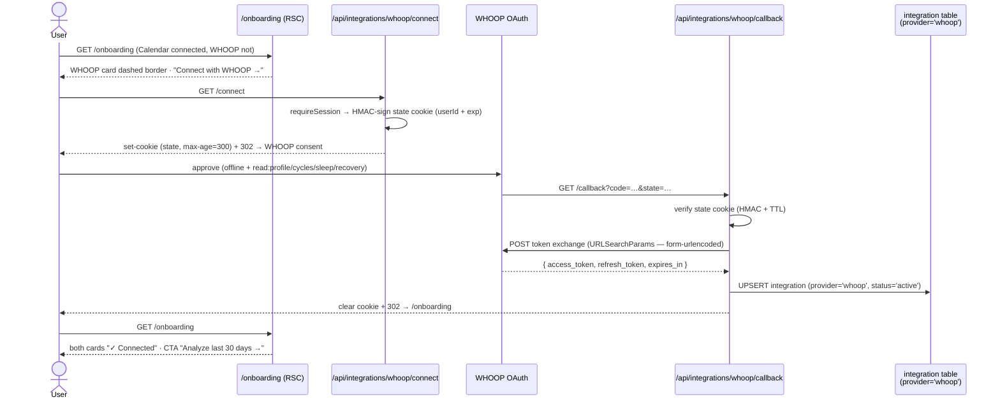
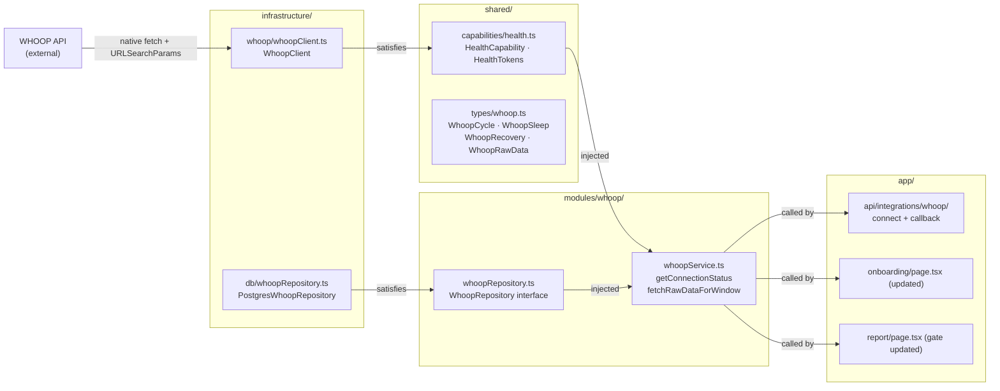

# feat: S6 — WHOOP provider (OAuth + retrieval)

## Summary

Adds WHOOP as the second data provider, conforming to the integration pattern S5
establishes. S6 implements: a dedicated WHOOP OAuth consent flow with form-urlencoded
token exchange (the key deviation from Google's JSON approach — spike-confirmed), atomic
token storage in S5's `integration` table (`provider = 'whoop'`), a compare-and-swap
refresh path that handles WHOOP's rotating refresh tokens without concurrent clobbering,
paginated retrieval of Cycles / Sleep / Recovery over the 30-day window with all spike
data rules applied, a `HealthCapability` interface mirroring `CalendarCapability`'s
structure, and the onboarding page WHOOP card made live. The analysis layer remains
fixture-backed; WHOOP data is retrieved into memory and confirmed via server log.

**Prerequisite:** S5 must ship before S6 implementation starts. S6 depends on S5's
`integration` table, CSRF cookie pattern, `getConnectionStatus` service shape, and
`/onboarding` page structure.

**Demo milestone (S6):** sign in → connect Google Calendar → connect WHOOP → both
real sources confirmed in server logs; `/onboarding` shows both services as connected.

---

## Problem Frame

S5 delivers Calendar OAuth, retrieval, and the `/onboarding` page with a WHOOP card
rendered as a disabled placeholder. S6 makes that placeholder live.

WHOOP has no Better Auth provider and its token endpoint requires form-urlencoded
bodies — both constraints confirmed by the spike and impossible to work around. The
`integration` table S5 introduced (provider-keyed rows, outside Better Auth's `account`
table) was designed precisely with this in mind: S6 inserts a row with `provider =
'whoop'`. The only WHOOP-specific engineering challenges are the form-urlencoded token
exchange and the rotating refresh token, which requires serialized handling that
Calendar's stable refresh token does not.

---

## S5 Assumed Contract

S6 depends on S5 having established the surfaces below. Confirm these match the shipped
S5 before implementing U3 (the callback stores tokens) and U5 (onboarding page update).

| Surface | Expected from S5 |
|---|---|
| `integration` table | `id`, `userId`, `provider`, `accessToken`, `refreshToken`, `expiresAt`, `scope`, `status`, `createdAt`, `updatedAt`; unique on `(userId, provider)` |
| `IntegrationRow` type | Drizzle-inferred from `infrastructure/db/schema.ts` `integration` table; shared between CalendarRepository and WhoopRepository |
| State cookie CSRF pattern | HMAC-SHA256 signed with `BETTER_AUTH_SECRET`; `{ userId, exp }` payload; HTTP-only `SameSite=Lax` `max-age=300` |
| `getConnectionStatus` return shape | `'not_connected' \| 'needs_reconnect' \| 'connected'` |
| `/onboarding` RSC page | At `app/onboarding/page.tsx`; currently passes only `calendarStatus` to `<OnboardingPage>`; S6 adds `whoopStatus` |
| Onboarding WHOOP card | Rendered as a disabled/grayed placeholder in S5; S6 activates it |
| Token refresh threshold | 5-minute expiry buffer (refresh if `expiresAt - now < 5 min`) |

---

## Requirements

- **R1** — `shared/env.ts` validates `WHOOP_CLIENT_ID` and `WHOOP_CLIENT_SECRET`. The
  WHOOP redirect URI is derived from `BETTER_AUTH_URL` at call sites:
  `` `${env.BETTER_AUTH_URL}/api/integrations/whoop/callback` `` — no additional env var,
  following S5's Calendar pattern.
- **R2** — `shared/types/whoop.ts` defines Zod-validated schemas for WHOOP API shapes:
  `WhoopCycle`, `WhoopSleep`, `WhoopRecovery`, `WhoopPage<T>` (paginated response
  wrapper), and `WhoopRawData` (joined result: cycles array with matched sleep and
  recovery records keyed by `cycle_id`).
- **R3** — `shared/capabilities/health.ts` defines `HealthCapability`: `fetchRawData(tokens:
  HealthTokens, window: DateWindow) → Promise<WhoopRawData>` and `refreshTokens(refreshToken:
  string) → Promise<HealthTokens>`. Follows the same structural pattern as `CalendarCapability`
  (S5 `shared/capabilities/calendar.ts`). The capability does not auto-refresh tokens — the
  service layer owns that decision.
- **R4** — `infrastructure/whoop/whoopClient.ts` implements `HealthCapability` using native
  `fetch` only. All token requests — both the initial code exchange and every refresh —
  use `URLSearchParams` body with `Content-Type: application/x-www-form-urlencoded` (spike
  finding #1: JSON does not reliably work). `fetchRawData` paginates all three endpoints via
  `next_token` loop (cap 50 pages) and joins results on `cycle_id`.
- **R5** — `modules/whoop/whoopService.ts` exports: `getConnectionStatus(userId, repo) →
  'not_connected' | 'needs_reconnect' | 'connected'`; `fetchRawDataForWindow(userId, window,
  repo, client, logger)` — loads tokens, refreshes if near expiry using compare-and-swap
  `updateTokens` (see KTD3), calls `client.fetchRawData`, on any auth failure marks
  `needs_reconnect` and rethrows, on success logs `logger.info('whoop data retrieved', {
  cycleCount, sleepCount, recoveryCount })`.
- **R6** — No new DB migration in S6. S5's `integration` table schema covers all WHOOP
  token fields. WHOOP rows use `provider = 'whoop'`.
- **R7** — `app/api/integrations/whoop/connect/route.ts` (GET): requires session; signs a
  CSRF state cookie (same HMAC-SHA256 pattern as S5 Calendar connect); builds the WHOOP
  authorization URL with scopes `offline read:profile read:cycles read:sleep read:recovery`
  and `redirect_uri` derived from `BETTER_AUTH_URL`; redirects to WHOOP consent.
- **R8** — `app/api/integrations/whoop/callback/route.ts` (GET): verifies state cookie
  (HMAC + TTL); on `error=access_denied` redirects to `/onboarding?whoop_error=denied`;
  exchanges code via form-urlencoded POST; upserts integration row (`provider = 'whoop'`,
  `status = 'active'`); clears state cookie; redirects to `/onboarding`.
- **R9** — `WhoopClient.fetchRawData` applies all spike-mandated data rules: gate on
  `score_state === 'SCORED'` (spike finding #7); filter `nap === true` sleeps (spike
  finding #6); join on `cycle_id` — not by array index (spike finding #4); preserve
  `timezone_offset` and `start` raw on each cycle (spike finding #3 — bucketing is S7's
  responsibility); paginate each endpoint until `next_token` absent.
- **R10** — `app/onboarding/page.tsx` is updated to also fetch WHOOP connection status.
  `frontend/onboarding/OnboardingPage.tsx` is updated: WHOOP card becomes live when
  `not_connected`; shows "✓ Connected" badge when active; tier hint and primary CTA
  reflect the actual connection combination per wireframe Screen 02 (see U5 approach).
- **R11** — `app/report/page.tsx` access gate is updated to grant access when WHOOP is
  the only active service (WHOOP `connected` + Calendar `not_connected`). Redirect logic:
  both `not_connected` → `/onboarding`; Calendar `needs_reconnect` AND WHOOP
  `not_connected` → `/onboarding`; Calendar `connected` with no selections AND WHOOP
  `not_connected` → `/connect/calendar`; otherwise render report.

---

## Key Technical Decisions

**KTD1 — S5's `integration` table covers WHOOP; no new migration.**

The table is provider-keyed by design (S5 KTD1) to handle exactly this case. S6 adds
rows with `provider = 'whoop'`. If S5 shipped with a missing column (e.g., `expiresAt`),
S6 adds a migration for that column only — not a new table.

**KTD2 — WHOOP token exchange is form-urlencoded (spike finding #1).**

Both the initial code exchange and every subsequent refresh use `URLSearchParams` body,
not `JSON.stringify`. `Content-Type: application/x-www-form-urlencoded`. This is the
single most likely implementation failure if missed; it was the spike's first finding.

**KTD3 — Rotating refresh token requires compare-and-swap in `updateTokens`.**

WHOOP issues a new refresh token on every refresh call and invalidates the old one (spike
finding #9). If two concurrent requests both attempt a refresh, the second clobbers the
first's new token, causing the next refresh to fail and logging the user out.

Defense: `PostgresWhoopRepository.updateTokens(userId, currentRefreshToken, newTokens)`
executes a conditional UPDATE:

```sql
UPDATE integration
SET accessToken = $1, refreshToken = $2, expiresAt = $3, updatedAt = $4
WHERE userId = $5 AND provider = 'whoop' AND refreshToken = $6
```

Returns `true` if rows affected > 0. If `false`, a concurrent request won — the DB
already holds fresh tokens. The service re-reads the integration row and uses those
tokens instead of attempting another refresh.

This differs from `CalendarRepository.updateTokens(userId, tokens)`, which does not need
a conditional WHERE (Google's refresh token is stable; only the access token rotates, and
concurrent access-token clobbers are harmless for a single-user app).

**KTD4 — State cookie CSRF: same HMAC-SHA256 pattern as S5 Calendar connect.**

Identical to S5 KTD4: sign `{ userId, exp }` with `BETTER_AUTH_SECRET`, HTTP-only,
`SameSite=Lax`, `max-age=300`. Embedding `userId` in state means the callback knows who
is connecting even if the session cookie was not preserved across the WHOOP redirect.

**KTD5 — No WHOOP sub-selection. Callback redirects to `/onboarding`.**

Calendar has a post-OAuth picker step (`/connect/calendar`). WHOOP has no equivalent —
one account, one data stream. The callback redirects directly to `/onboarding`. The WHOOP
"Edit" button on the onboarding card re-triggers `/api/integrations/whoop/connect` for
reconnection, not a separate selection page.

**KTD6 — Cycle→local-date bucketing deferred to S7. `WhoopRawData` preserves raw timestamps.**

Spike finding #3: 31 cycles mapped to 26 unique local days (physiological, not
midnight-aligned). The bucketing rule belongs in S7's normalization layer. `WhoopRawData`
carries `cycle.start` and `cycle.timezone_offset` raw so S7 can apply the rule without
a re-fetch. S6 retrieval does not group, bucket, or interpret these fields.

---

## High-Level Technical Design

### WHOOP OAuth flow



### Capability and repository layering



---

## Output Structure

New files created by S6:

```
shared/
  capabilities/
    health.ts                    # HealthCapability interface + HealthTokens
  types/
    whoop.ts                     # WhoopCycle, WhoopSleep, WhoopRecovery, WhoopPage<T>, WhoopRawData

infrastructure/
  whoop/
    whoopClient.ts               # WhoopClient (HealthCapability implementation)
  db/
    whoopRepository.ts           # PostgresWhoopRepository

modules/
  whoop/
    whoopRepository.ts           # WhoopRepository interface
    whoopService.ts              # service functions

app/
  api/
    integrations/
      whoop/
        connect/
          route.ts               # OAuth initiator (GET)
        callback/
          route.ts               # OAuth receiver + token storage (GET)

__tests__/
  whoopClient.test.ts
  whoopService.test.ts
```

Modified by S6:

```
shared/env.ts                           # + WHOOP_CLIENT_ID, WHOOP_CLIENT_SECRET
shared/index.ts                         # re-export HealthCapability + WHOOP types
infrastructure/index.ts                 # re-export whoopClient, postgresWhoopRepository
modules/index.ts                        # re-export whoopService
app/onboarding/page.tsx                 # also fetch WHOOP connection status
frontend/onboarding/OnboardingPage.tsx  # WHOOP card activation + CTA logic
app/report/page.tsx                     # access gate updated for WHOOP-only path
```

No migration files — S5's `integration` table covers all WHOOP token fields.

---

## Implementation Units

### U1. Env vars, WHOOP types, and HTTP client

**Goal:** Add WHOOP credentials to env validation, define Zod-validated API types, and
build the raw HTTP client with form-urlencoded token requests and pagination.

**Requirements:** R1, R2, R4 (client foundation)

**Dependencies:** None — can start immediately once S5 ships and env vars are available.

**Files:**
- `shared/env.ts` — add `WHOOP_CLIENT_ID`, `WHOOP_CLIENT_SECRET` to `serverSchema`
- `shared/types/whoop.ts` — WHOOP API schemas and inferred types
- `infrastructure/whoop/whoopClient.ts` — `WhoopClient` (initial — token methods + `paginateAll`; `fetchRawData` completed in U4)
- `__tests__/whoopClient.test.ts` — unit tests (token + pagination; extended in U4)

**Approach:**

Env vars: `WHOOP_CLIENT_ID: z.string().min(1)`, `WHOOP_CLIENT_SECRET: z.string().min(1)`.
No `WHOOP_REDIRECT_URI` — derived at call sites from `BETTER_AUTH_URL`.

`shared/types/whoop.ts`:
- `WhoopPage<T>`: `{ records: T[]; next_token?: string }`
- `WhoopCycle`: `id`, `start` (ISO string), `end` (ISO string | null — in-progress),
  `timezone_offset` (e.g. `"+10:00"`), `score_state`, `score.strain`
- `WhoopSleep`: `id`, `cycle_id`, `nap` (boolean), `score_state`,
  `score.stage_summary` (millisecond totals per stage), `score.sleep_needed`
- `WhoopRecovery`: `cycle_id`, `sleep_id`, `score_state`, `score.recovery_score`,
  `score.hrv_rmssd_milli`, `score.resting_heart_rate`, `score.spo2_percentage`,
  `score.skin_temp_celsius`
- `WhoopRawData`: `{ cycles: WhoopCycle[]; sleeps: WhoopSleep[]; recoveries: WhoopRecovery[] }`
  — the post-join, post-filter result from one retrieval run

Constants in `whoopClient.ts`:
- `WHOOP_AUTH_URL = 'https://api.prod.whoop.com/oauth/oauth2/auth'`
- `WHOOP_TOKEN_URL = 'https://api.prod.whoop.com/oauth/oauth2/token'`
- `WHOOP_API_BASE = 'https://api.prod.whoop.com/developer/v2'`

`paginateAll<T>(buildUrl: (nextToken?: string) => string, accessToken: string): Promise<T[]>`:
fetches the first page; if `next_token` is present, fetches subsequent pages in sequence;
accumulates `records`; caps at 50 pages. Hard cap guards against an infinite loop if the
API misbehaves; in practice ≈2 pages covers 30 days at 25 records/page.

`exchangeCode(code: string, redirectUri: string): Promise<HealthTokens>` and
`refreshAccessToken(refreshToken: string): Promise<HealthTokens>` — both POST to
`WHOOP_TOKEN_URL` using `URLSearchParams` body (see KTD2). `HealthTokens` import
deferred until U2 defines the type; stub with a local shape for U1 if needed.

**Patterns to follow:** `infrastructure/calendar/googleCalendar.ts` — native fetch, pagination
loop, structured error throws; `shared/env.ts` — Zod server schema pattern.

**Test scenarios:**
- Token exchange request uses `Content-Type: application/x-www-form-urlencoded`; body is
  built with `URLSearchParams`, not `JSON.stringify`
- Refresh grant request is also form-urlencoded (same requirement as exchange)
- `paginateAll` follows `next_token` across pages; accumulates records from all pages
- `paginateAll` stops when `next_token` is absent from a response
- `paginateAll` caps at 50 pages and returns accumulated records up to that point
- On non-200 token response: throws a structured error containing the HTTP status

Stub `fetch` via `vi.fn()` on the global; no real HTTP calls in tests.

**Verification:** TypeScript compiles; env tests pass for new vars; client unit tests pass.

---

### U2. HealthCapability interface + WhoopRepository + WhoopService

**Goal:** Define the HealthCapability contract, implement the Postgres repository for
WHOOP token storage (with compare-and-swap `updateTokens`), and build the service that
orchestrates token refresh and capability invocation.

**Requirements:** R3, R5, R6

**Dependencies:** U1 (WHOOP types; `WhoopClient` partially defined)

**Files:**
- `shared/capabilities/health.ts` — `HealthCapability` interface + `HealthTokens` type
- `modules/whoop/whoopRepository.ts` — `WhoopRepository` interface
- `infrastructure/db/whoopRepository.ts` — `PostgresWhoopRepository`
- `modules/whoop/whoopService.ts` — service functions
- `modules/index.ts` — re-export `whoopService`
- `shared/index.ts` — re-export `HealthCapability`
- `__tests__/whoopService.test.ts` — service tests with stubs

**Approach:**

`shared/capabilities/health.ts` exports:
- `HealthTokens`: `{ accessToken: string; refreshToken: string; expiresAt: Date }`
- `HealthCapability` interface:
  - `fetchRawData(tokens: HealthTokens, window: { startDate: Date; endDate: Date }): Promise<WhoopRawData>`
  - `refreshTokens(refreshToken: string): Promise<HealthTokens>`

`WhoopRepository` interface (`modules/whoop/whoopRepository.ts`):
- `getIntegration(userId: string): Promise<IntegrationRow | null>` — `IntegrationRow` is
  the Drizzle-inferred type from the `integration` table in `infrastructure/db/schema.ts`,
  shared with S5's `CalendarRepository`. Import from `infrastructure/db/schema.ts` or a
  shared type alias — do not duplicate.
- `saveIntegration(userId: string, tokens: HealthTokens, scope: string): Promise<void>` —
  upserts on `(userId, provider = 'whoop')` using Drizzle's `onConflictDoUpdate`
- `markNeedsReconnect(userId: string): Promise<void>` — sets `status = 'needs_reconnect'`
  for the user's `whoop` row
- `updateTokens(userId: string, currentRefreshToken: string, newTokens: HealthTokens): Promise<boolean>` —
  conditional UPDATE (see KTD3); returns `true` if the row was updated, `false` if the
  refresh token had already changed (concurrent refresh won the race)

Note: `updateTokens` carries an extra `currentRefreshToken` parameter compared to
`CalendarRepository.updateTokens(userId, tokens)`. This is the compare-and-swap guard
for WHOOP's rotating token requirement.

`whoopService.ts` (pure functions; dependencies injected as explicit parameters — see
architecture-context.md Wiring):

`getConnectionStatus(userId, repo)`:
- `null` row → `'not_connected'`
- `status === 'needs_reconnect'` → `'needs_reconnect'`
- `status === 'active'` → `'connected'`

`fetchRawDataForWindow(userId, window, repo, client, logger)`:
1. `repo.getIntegration(userId)` — throws `IntegrationNotFoundError` if null
2. If `integration.expiresAt - now < 5 minutes`:
   - `client.refreshTokens(integration.refreshToken)` — on throw: `repo.markNeedsReconnect(userId)`, rethrow
   - `repo.updateTokens(userId, integration.refreshToken, newTokens)`:
     - `true` → use `newTokens.accessToken`
     - `false` (concurrent winner) → `repo.getIntegration(userId)` again; use fresh row's `accessToken`
3. `client.fetchRawData(tokens, window)` — on HTTP 401: `repo.markNeedsReconnect(userId)`, rethrow
4. `logger.info('whoop data retrieved', { cycleCount: data.cycles.length, sleepCount: data.sleeps.length, recoveryCount: data.recoveries.length })`
5. Return `WhoopRawData`

**Patterns to follow:** `modules/calendar/calendarService.ts` — service function shape,
`IntegrationNotFoundError` type, refresh-then-update pattern; `examples.md` — stub testing.

**Test scenarios:**
- `getConnectionStatus`: `'not_connected'` when no row; `'needs_reconnect'` when status
  matches; `'connected'` when active
- `fetchRawDataForWindow` (tokens valid): calls `client.fetchRawData` with stored tokens;
  does not call `refreshTokens`
- `fetchRawDataForWindow` (tokens near expiry): calls `client.refreshTokens`; calls
  `repo.updateTokens` with `currentRefreshToken = integration.refreshToken`; uses new
  `accessToken` for the API call
- `fetchRawDataForWindow` (`updateTokens` returns `false` — concurrent refresh): re-reads
  integration via `repo.getIntegration`; uses fresh row's token; does not call
  `refreshTokens` again
- `fetchRawDataForWindow` (refresh throws): calls `repo.markNeedsReconnect`; rethrows
- `fetchRawDataForWindow` (no integration row): throws `IntegrationNotFoundError`
- `fetchRawDataForWindow` (success): calls `logger.info('whoop data retrieved', ...)` with
  correct counts

**Verification:** TypeScript rejects direct DB imports in `whoopService.ts`; all tests pass.

---

### U3. WHOOP OAuth routes — connect and callback

**Goal:** Implement the two thin route handlers that initiate and receive the WHOOP OAuth
consent flow.

**Requirements:** R7, R8

**Dependencies:** U2 (`whoopService.saveIntegration` or `repo.saveIntegration` called by
callback; token exchange method from U1)

**Files:**
- `app/api/integrations/whoop/connect/route.ts`
- `app/api/integrations/whoop/callback/route.ts`
- `__tests__/whoopOauth.test.ts`

**Approach:**

Identical structure to S5's Calendar connect/callback — different URLs, form-urlencoded
body, and redirect destination.

**`/connect` GET handler:**
1. `authCapability.requireSession(headers)` — unauthenticated → redirect to `/sign-in`
2. Generate state: `HMAC-SHA256(JSON.stringify({ userId, exp: Date.now() + 300_000 }), BETTER_AUTH_SECRET)`
3. Set state cookie: HTTP-only, `SameSite=Lax`, `Secure` (production), `max-age=300`
4. Build WHOOP authorization URL: `WHOOP_AUTH_URL` + `response_type=code`, `client_id`,
   `redirect_uri` (`` `${env.BETTER_AUTH_URL}/api/integrations/whoop/callback` ``),
   `scope=offline read:profile read:cycles read:sleep read:recovery`, `state`
5. Return `NextResponse.redirect(authorizationUrl)`

**`/callback` GET handler:**
1. Read `code` and `state` from `request.nextUrl.searchParams`
2. `error=access_denied` → redirect to `/onboarding?whoop_error=denied`; missing `code`
   → 400
3. Read state cookie; verify HMAC and `exp`; failure → 403
4. Extract `userId` from verified state
5. Exchange code: form-urlencoded POST to `WHOOP_TOKEN_URL` with `grant_type=authorization_code`,
   `code`, `client_id`, `client_secret`, `redirect_uri`
6. Non-200 from WHOOP: log error, redirect to `/onboarding?whoop_error=failed`
7. Compute `expiresAt = new Date(Date.now() + expires_in * 1000)`
8. `repo.saveIntegration(userId, { accessToken, refreshToken, expiresAt }, scope)`
9. Clear state cookie (`max-age=0`)
10. Redirect to `/onboarding`

**External config note:** Add `http://localhost:3000/api/integrations/whoop/callback` (and
the production HTTPS equivalent) to authorized redirect URIs in the WHOOP Developer
Dashboard before end-to-end testing. Spike finding #2 confirmed `http://localhost`
redirect URIs are accepted by WHOOP.

**State cookie helper:** S5 inlines the HMAC sign/verify logic in its Calendar routes.
Rather than duplicating it in the WHOOP routes, extract a shared `createStateCookie` /
`verifyStateCookie` helper (e.g., `infrastructure/oauth/stateCookie.ts`) and have both
Calendar and WHOOP routes import it. If S5 already extracted this, conform to its
location; if not, this is the right moment — two call sites is the extraction threshold.

**README vs. S5 HTTP method note:** The `README.md` API table lists `POST` for the
connect route; S5 implements it as `GET`. S6 follows S5's actual implementation (GET) for
consistency. Reconcile the README at S5 or S6 implementation time.

**Patterns to follow:** `app/api/integrations/google-calendar/connect/route.ts` and
`callback/route.ts` from S5 — identical structure; `infrastructure/auth.ts` —
`authCapability` import pattern.

**Test scenarios:**
- `/connect`: returns 302 with Location containing `api.prod.whoop.com/oauth/oauth2/auth`;
  URL contains `scope=offline read:profile read:cycles read:sleep read:recovery` and the
  derived `redirect_uri`; sets state cookie; returns redirect to `/sign-in` without session
- `/callback` (valid): verifies state cookie; token exchange request body is URLSearchParams
  (not JSON); calls `saveIntegration`; clears cookie; redirects to `/onboarding`
- `/callback` (`access_denied`): redirects to `/onboarding?whoop_error=denied` without
  touching the DB
- `/callback` (tampered state cookie): returns 403; does not call token exchange
- `/callback` (expired state TTL): returns 403
- `/callback` (WHOOP token exchange non-200): logs error; redirects to
  `/onboarding?whoop_error=failed`

**Verification:** End-to-end manual test: complete WHOOP OAuth → `integration` row in
Supabase Studio with `provider = 'whoop'`, `status = 'active'`, non-null `refreshToken`
→ redirected to `/onboarding` → WHOOP card shows "✓ Connected".

---

### U4. WHOOP data retrieval — `fetchRawData` implementation

**Goal:** Implement the paginated multi-endpoint retrieval, `cycle_id` join, and
filtering logic inside `WhoopClient.fetchRawData`, applying all spike-mandated data
rules.

**Requirements:** R4 (full), R9

**Dependencies:** U1 (`paginateAll`, client skeleton), U2 (`HealthCapability` interface,
`WhoopRawData` type)

**Files:**
- `infrastructure/whoop/whoopClient.ts` — complete `fetchRawData`; export `WhoopClient`
  class
- `infrastructure/index.ts` — export `whoopClient` singleton
- `__tests__/whoopClient.test.ts` — extend with retrieval tests

**Approach:**

`WhoopClient.fetchRawData(tokens, { startDate, endDate })`:

1. Fetch all three endpoints in parallel (`Promise.all`), each using `paginateAll`:
   - `GET /v2/cycle?start=<ISO>&end=<ISO>`
   - `GET /v2/activity/sleep?start=<ISO>&end=<ISO>`
   - `GET /v2/recovery?start=<ISO>&end=<ISO>`
   All requests carry `Authorization: Bearer {accessToken}`. On any non-200 response,
   throw a structured error with the HTTP status and endpoint path. The service layer
   treats a 401 from any endpoint as an auth failure and calls `markNeedsReconnect`.

2. Filter after fetch (spike rules):
   - Cycles: keep `score_state === 'SCORED'`; in-progress cycles (`end: null`) are
     included if scored — S7 handles the open window
   - Sleeps: keep `score_state === 'SCORED'` AND `nap === false`
   - Recoveries: keep `score_state === 'SCORED'`

3. Build `WhoopRawData` — outer join on `cycle_id`:
   - For each scored cycle: find matching sleep (`sleep.cycle_id === cycle.id`) if any;
     find matching recovery (`recovery.cycle_id === cycle.id`) if any
   - Include cycles even when sleep or recovery is absent (count mismatch is expected —
     spike finding #4: 31 cycles / 30 sleeps / 29 recoveries)
   - Do NOT zip arrays by index

4. Return `{ cycles: scoredCycles, sleeps: matchedSleeps, recoveries: matchedRecoveries }`.
   Cycles carry `start`, `end`, `timezone_offset` raw — S7 does the bucketing (KTD6).

`whoopClient` singleton: constructed in `infrastructure/index.ts` with `clientId` and
`clientSecret` from `env`; exported as `whoopClient`.

**Patterns to follow:** `infrastructure/calendar/googleCalendar.ts` — native fetch
pattern, pagination, structured error throws; `context/spike/whoop/whoop-spike.ts` —
verified API call shape and field names.

**Test scenarios:**
- `fetchRawData` (happy path): calls all three WHOOP endpoints; returns `WhoopRawData`
  with arrays of cycles, sleeps, and recoveries
- Cycles with `score_state !== 'SCORED'` excluded; SCORED cycles present in results
- Sleep records with `nap === true` excluded even when `score_state === 'SCORED'`
- Sleep records with `score_state !== 'SCORED'` excluded
- Mismatched counts handled: stub returns 31 cycles / 30 sleeps / 29 recoveries → join
  produces 29 full matches + 2 cycles with no matching recovery; no crash, no index-zip
- In-progress cycle (`end: null`, `score_state === 'SCORED'`): included in results
- `paginateAll` fetches subsequent pages per endpoint; records accumulated across pages
- On non-200 from any WHOOP data endpoint: throws structured error with status and path

**Verification:** TypeScript accepts `whoopClient as HealthCapability`. After completing
the end-to-end OAuth (U3), invoke `fetchRawDataForWindow` in a temporary test route or
server action; confirm server log shows `'whoop data retrieved'` with non-zero counts
from real WHOOP data.

---

### U5. Onboarding page WHOOP activation + report access gate update

**Goal:** Make the WHOOP card on `/onboarding` a live connection entry point and update
the report access gate to allow WHOOP-only report access.

**Requirements:** R10, R11

**Dependencies:** U2 (`whoopService`), U3 (connect/callback routes exist to link to),
U4 (integration is retrievable for status)

**Files:**
- `app/onboarding/page.tsx` — fetch WHOOP status alongside Calendar status
- `frontend/onboarding/OnboardingPage.tsx` — activate WHOOP card; update CTA + tier hint
- `app/report/page.tsx` — update access gate for WHOOP-only path
- `modules/report/reportAccess.ts` — pure `resolveReportAccess` function extracted from
  the gate logic (see Approach)
- `__tests__/reportAccess.test.ts` — unit tests for the gate decision function

**Approach:**

**`app/onboarding/page.tsx`:**
Add `whoopService.getConnectionStatus(userId, postgresWhoopRepository)` fetched in
parallel with the existing Calendar status fetch (`Promise.all`). Pass `whoopStatus` as
a new prop to `<OnboardingPage>`.

**`frontend/onboarding/OnboardingPage.tsx` — WHOOP card states (wireframe Screen 02):**

| WHOOP status | Card appearance |
|---|---|
| `not_connected` (was disabled in S5) | Dashed border (`#D4CCBC`); `💪` icon on `#EEE9DF` bg; "WHOOP / Recovery · sleep · strain"; dark button linking to `GET /api/integrations/whoop/connect` |
| `connected` | White card, solid border; `💪` icon on `#F3E8FF` bg; "WHOOP / ✓ Connected" (green, `#6BCB77`); subtitle "Recovery · sleep · strain synced"; "Edit" button links to `GET /api/integrations/whoop/connect` (re-OAuth for reconnect — no sub-selection page) |
| `needs_reconnect` | White card; "✓ Connected" badge with expired-state label; connect link to re-authorize |

**Tier hint and primary CTA (wireframe Screen 02 connection-state matrix):**

| Calendar | WHOOP | Tier hint | Primary CTA |
|---|---|---|---|
| `not_connected` | `not_connected` | "Connect any service to begin" | Disabled "Get started →" (opacity 0.3) |
| `connected` | `not_connected` | ✓ "Time allocation view ready" + "+ Add WHOOP → recovery correlations" | "Start with Calendar →" (links to `/report`) |
| `not_connected` | `connected` | ✓ "Recovery & sleep view ready" + "+ Add Calendar → schedule correlations" | "Start with WHOOP →" (links to `/report`) |
| `connected` | `connected` | Tier card omitted | "Analyze last 30 days →" (links to `/report`) |
| Either `needs_reconnect` | — | Reconnect CTA on affected card | Adjust based on remaining active service |

**`app/report/page.tsx` access gate update:**

Extract the gate decision into a pure function to make it testable:

```ts
// modules/report/reportAccess.ts
export function resolveReportAccess(
  calendarStatus: ConnectionStatus,
  hasCalendarSelections: boolean,
  whoopStatus: ConnectionStatus,
): 'onboarding' | 'connect-calendar' | 'render'
```

The page calls `resolveReportAccess` and switches on the result. The function is a pure
input→output with no async, no redirects — fully unit-testable. Check how S5 handles its
own gate test; if it is untested inline, this extraction improves on the pattern.

Decision table (`ConnectionStatus = 'not_connected' | 'needs_reconnect' | 'connected'`):

| Calendar | hasSelections | WHOOP | Result |
|---|---|---|---|
| `not_connected` | — | `not_connected` | `'onboarding'` |
| `needs_reconnect` | — | `not_connected` | `'onboarding'` |
| `connected` | false | `not_connected` | `'connect-calendar'` |
| `connected` | false | `connected` | `'render'` (Calendar half-configured; user chose WHOOP-only. Acceptable in S6 — fixture driven; S7+ may revisit) |
| `connected` | true | any | `'render'` |
| any | — | `connected` | `'render'` (WHOOP-only path new in S6) |

"Render" means: at least one service is active. Report still shows the fixture in S6
regardless of which service is active.

**Patterns to follow:** `app/onboarding/page.tsx` from S5 — RSC parallel fetch; `frontend/
onboarding/OnboardingPage.tsx` from S5 — card component structure (reuse `shadcn/ui Card
+ Button`); `app/report/page.tsx` from S5 — `requireSession` + redirect pattern.

**Test scenarios:**
- Onboarding (WHOOP `not_connected`): WHOOP card has dashed border; connect button is a
  live link to `/api/integrations/whoop/connect`; not `aria-disabled`
- Onboarding (WHOOP `connected`): WHOOP card is white; "✓ Connected" badge present;
  "Edit" button links to connect route
- Onboarding (WHOOP `needs_reconnect`): WHOOP card shows reconnect indicator
- Onboarding (Calendar `connected`, WHOOP `not_connected`): CTA is "Start with Calendar →";
  tier hint includes WHOOP add-on line
- Onboarding (WHOOP `connected`, Calendar `not_connected`): CTA is "Start with WHOOP →";
  tier hint includes Calendar add-on line
- Onboarding (both `connected`): CTA is "Analyze last 30 days →"; tier hint card absent
- Report gate (WHOOP `connected`, Calendar `not_connected`): renders report (does not
  redirect to `/onboarding` or `/connect/calendar`)
- Report gate (Calendar `connected` with selections, WHOOP `not_connected`): renders report
  (unchanged from S5 — regression guard)
- Report gate (both `not_connected`): redirects to `/onboarding`
- Report gate (Calendar `needs_reconnect`, WHOOP `not_connected`): redirects to `/onboarding`
- Report gate (Calendar `connected` no selections, WHOOP `not_connected`): `'connect-calendar'`
- Report gate (Calendar `connected` no selections, WHOOP `connected`): `'render'` (deliberate
  — WHOOP-only is a valid access path even when Calendar selections are absent)
- `resolveReportAccess` covers all cells of the decision table above

**Verification:** Manual end-to-end: connect WHOOP only (skip Calendar) → `/onboarding`
shows WHOOP "✓ Connected", Calendar card with connect button, CTA "Start with WHOOP →" →
click CTA → `/report` renders fixture (not redirected). Re-test with both connected →
"Analyze last 30 days →" CTA visible.

---

## Risks and Dependencies

- **S5 must ship before S6 starts.** `integration` table schema, `/onboarding` page
  structure, CSRF cookie pattern, `IntegrationRow` type, and `getConnectionStatus` shape
  all come from S5. Starting S6 before S5 is complete risks schema conflicts and pattern
  drift.
- **WHOOP Developer Dashboard redirect URI registration.** Register
  `http://localhost:3000/api/integrations/whoop/callback` (dev) and the production HTTPS
  equivalent before end-to-end testing. This is a 2-minute external config step; missing
  it completely blocks OAuth testing. Spike finding #2 confirmed `http://localhost` is
  accepted for dev.
- **Refresh-token write failure after successful WHOOP refresh.** If `client.refreshTokens`
  succeeds at WHOOP but `repo.updateTokens` fails (e.g., a transient DB error), the new
  refresh token is lost and the stored token is now invalid. On the next refresh attempt
  the user will be logged out. Mitigation: wrap the refresh-then-update sequence in a
  try/catch; if `updateTokens` throws (as distinct from returning `false`), call
  `repo.markNeedsReconnect(userId)` and surface the reconnect CTA. The user re-consents
  once.
- **WHOOP refresh-failure response shape is unknown.** S5 keys Calendar reconnect on
  the `invalid_grant` response body. The spike never documented WHOOP's equivalent error
  code or body shape for an expired/invalidated refresh token. U2 and U4 currently key on
  HTTP 401 from a data endpoint; the refresh endpoint's failure signal is unverified.
  Resolve at implementation time: inspect the actual WHOOP error response when a bad
  refresh token is sent and align `markNeedsReconnect` triggering to the real shape.
- **Count drift.** Spike returned 31 cycles / 30 sleeps / 29 recoveries. The join
  tolerates this (outer join on `cycle_id`). If WHOOP changes data availability rules
  (e.g., behind a premium tier), retrieval counts may drop further. S6 logs the counts on
  each retrieval so the drift is observable before S7 depends on completeness.

---

## Scope Boundaries

### In scope (S6)
- WHOOP OAuth connect + callback (form-urlencoded, CSRF cookie, same pattern as S5)
- Token storage in S5's `integration` table (`provider = 'whoop'`)
- Compare-and-swap rotating refresh token serialization
- `HealthCapability` interface + `WhoopClient` implementation
- Paginated retrieval of Cycles / Sleep / Recovery (30-day window)
- Spike data rules: `cycle_id` join, `score_state === 'SCORED'`, nap filter,
  `timezone_offset` preserved
- Onboarding page WHOOP card activation + CTA/tier-hint logic (wireframe Screen 02)
- Report access gate update (WHOOP-only path)

### Deferred to S7 (deterministic normalization layer)
- Cycle→local-date bucketing (apply `timezone_offset` to `cycle.start`, handle
  double-cycle days)
- Correlating WHOOP data with Calendar events
- Normalization into `DaySummary` / `Signal` common timeline
- Double-cycle day decision (keep primary / sum — decide on purpose in S7)

### Outside S6 scope
- Persisting raw WHOOP data to the database (re-fetched each run; providers are the record)
- WHOOP user profile fetch (`/v2/user/profile/basic`) — not needed for the report metrics
- WHOOP strain activities (`/v2/activity/workout`) — not needed for S6 or S7 MVP metrics
- Token encryption at rest (plaintext for MVP; consistent with S5's decision)
