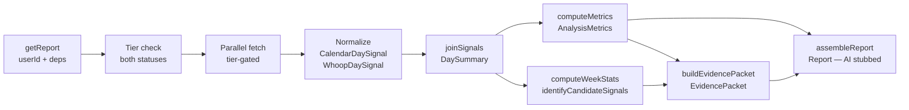

# feat: S7 — deterministic normalization, metrics, and correlations

## Summary

Replace `getReport`'s hardcoded fixture with a real deterministic pipeline: normalize
WHOOP cycles and Calendar events into a common daily timeline, compute activity
allocation and recovery metrics with uncertainty, build the evidence packet the S8
AI layer will consume, and wire the full chain into the existing report route and
page. The AI insight section (`executiveSummary`, `weekHighlights[].summary`,
`findings`) remains empty-stubbed and schema-valid — S8 replaces those values.

---

## Problem Frame

After S5 and S6, both provider integrations connect and raw data flows in-memory per
request. The report still returns the hardcoded fixture — there are no real numbers.
S7 closes that gap: introduce the deterministic layer that turns raw events and cycles
into the `DaySummary[]` spine, compute every metric the report schema requires, and
build the `EvidencePacket` the AI step will receive. This is the last purely
deterministic step before the AI layer.

---

## Requirements

Carrying forward from the origin document (see `docs/plans/2026-06-20-001-feat-build-sequence-plan.md`):

- **R1** — Normalize WHOOP raw data into `WhoopDaySignal[]` per the spike-derived rules (join on `cycle_id`, SCORED-only filter, UTC date extraction, nap exclusion, double-cycle dedup by latest `cycle.start`).
- **R2** — Normalize Calendar events into `CalendarDaySignal[]` (UTC date bucketing, cancelled-event filter, keyword-based category assignment, all-day event handling).
- **R3** — Join normalized signals into `DaySummary[]` using the union of dates from connected sources; `coverageDays` equals the count of joined days (days with at least one source's data — not all 30 calendar days).
- **R4** — Compute `AnalysisMetrics` from `DaySummary[]`, field presence gated by which sources are connected.
- **R5** — Compute `activityRecoveryDeltas` only when both sources are connected; include `n` and `confidence` per defined thresholds.
- **R6** — Compute week stats (best/worst week by average recovery) when WHOOP is connected; `weekHighlights[].summary` is empty-stubbed for S8.
- **R7** — Identify candidate signals and build an `EvidencePacket` for S8 consumption.
- **R8** — `getReport` returns a schema-valid `Report` with real metrics and empty-stubbed AI fields (`executiveSummary: ""`, `findings: []`).
- **R9** — The API route and report page both thread `userId` and capability dependencies into `getReport`; the page's current scaffolded separate fetches are removed (they move inside the service).

---

## Key Technical Decisions

### KTD 1 — "Schedule-fragmentation" maps to existing schema fields

The S7 goal mentions "schedule-fragmentation metrics." Build-plan Decision 1 limits
schema changes to the `activityRecoveryDeltaSchema` amendment only. No new schema
fields are added for fragmentation. Schedule density is expressed via the existing
`totalEvents`, `totalScheduledHours`, and `busiestDay` fields — collectively they
convey how fragmented the schedule is without a dedicated scalar.

### KTD 2 — Thresholds are exported constants in `metrics.ts`

Recovery bands (confirmed):
- `HIGH_RECOVERY_THRESHOLD = 67` — matches WHOOP's green band (≥ 67%)
- `LOW_RECOVERY_THRESHOLD = 33` — matches WHOOP's red band (≤ 33%)

Correlation confidence (confirmed):
- **Insufficient**: n < 5 — sample too small to interpret; excluded from output
- **Strong**: n ≥ 10 AND |Δ| ≥ 5% — enough data, meaningful effect
- **Weak**: everything else

Exporting as named constants lets tests reference them directly without magic numbers.

### KTD 3 — Normalization functions are pure — no fetch logic

`modules/report/normalize.ts` takes already-fetched raw data and returns normalized
signals. Fetch calls remain in the existing `calendarService.fetchEventsForWindow` and
`whoopService.fetchRawDataForWindow` functions. `reportService.getReport` orchestrates
both — it does not inline fetch logic.

### KTD 4 — `getReport` signature expands to take `userId` + deps

Directional guidance (not implementation spec):
```
getReport(userId: string, deps: {
  calendarRepo: CalendarRepository
  calendarClient: CalendarCapability
  whoopRepo: WhoopRepository
  whoopClient: HealthCapability
  logger: Logger
}): Promise<Report>
```

The route and page import concrete instances from `@/infrastructure` and pass them
inward. No DI container.

### KTD 5 — Both call sites updated; page sheds scaffolded fetches

`app/report/page.tsx` currently calls `fetchEventsForWindow` and `fetchRawDataForWindow`
separately (scaffolded in S5–S6), then ignores their return values before calling
`getReport`. S7 moves those fetches inside `getReport`. The page becomes: check
connection status → redirect if needed → `getReport(userId, deps)` → render. The
`try/catch` for `OAuthError` and `IntegrationNotFoundError` stays on the page,
wrapping the `getReport` call instead of the separate fetches.

### KTD 6 — Internal seam types live in `modules/report/`, not `shared/`

`EvidencePacket`, `CandidateSignal`, `WhoopDaySignal`, and `CalendarDaySignal` are
consumed only within `modules/report/`. S8's AI generation function will live in the
same module and import directly from `evidencePacket.ts`. No need to promote these to
`shared/`.

### KTD 7 — `activityRecoveryDeltas` omits insufficient correlations from output

Correlations where n < 5 are dropped from the `activityRecoveryDeltas` array
entirely (not emitted with `confidence: "insufficient"`). The `EvidencePacket`'s
`candidateSignals` field also filters them out. The AI receives only signals it can
reason about; insufficient samples would invite hallucination.

---

## High-Level Technical Design

Data flow for a single `getReport` call:



**Tier gating** (KTD 5, build-plan S7–S9 shared notes): the tier is checked once at
the top of `getReport`, before any fetching. Calendar-only skips the WHOOP fetch and
omits WHOOP-derived fields; WHOOP-only skips the calendar fetch and omits calendar
fields; both enables the full pipeline including cross-source correlations.

---

## Scope Boundaries

### In scope

WHOOP normalization, Calendar normalization, signal joining, metric computation,
evidence packet construction, report service wiring, page and route simplification.

### Deferred to Follow-Up Work

- **S8** — AI insight generation (`executiveSummary`, `findings`, `weekHighlights[].summary`).
- **S9** — Pipeline assembly, staleness detection, auto-regeneration.
- Calendar-based week highlights (busiest/lightest week without WHOOP) — only
  recovery-based week stats ship in S7; `weekHighlights` is empty when WHOOP not connected.
- Keyword→category map tuning — initial map ships; refinement is product iteration.
- `topCategories.percent` rounding policy — implement as floats rounded to one decimal;
  revisit if the UI needs integer percents.

### Outside this product's identity

Causation claims; timezone-aware day boundaries (S7 uses UTC per build-plan Decision 2).

---

## Implementation Units

### U1. Schema amendment — `activityRecoveryDeltaSchema`

**Goal:** Add `n` and `confidence` to the activity-recovery delta schema and update
the fixture to supply those fields.

**Requirements:** R5

**Dependencies:** None

**Files:**
- `shared/schemas/report.ts` — add `n: z.number()` and `confidence: z.enum(["strong", "weak", "insufficient"])` to `activityRecoveryDeltaSchema`
- `frontend/report/fixture.ts` — add `n` and `confidence` to each `activityRecoveryDeltas` entry
- `__tests__/report-schema.test.ts` — add rejection tests for the new required fields

**Approach:** Minimal targeted amendment. Both `n` and `confidence` are required (not
optional) — every computed delta will always have them. The fixture's existing entries
each need both fields added to remain schema-valid. Use plausible fixture values (e.g.,
`n: 14, confidence: "strong"` for Exercise).

**Patterns to follow:** Existing field additions in `shared/schemas/report.ts`.

**Test scenarios:**
- Schema rejects a delta object missing `n`
- Schema rejects a delta object missing `confidence`
- Schema rejects a delta with `confidence` outside the allowed enum values
- Schema accepts a valid delta with all four fields (`activity`, `deltaPercent`, `n`, `confidence`)
- `reportSchema.parse(FIXTURE)` does not throw after amendment (regression guard)

**Verification:** `npm run test` passes. Fixture round-trips through `reportSchema.parse`.

---

### U2. Normalization layer

**Goal:** Pure functions that transform raw provider data into the common signal types
and join them into the `DaySummary[]` spine.

**Requirements:** R1, R2, R3

**Dependencies:** U1

**Files:**
- `modules/report/normalize.ts` — new; exports `normalizeWhoopCycles`, `normalizeCalendarEvents`, `joinSignals`; defines internal `WhoopDaySignal` and `CalendarDaySignal` types
- `__tests__/normalize.test.ts` — new test file

**Approach:**

**WHOOP normalization rules** (from spike findings — treat as authoritative):
- Build lookup maps: cycles by id, sleeps by `cycle_id`, recoveries by `cycle_id`
- Per cycle: skip if `end === null` (in-progress); skip if `score_state !== "SCORED"`;
  skip if matching recovery's `score_state !== "SCORED"`
- Nap exclusion: skip cycles whose matching sleep has `nap === true`; if no sleep
  record exists for a cycle, treat sleep data as absent (`sleepHours: null`) but still
  include the cycle if the cycle and recovery are both SCORED
- UTC date: extract `new Date(cycle.start).toISOString().slice(0, 10)` → `YYYY-MM-DD`
- Double-cycle days (same UTC date): keep the entry with the latest `cycle.start` timestamp
- `sleepHours`: `(total_in_bed_time_milli - total_awake_time_milli) / 3_600_000`
- `strain`: `cycle.score?.strain ?? null`
- `recovery`: `recovery.score?.recovery_score ?? null`

**Calendar normalization:**
- Skip events where `status === "cancelled"`
- All-day events (`start.date` present, `start.dateTime` absent): `date = start.date`,
  `hours = 1` (full day, counted as 1 day unit), `eventCount += 1`
- Timed events: `date = new Date(start.dateTime).toISOString().slice(0, 10)` (UTC);
  `hours = (Date.parse(end.dateTime) - Date.parse(start.dateTime)) / 3_600_000`;
  skip if `hours <= 0`
- Category assignment: lowercase `summary`, test against keyword map in priority order;
  default = `"Personal"` for unmatched titles
- Keyword→category map (initial, case-insensitive match on substring):
  - `Work`: meeting, standup, sync, interview, review, planning, sprint, office, presentation, 1:1, onboarding
  - `Exercise`: gym, workout, run, bike, swim, yoga, hike, pilates, crossfit, training, lift, cycling
  - `Family`: family, kids, school, parent, birthday, wedding
  - `Social`: lunch, coffee, happy hour, dinner, party, drinks, friend
  - `Learning`: course, class, study, read, book club, conference, workshop, lecture
  - `Travel`: flight, travel, trip, hotel, airport, train
  - `Rest`: rest, relax, day off, vacation, holiday, pto, nap
- Accumulate `hours` per `(date, category)` pair; accumulate `eventCount` per date

**Signal joining:**
- Collect union of all unique dates from both signal arrays
- For each date: merge `CalendarDaySignal` fields (`activities`, `eventCount`) and
  `WhoopDaySignal` fields (`recovery`, `sleepHours`, `strain`) into one `DaySummary`
- Days with only calendar data: `recovery`, `sleepHours`, `strain` absent
- Days with only WHOOP data: `activities = {}`, `eventCount = 0` (or omit)
- Sort result by date ascending

**Execution note:** Implement test-first. All three functions are pure with no external
deps — ideal candidates for writing the tests before the implementation.

**Patterns to follow:** Normalization rules from `context/spike/whoop/whoop-spike.ts`
and `context/spike/google-calendar/google-calendar-spike.ts`; `WhoopCycle`, `WhoopSleep`,
`WhoopRecovery` types from `shared/types/whoop.ts`; `RawCalendarEvent` from
`shared/capabilities/calendar.ts`.

**Test scenarios — WHOOP:**
- SCORED cycle with SCORED recovery and non-nap sleep → correct `date`, `recovery`, `sleepHours`, `strain`
- In-progress cycle (`end: null`) → excluded from output
- Unscored cycle (`score_state !== "SCORED"`) → excluded
- SCORED cycle with unscored recovery → cycle included with `recovery: null`
- Nap sleep on a cycle that has no other sleep → cycle included with `sleepHours: null`
- Two SCORED cycles on the same UTC date → keep the one with the later `cycle.start`
- `sleepHours` formula: `(in_bed_milli - awake_milli) / 3_600_000` — verify arithmetic with known values
- Cycle with no `score` object → `strain: null`, cycle still included if recovery passes
- Empty input (`{ cycles: [], sleeps: [], recoveries: [] }`) → returns `[]`

**Test scenarios — Calendar:**
- Cancelled event → excluded from output
- All-day event (`start.date` only) → `date = start.date`, 1 hour allocated, `eventCount = 1`
- Timed event with keyword match → correct category, duration in hours
- Timed event with no keyword match → category `"Personal"`
- Multiple events same day, same category → hours accumulated
- Multiple events same day, different categories → separate entries per category
- Timed event with zero or negative duration (end before start) → excluded
- Empty input → returns `[]`

**Test scenarios — joinSignals:**
- Day with only calendar data → `DaySummary` has `activities`, `recovery` absent
- Day with only WHOOP data → `DaySummary` has `recovery` present, `activities` present (empty or absent)
- Day with both → full `DaySummary` with all fields
- Output sorted ascending by date
- Two calendar signals and one WHOOP signal: result length equals union of unique dates

**Verification:** Unit tests pass. Functions are pure — no infrastructure imports permitted in `normalize.ts`.

---

### U3. Metric computation

**Goal:** Compute the full `AnalysisMetrics` object from `DaySummary[]`, including
calendar-only, WHOOP-only, and cross-source correlation metrics, gated by connected tier.

**Requirements:** R4, R5

**Dependencies:** U1, U2

**Files:**
- `modules/report/metrics.ts` — new; exports `computeMetrics`, `HIGH_RECOVERY_THRESHOLD`, `LOW_RECOVERY_THRESHOLD`
- `__tests__/metrics.test.ts` — new test file

**Approach:**

**Calendar metrics** (only when `"calendar"` in `connectedSources`):
- `totalEvents`: sum of `eventCount` across all days
- `totalScheduledHours`: sum of all `activities` values (float, not rounded)
- `topCategories`: aggregate hours per category across all days; `percent = (hours / totalScheduledHours) * 100`; sort by hours descending; include categories with > 0 hours
- `busiestDay`: date where sum of activity hours is highest; tie-break: earlier date wins

**WHOOP metrics** (only when `"health"` in `connectedSources`):
- Days with recovery data = days where `daySummary.recovery !== undefined && daySummary.recovery !== null`
- `avgRecovery`: mean of recovery values across days with recovery data (round to nearest integer)
- `avgStrain`: mean of strain values across days with non-null strain
- `totalRecoveryCycles`: count of days with non-null recovery
- `highRecoveryDays`: count of days with `recovery >= HIGH_RECOVERY_THRESHOLD` (67)
- `lowRecoveryDays`: count of days with `recovery <= LOW_RECOVERY_THRESHOLD` (33)

**Cross-source metrics** (only when both sources in `connectedSources`):
- For each category observed in any day's `activities`:
  - `daysWithCategory` = days where `activities[category] > 0` AND `recovery !== null`
  - `daysWithoutCategory` = days where `activities[category] === 0 || activities[category] === undefined` AND `recovery !== null`
  - `n = daysWithCategory.length`
  - If `n < 5` → skip (insufficient, not included in output per KTD 7)
  - `avgRecoveryWith` = mean recovery of `daysWithCategory`
  - `avgRecoveryWithout` = mean recovery of `daysWithoutCategory` (if 0 days without → `deltaPercent = 0`)
  - `deltaPercent = ((avgRecoveryWith - avgRecoveryWithout) / avgRecoveryWithout) * 100`
  - Confidence: `n >= 10 AND |deltaPercent| >= 5` → `"strong"`; else → `"weak"`
- Sort by `|deltaPercent|` descending
- `activityRecoveryDeltas` contains only sufficient correlations (n ≥ 5)

**Patterns to follow:** `modules/report/reportAccess.ts` (pure function pattern, typed inputs).

**Test scenarios:**
- Calendar-only: `activityRecoveryDeltas` absent, `avgRecovery` absent
- WHOOP-only: `topCategories` absent, `totalEvents` absent
- Both connected, exercise on 12 days with mean delta +9.2%: `confidence: "strong"`, `n: 12`
- Both connected, travel on 3 days: excluded from `activityRecoveryDeltas` (n < 5)
- `highRecoveryDays`: day at exactly 67 counts as high (boundary inclusive)
- `lowRecoveryDays`: day at exactly 33 counts as low (boundary inclusive)
- `busiestDay` tie: earlier date returned
- `topCategories` includes only categories with hours > 0
- `totalScheduledHours` is 0 when all days have empty activities (calendar connected but no events)
- Empty `DaySummary[]` input: all numeric fields reflect 0 / empty arrays

**Verification:** Unit tests pass with controlled `DaySummary[]` input arrays.
Threshold constants are importable from `metrics.ts`.

---

### U4. Evidence packet

**Goal:** Build the `EvidencePacket` the S8 AI layer will consume: week stats (best/worst week),
candidate signals (notable patterns), and exemplar days.

**Requirements:** R6, R7

**Dependencies:** U2, U3

**Files:**
- `modules/report/evidencePacket.ts` — new; exports `buildEvidencePacket`, `computeWeekStats`, `identifyCandidateSignals`; defines `CandidateSignal`, `EvidencePacket`, `WeekStat` types
- `__tests__/evidencePacket.test.ts` — new test file

**Approach:**

**Week stats** (when `"health"` in `connectedSources`):
- Group `DaySummary[]` by ISO week (Monday–Sunday); compute the week number via pure date arithmetic (no library)
- For each week: compute average recovery across days with non-null recovery in that week
- Minimum threshold: ≥ 3 days of WHOOP data in a week for it to qualify (prevents a single-day spike driving the label)
- Best week = max avg recovery; Worst week = min avg recovery
- `dateRange` label format: `"Jun 2–8"` — derived from the first and last day of the week that appear in the data (not the full Mon–Sun span if data is sparse)
- When WHOOP not connected: return `[]`

**Candidate signals:**
- Source from the `activityRecoveryDeltas` in `AnalysisMetrics`
- Filter: keep only entries with `confidence !== "insufficient"` (already excluded by U3, so all entries qualify)
- Format each as `CandidateSignal`: `description = "<Category> days show +/-<X.X%> recovery (n=<n>, <confidence>)"`
- Take top 5 by `|deltaPercent|` descending (or all if fewer than 5)
- When no correlations available: return `[]`

**Exemplar days** (when `"health"` in `connectedSources`):
- `highest`: `DaySummary` with the maximum `recovery` value; include `date`, `recovery`, `activities`
- `lowest`: `DaySummary` with the minimum `recovery` value; same shape
- When recovery data absent for all days: `null`

**Evidence packet shape:** (directional — not implementation spec)
```
EvidencePacket {
  window: { start, end, days }
  coverageDays: number
  connectedSources: ConnectedSource[]
  metrics: AnalysisMetrics
  exemplarDays: { highest, lowest } | null
  weekStats: WeekStat[]
  candidateSignals: CandidateSignal[]
}
```

**Test scenarios:**
- 30 days spanning 5 ISO weeks, 4+ weeks with ≥ 3 WHOOP days: best and worst week correctly identified
- Week with only 2 WHOOP days: excluded from week stats
- WHOOP not connected: `weekStats: []`, `exemplarDays: null`
- All recovery scores identical: best week === worst week; both labels point to same range
- `candidateSignals` description format: `"Exercise days show +9.2% recovery (n=14, strong)"`
- Top-5 limit: 6 correlations → only top 5 by |Δ| appear
- `exemplarDays.highest` and `.lowest` are different days when at least two recovery scores differ
- Single day with recovery data: `exemplarDays.highest === exemplarDays.lowest`

**Verification:** Unit tests pass. `buildEvidencePacket` output matches the defined `EvidencePacket` type. No infrastructure imports permitted in `evidencePacket.ts`.

---

### U5. Report service wiring

**Goal:** Update `getReport` to run the full deterministic pipeline end-to-end and
return a real `Report` with stubbed AI fields.

**Requirements:** R1–R9

**Dependencies:** U1–U4

**Files:**
- `modules/report/reportService.ts` — rewrite; new signature; orchestrates full pipeline
- `modules/index.ts` — update `getReport` re-export (signature change propagates)
- `__tests__/reportService.test.ts` — rewrite to use stub repos/clients and test real pipeline behavior

**Approach:**

1. **Window**: compute `windowEnd = today (UTC date, YYYY-MM-DD)`, `windowStart = 30 days prior (YYYY-MM-DD)`. The `window.label` is formatted as `"MMM D – MMM D"`.
2. **Connection check**: call `getConnectionStatus` and `getWhoopConnectionStatus` in parallel.
3. **Tier and `connectedSources`**: determine active sources.
4. **Parallel fetch**: both fetches run concurrently when both sources are active.
5. **Normalize**: `normalizeCalendarEvents`, `normalizeWhoopCycles` (empty arrays when source not connected).
6. **Join**: `joinSignals(calSignals, whoopSignals)` → `DaySummary[]`.
7. **Metrics**: `computeMetrics(daySummaries, connectedSources)`.
8. **Evidence packet**: `buildEvidencePacket({ window, coverageDays, connectedSources, metrics, daySummaries })`.
9. **Assemble**:
   - `weekHighlights`: map `evidencePacket.weekStats` → `WeekHighlight[]` with `summary: ""`
   - `executiveSummary: ""`
   - `findings: []`
   - `generatedAt: new Date().toISOString()`
10. **Validate and return**: `reportSchema.parse(assembled)` — throws on schema violation (surfaces programming errors early).

Errors from `fetchEventsForWindow` and `fetchRawDataForWindow` (`OAuthError`,
`IntegrationNotFoundError`) propagate out of `getReport` without being caught — the
page handles redirection. The report service must not import anything from `infrastructure/`.

**Patterns to follow:** Dependency injection pattern from `calendarService.ts`
(`userId`, concrete deps passed as parameters). Existing `getConnectionStatus` and
`getWhoopConnectionStatus` from `@/modules/calendar/calendarService` and
`@/modules/whoop/whoopService`.

**Test scenarios:**
- Both connected with stub data → schema-valid `Report` with real metrics, `executiveSummary: ""`, `findings: []`
- Calendar-only (WHOOP `getIntegration` returns `null`) → no WHOOP metrics, schema-valid, `weekHighlights: []`
- WHOOP-only (no calendar integration) → no calendar metrics, schema-valid
- Empty calendar window (0 events): `daySummaries` contains WHOOP-only days; `coverageDays` reflects count
- `reportSchema.parse` is called on the assembled result (verify schema contract is enforced at service boundary)
- Logger called at least once during execution
- Fetch functions called once each when both connected; only the active fetch called in single-source tiers

**Test approach:** Inject stub `CalendarRepository`, `CalendarCapability`, `WhoopRepository`,
`HealthCapability`, and `Logger` as in `calendarService.test.ts`. Stub repos return
controlled `WhoopRawData` and `RawCalendarEvent[]` so metric assertions are deterministic.
Replace all current tests in `reportService.test.ts` (the old tests assume the fixture
is returned; they no longer apply). The `findings.length > 0` assertion is dropped
(S7 stubs `findings: []`); add a `findings.length === 0` assertion instead.

**Verification:** `npm run test` passes. `getReport` returns a schema-valid report with
all AI fields stubbed; no real infrastructure called.

---

### U6. API route and report page update

**Goal:** Update both `getReport` call sites to pass `userId` and capability dependencies;
simplify the page by removing its scaffolded separate fetches.

**Requirements:** R9

**Dependencies:** U5

**Files:**
- `app/api/report/route.ts` — add infrastructure imports; extract `userId` from session; call `getReport(userId, deps)`
- `app/report/page.tsx` — remove separate `fetchEventsForWindow`/`fetchRawDataForWindow` calls; wrap `getReport(userId, deps)` in the `OAuthError`/`IntegrationNotFoundError` try/catch
- `__tests__/reportRoute-auth.test.ts` — add `@/modules` mock with `getReport: vi.fn().mockResolvedValue(FIXTURE)` so the 200-success path resolves without real infrastructure
- `__tests__/reportPageGate.test.ts` — remove assertions that `mockFetchEventsForWindow`/`mockFetchRawDataForWindow` are called (those calls now live inside `getReport`); update OAuthError redirect test to throw from `mockGetReport` instead of `mockFetchEventsForWindow`

**Approach:**

*API route (`app/api/report/route.ts`):*
- Import `postgresCalendarRepository`, `googleCalendarClient`, `postgresWhoopRepository`, `whoopClient`, `logger` from `@/infrastructure`
- Extract `userId = session.user.id`
- Call `getReport(userId, { calendarRepo: postgresCalendarRepository, calendarClient: googleCalendarClient, whoopRepo: postgresWhoopRepository, whoopClient, logger })`

*Report page (`app/report/page.tsx`):*
- Remove the `try/catch` block that wraps separate `fetchEventsForWindow`/`fetchRawDataForWindow` calls
- Remove those two function calls entirely
- Remove their imports from `@/modules`
- Add a `try/catch` wrapping `getReport(userId, deps)` that redirects to `/onboarding` on `OAuthError` (invalid_grant) or `IntegrationNotFoundError`
- The connection-status checks and redirect logic above `getReport` remain unchanged

*`reportPageGate.test.ts` update:*
- Tests that assert `expect(mockFetchEventsForWindow).toHaveBeenCalled()` → remove those assertions or replace with `expect(mockGetReport).toHaveBeenCalledWith('u1', expect.any(Object))`
- "fetches both when both connected" → rewrite to assert `mockGetReport` called
- OAuthError test → `mockGetReport.mockRejectedValue(new OAuthError('rejected', 'invalid_grant'))` instead of throwing from `mockFetchEventsForWindow`
- `IntegrationNotFoundError` redirect → similar: throw from `mockGetReport`

**Test scenarios:**
- Route: 401 when no session (unchanged)
- Route: 200 with schema-valid body when session valid (`getReport` mocked)
- Page: redirects to `/onboarding` when both sources not connected (unchanged gate logic)
- Page: renders report when at least one source connected (`mockGetReport` resolves)
- Page: `getReport` called with correct `userId`
- Page: redirects to `/onboarding` when `getReport` throws `OAuthError(invalid_grant)`
- Page: redirects to `/onboarding` when `getReport` throws `IntegrationNotFoundError`
- Page: `fetchEventsForWindow` and `fetchRawDataForWindow` are NOT called directly from the page (they live inside `getReport` now)

**Verification:** `npm run test` passes. No call to `getReport` anywhere in the codebase
omits `userId`. Imports of `fetchEventsForWindow`/`fetchRawDataForWindow` removed from
`app/report/page.tsx`.

---

## Open Questions

- **Inclusive window end** — `fetchEventsForWindow` uses `timeMax = now` (ISO string of `Date.now()`), not a clean day boundary. Events started today but not yet ended are included. Carry forward as-is; window boundary precision is a S9 concern.
- **`activityRecoveryDeltas` when calendar-only** — the field is `optional()` in the schema; it should be absent (not `[]`) when WHOOP is not connected. Verify the UI handles `undefined` cleanly during manual testing in S9.
- **`weekHighlights` when WHOOP-only** — return `[]`; confirm the report UI renders gracefully with an empty array (no crash, no placeholder needed).

---

## Risks & Dependencies

- **Four test files rewritten or extended** — `reportService.test.ts`, `reportPageGate.test.ts`, `reportRoute-auth.test.ts`, and `report-schema.test.ts` all change significantly. Missing test coverage in any one of these risks regression at S8. Review test coverage explicitly during PR.
- **`OAuthError` import in `reportService`** — the report service must NOT import `OAuthError` from `infrastructure/` (violates the dependency direction invariant). Errors thrown by the fetch services propagate naturally — the service catches nothing. Verify the `catch` block stays on the page.
- **Percent rounding consistency** — `topCategories.percent` and `avgRecovery` round to one decimal and integer respectively (as defined in U3). If the fixture's existing values don't match the rounding policy after U1, update the fixture in U5 to use computed-style values.
- **`coverageDays` vs `daySummaries.length`** — these must stay equal; the existing `reportService.test.ts` asserts this. The assertion carries forward in the rewritten tests.

---

## Sources & Research

- `docs/plans/2026-06-20-001-feat-build-sequence-plan.md` — S7 goal, normalization rules, data flow chain, EvidencePacket shape, Decision 1 (schema amendment only), Decision 2 (UTC), S7–S9 shared notes
- `context/spike/whoop/whoop-spike.ts` — WHOOP API field names and pagination shape
- `context/spike/google-calendar/google-calendar-spike.ts` — Calendar event structure
- `shared/schemas/report.ts` — locked contract; only `activityRecoveryDeltaSchema` amended
- `shared/types/whoop.ts` — `WhoopCycle`, `WhoopSleep`, `WhoopRecovery` types
- `shared/capabilities/calendar.ts` — `RawCalendarEvent` type
- `app/report/page.tsx` — two-call-site discovery; page structure to simplify
- `__tests__/reportPageGate.test.ts` — tests to update (scaffolded fetch assertions)
