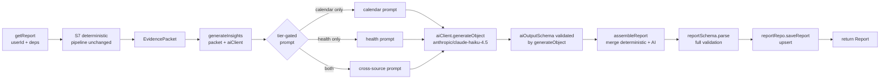

# feat: S8 — AI insight generation + persistence

## Summary

Replace the three AI stubs in `getReport` (`executiveSummary: ""`, `findings: []`,
`weekHighlights[].summary: ""`) with real AI-generated content. Feed the
`EvidencePacket` S7 already builds into a tier-gated prompt using the five
techniques. Validate the AI output against a Zod sub-schema before it touches state
(Invariant #7). Introduce the `reports` table and persist each generated report via
an upsert. After this slice, the report is fully real and stored in the database.

---

## Problem Frame

S7 produces a `Report` with accurate deterministic numbers but empty AI fields.
S8 fills those fields by: wiring the Vercel AI Gateway (`createGateway` from `ai`,
model string `anthropic/claude-haiku-4.5`) behind a new `AICapability` interface; building a tier-gated
system prompt that enforces all five insight techniques; schema-validating the model's
output; merging it with the deterministic fields; and upserting the assembled report to
a new `reports` table. S9 will add the read-through / staleness check on top of this
write path.

---

## Requirements

Carrying forward from `docs/plans/2026-06-20-001-feat-build-sequence-plan.md`:

- **R1** — Vercel AI SDK behind an `AICapability` interface; feature code never imports
  the SDK directly.
- **R2** — Evidence packet (never raw events) is the sole AI input.
- **R3** — AI output is validated against `aiOutputSchema` (Zod) before it reaches state
  (Invariant #7).
- **R4** — Five techniques wired structurally in the system prompt: competing
  hypotheses, skeptical self-critique, falsifiable recommendations, license to find
  nothing, calibrated confidence.
- **R5** — Prompt is tier-gated: cross-source language appears only when both sources
  are connected (direct Technique 4 violation guard from S7–S9 shared notes).
- **R6** — `reports` table introduced; one row per user, upserted on every generation.
- **R7** — `integration_snapshot_at` computed and stored for S9's staleness detection.
- **R8** — AI failure (API error, schema rejection) propagates out of `getReport`
  without persisting a partial report.
- **R9** — `getReport` returns a schema-valid `Report` with all AI fields populated;
  the fixture stubs are gone.

---

## Key Technical Decisions

### KTD 1 — Model: `anthropic/claude-haiku-4.5` via Vercel AI Gateway (user-specified)

The user chose `anthropic/claude-haiku-4.5` using the Vercel AI Gateway model string
format (provider/model with dotted version). The gateway is a first-party feature of
the `ai` package — no separate `@ai-sdk/anthropic` package is needed. The capability
interface is model-agnostic; only `infrastructure/ai.ts` changes if the model does.

### KTD 2 — Vercel AI Gateway (`ai` package, `createGateway`) over direct Anthropic SDK

`architecture-context.md` specifies Vercel AI SDK. The gateway handles routing and
authentication via `AI_GATEWAY_API_KEY`. `generateObject` validates the model's
response against a Zod schema internally, satisfying Invariant #7 without a separate
parse step. Only `ai` is installed — no `@ai-sdk/anthropic`.

### KTD 3 — `AICapability` interface: `generateObject<T>` with a Zod schema

Feature code (`aiInsights.ts`) passes `aiOutputSchema` to the capability. The
infrastructure implementation calls `generateObject` with that schema. Vendor knowledge
stays in `infrastructure/`; schema knowledge stays in `shared/`. The interface uses Zod
because Zod is already an owned dependency.

Directional interface shape (not implementation spec):
```
interface AICapability {
  generateObject<T>(config: {
    system: string
    prompt: string
    schema: z.ZodSchema<T>
  }): Promise<T>
}
```

### KTD 4 — AI failure: throw, no persist

When `generateInsights` throws (API timeout, quota error, schema validation failure),
`getReport` propagates the error without persisting anything. No retry or fallback
in MVP. The page already handles errors from `getReport` with an error boundary; it
will surface the failure to the user. This keeps S8 simple and avoids storing corrupt
partial reports.

### KTD 5 — Tier-gated prompt construction (three variants)

Three system prompt variants: calendar-only, WHOOP-only, both. Cross-source language
(relationship framing, recovery correlations, "how your schedule affects recovery") is
included only in the "both" variant. S8 wires the structural gates; S10 tunes the
wording and calibration.

### KTD 6 — `IntegrationRow.updatedAt` added for `integration_snapshot_at`

S9's staleness detection compares the stored `integration_snapshot_at` with the current
integration `updatedAt` at read time. Computing `integration_snapshot_at` requires
`updatedAt` from the integration rows. The DB schema already has the column; the
`IntegrationRow` type and both DB implementations (`calendarRepository.ts`,
`whoopRepository.ts`) simply omit it today. Add `updatedAt: Date` to `IntegrationRow`
and include it in both `getIntegration` return mappings.

### KTD 7 — S8 generates and persists on every call; no read-through

`getReport` in S8 always calls `generateInsights` and always upserts. There is no
staleness check or read-through yet — that is S9. Observable effect: after S8, every
successful report load writes/overwrites the `reports` row for that user.

---

## High-Level Technical Design

Updated `getReport` data flow after S8 (the deterministic half is unchanged):



**`weekHighlights` merge** — the positional join between `evidencePacket.weekStats`
and `aiOutput.weekHighlightSummaries`:

```
weekHighlights = weekStats.map((w, i) => ({
  ...w,
  summary: aiOutput.weekHighlightSummaries[i] ?? "",
}))
```

`?? ""` guards the length mismatch edge case where the model returns fewer summaries
than `weekStats` entries.

---

## Scope Boundaries

### In scope

AI capability interface and infrastructure; `aiOutputSchema`; tier-gated prompt with
five techniques; `reports` table + migration; `ReportRepository` interface + Drizzle
implementation; `IntegrationRow.updatedAt`; report service wiring (generate + upsert);
call-site dependency threading.

### Deferred to Follow-Up Work

- **S9** — Read-through, staleness detection (`checkReportStatus`), auto-regeneration,
  loading states, connection-tier UI.
- **S10** — AI prompt quality: wording tuning, calibration, "find nothing" behavior,
  response length.
- Retry / fallback on AI API failure.
- Prompt caching (Anthropic prefix caching for the system prompt).

### Outside this product's identity

Causation claims; multi-user AI context.

---

## Implementation Units

### U1. AI dependency setup + `aiOutputSchema`

**Goal:** Install the `ai` package (Vercel AI SDK), add `AI_GATEWAY_API_KEY` to env
validation, and add `aiOutputSchema` to the locked report schema contract.

**Requirements:** R1, R3

**Dependencies:** None

**Files:**
- `package.json` — add `ai`
- `shared/env.ts` — add `AI_GATEWAY_API_KEY: z.string().min(1)` to `serverSchema`
- `shared/schemas/report.ts` — add `aiOutputSchema` alongside `reportSchema`
- `__tests__/report-schema.test.ts` — add `aiOutputSchema` tests
- `__tests__/env-schema.test.ts` — add `AI_GATEWAY_API_KEY` absence rejection test

**Approach:**

`aiOutputSchema` (from build plan — treat as authoritative):
```
aiOutputSchema = z.object({
  executiveSummary: z.string().min(1).max(2000),
  weekHighlightSummaries: z.array(z.string()),
  findings: z.array(findingSchema).min(0).max(5),
})
```

This is a sub-schema; `reportSchema` is not modified. The AI output is validated
against `aiOutputSchema` first, then the assembled report is validated against
`reportSchema`.

**Patterns to follow:** Existing field additions in `shared/schemas/report.ts`; env
additions in `shared/env.ts`.

**Test scenarios:**
- `aiOutputSchema` rejects when `executiveSummary` is `""`
- `aiOutputSchema` rejects when `executiveSummary` exceeds 2000 chars
- `aiOutputSchema` rejects when `findings` has more than 5 entries
- `aiOutputSchema` rejects a finding with invalid `confidence` value
- `aiOutputSchema` accepts `{ executiveSummary: "...", weekHighlightSummaries: [], findings: [] }`
- `aiOutputSchema` accepts output with 1–5 valid findings
- `__tests__/env-schema.test.ts`: env parse throws when `AI_GATEWAY_API_KEY` is absent

**Verification:** `npm run test` passes. `aiOutputSchema` exported from
`shared/schemas/report.ts`.

---

### U2. AI capability interface + infrastructure

**Goal:** Define `AICapability` in `shared/capabilities/ai.ts`. Implement it in
`infrastructure/ai.ts` using the Vercel AI Gateway (`createGateway` from `ai`) with
model `anthropic/claude-haiku-4.5`. Export the singleton from `infrastructure/index.ts`.

**Requirements:** R1, R2, R3

**Dependencies:** U1

**Files:**
- `shared/capabilities/ai.ts` — new; exports `AICapability` interface
- `infrastructure/ai.ts` — new; gateway implementation (createGateway, generateObject)
- `infrastructure/ai.singleton.ts` — new; singleton export (`aiClient`)
- `infrastructure/index.ts` — add `export { aiClient } from './ai.singleton'`

**Approach:**

The capability interface exposes `generateObject<T>` — accepts a system prompt, a user
prompt, and a Zod schema; returns the schema-validated result. The implementation uses
`createGateway` from `ai` (which reads `AI_GATEWAY_API_KEY` from the environment
automatically) and calls `generateObject` from `ai` with the gateway model
`gateway('anthropic/claude-haiku-4.5')`.

Directional implementation shape (not implementation spec):
```
import { createGateway, generateObject } from 'ai'

const gateway = createGateway()

export const aiClient: AICapability = {
  async generateObject({ system, prompt, schema }) {
    const { object } = await generateObject({
      model: gateway('anthropic/claude-haiku-4.5'),
      system,
      prompt,
      schema,
    })
    return object
  }
}
```

Feature code never imports `ai` directly.

**Patterns to follow:** `infrastructure/whoop/whoopClient.ts` (capability implementation
pattern); `infrastructure/whoop/whoopClient.singleton.ts` (singleton pattern);
`infrastructure/index.ts` (export pattern).

**Test scenarios:**
- No unit test for the infrastructure (it calls the real API); the interface is
  exercised via stub in U4's tests.
- `Test expectation: none — infrastructure implementation; covered at integration time`

**Verification:** `aiClient` exported from `@/infrastructure`. TypeScript compiles.
Feature code in `modules/` has no imports from `ai` or `@ai-sdk/anthropic`.

---

### U3. `IntegrationRow.updatedAt` + `ReportRepository`

**Goal:** Expose `updatedAt` on `IntegrationRow` so `reportService.ts` can compute
`integration_snapshot_at`. Introduce the `reports` table and its repository.

**Requirements:** R6, R7

**Dependencies:** None

**Files:**
- `modules/calendar/calendarRepository.ts` — add `updatedAt: Date` to `IntegrationRow`
- `infrastructure/db/calendarRepository.ts` — add `updatedAt: r.updatedAt` in `getIntegration` mapping
- `infrastructure/db/whoopRepository.ts` — same (both use identical manual mapping)
- `modules/report/reportRepository.ts` — new; exports `ReportRepository` interface and `StoredReport` type
- `infrastructure/db/schema.ts` — add `reports` table definition
- `infrastructure/db/migrations/` — Drizzle migration generated via `drizzle-kit generate`
- `infrastructure/db/reportRepository.ts` — new; Drizzle implementation
- `infrastructure/db/reportRepository.singleton.ts` — new; singleton export
- `infrastructure/index.ts` — add `export { postgresReportRepository } from './db/reportRepository.singleton'`

**Approach:**

`reports` table (from build plan — treat as authoritative):
```sql
CREATE TABLE reports (
  id                      uuid PRIMARY KEY DEFAULT gen_random_uuid(),
  user_id                 text NOT NULL REFERENCES users(id),
  data                    jsonb NOT NULL,
  window_start            date NOT NULL,
  window_end              date NOT NULL,
  generated_at            timestamptz NOT NULL,
  integration_snapshot_at timestamptz NOT NULL,
  created_at              timestamptz NOT NULL DEFAULT now()
);
CREATE UNIQUE INDEX reports_user_id_idx ON reports (user_id);
```

`ReportRepository` interface:
```
interface ReportRepository {
  getReport(userId: string): Promise<StoredReport | null>
  saveReport(userId: string, report: Report, integrationSnapshotAt: Date): Promise<void>
}

type StoredReport = {
  report: Report
  integrationSnapshotAt: Date
}
```

`saveReport` upserts using `ON CONFLICT (user_id) DO UPDATE` — one row per user,
last write wins. `data` stores the `Report` as JSONB. `generated_at` = `report.generatedAt`.

Generate the migration with `drizzle-kit generate` after updating `schema.ts`. Do not
hand-write migrations; Drizzle generates them.

**Patterns to follow:** Existing Drizzle table definitions in `infrastructure/db/schema.ts`;
`calendarRepository.ts`/`whoopRepository.ts` (singleton + class pattern).

**Test scenarios:**
- `Test expectation: none for repository unit — Drizzle implementations require real
  DB; verify via manual test in S9 after the full pipeline exists.` Note: the interface
  contract is exercised via stub in U5's updated `reportService.test.ts`.

**Verification:** TypeScript compiles. `IntegrationRow` now includes `updatedAt`.
`reports` table exists in the Supabase DB after migration is applied.
`postgresReportRepository` exported from `@/infrastructure`.

---

### U4. AI insight generation

**Goal:** Implement `generateInsights(packet, aiClient)` in `modules/report/aiInsights.ts`.
Build tier-gated system prompts, call the AI capability, validate the output, and return
the `AIOutput` shape.

**Requirements:** R2, R3, R4, R5

**Dependencies:** U1 (schema), U2 (capability interface)

**Files:**
- `modules/report/aiInsights.ts` — new; exports `generateInsights`
- `__tests__/aiInsights.test.ts` — new

**Approach:**

`generateInsights(packet: EvidencePacket, aiClient: AICapability): Promise<AIOutput>`

where `AIOutput` mirrors `aiOutputSchema`'s shape (a local type, not exported from
`shared/`).

**System prompt construction** (directional, not implementation spec):

Three variants based on `packet.connectedSources`:
- Calendar-only: covers activity allocation, schedule patterns, time-use insights.
  Must NOT reference recovery, health, or cross-source relationships.
- Health-only: covers recovery trends, sleep, strain patterns.
  Must NOT reference schedule, calendar, or cross-source relationships.
- Both: full cross-source analysis enabled; relationship framing ("how your schedule
  affects recovery") is permitted.

All three variants include the five technique instructions:
1. Competing hypotheses — for each finding, one alternative explanation that could
   equally explain the pattern.
2. Skeptical self-critique — downgrade or cut any claim indistinguishable from noise
   given the sample size.
3. Falsifiable recommendations — frame suggestions as experiments with a kill condition.
4. License to find nothing — `findings: []` is a valid, honest output.
5. Calibrated confidence — use `findingSchema`'s `"high" | "medium" | "low"` literally
   and conservatively.

**Domain facts the prompt must encode** (structural constraints, not S10 wording):
- Recovery (0–100%) is a morning readiness score for the calendar day, reflecting the
  *previous* night's HRV, resting heart rate, and sleep — it is measured before that
  day's activities occur. Activity→recovery correlations are therefore associational:
  the causal arrow is ambiguous, and the default competing hypothesis for any
  exercise–recovery finding is "high recovery may enable exercise rather than exercise
  causing high recovery."
- Strain (0–21) is cumulative cardiovascular load for the day. High strain and low
  next-day recovery are correlated in the short term; the prompt must not frame strain
  increases as simply negative without acknowledging this is a training tradeoff.
- Findings must not claim causation — directional language ("associated with",
  "tends to coincide with") is required; causal language ("causes", "leads to",
  "results in") is prohibited. This is a product invariant, not just a calibration
  preference.

The user prompt passes the evidence packet as JSON: `JSON.stringify(packet, null, 2)`.

**`generateInsights` calls `aiClient.generateObject({ system, prompt, schema: aiOutputSchema })`.**

Because `aiClient.generateObject` uses `generateObject` from Vercel AI SDK internally,
the schema validation happens inside the SDK. If the model returns invalid JSON or a
structure that fails `aiOutputSchema`, `generateObject` throws. `generateInsights`
propagates that throw (R8 — no persist on failure).

**Patterns to follow:** Pure function pattern from `modules/report/metrics.ts`;
`AICapability` interface from `shared/capabilities/ai.ts`.

**Test scenarios — tier-gating (stub `aiClient.generateObject`, assert on prompt shape):**
- Calendar-only: the system prompt passed to `aiClient.generateObject` does not contain
  "recovery", "health", "WHOOP", or "cross-source"
- Health-only: the system prompt does not contain "calendar", "schedule", "activity",
  or "cross-source"
- Both-connected: the system prompt contains cross-source framing (e.g. "recovery" AND
  "calendar" or "schedule" in the same prompt)

**Test scenarios — happy path:**
- Stub `aiClient.generateObject` resolves with a valid AI output → `generateInsights`
  returns the parsed output
- `weekHighlightSummaries` with correct length → all entries returned
- `findings: []` accepted → `generateInsights` returns empty findings (license to find
  nothing)
- 5 valid findings returned → all 5 preserved

**Test scenarios — edge cases:**
- `aiClient.generateObject` stub resolves with `weekHighlightSummaries` shorter than
  `weekStats.length` → `generateInsights` still returns without error (the `?? ""`
  fallback is in `reportService`, not here; `generateInsights` returns raw AI output)
- `aiClient.generateObject` stub throws → `generateInsights` propagates the error

**Verification:** `npm run test` passes. `generateInsights` has no imports from `ai`
or `@ai-sdk/anthropic`.

---

### U5. Report service wiring

**Goal:** Update `getReport` to call `generateInsights`, merge AI output with
deterministic fields, validate the assembled report, and upsert it via `reportRepo`.
Remove the three stubs (`executiveSummary: ""`, `findings: []`, `summary: ""`).

**Requirements:** R6, R7, R8, R9

**Dependencies:** U1, U2, U3, U4

**Files:**
- `modules/report/reportService.ts` — add `aiClient: AICapability` and
  `reportRepo: ReportRepository` to `ReportDeps`; call `generateInsights`; compute
  `integration_snapshot_at`; call `reportRepo.saveReport`; remove stubs
- `modules/index.ts` — ensure `getReport` re-export still valid (signature change)
- `__tests__/reportService.test.ts` — update: add stub `aiClient` and `reportRepo`;
  assert AI fields are populated; assert `reportRepo.saveReport` is called

**Approach:**

In `getReport`, after building the `EvidencePacket` (unchanged from S7):

1. **`integration_snapshot_at`** — retrieve the integration rows to extract `updatedAt`:
   ```
   parallel: calendarRepo.getIntegration(userId) [if calendar connected]
             whoopRepo.getIntegration(userId)     [if health connected]
   integrationSnapshotAt = max(updatedAt values) or new Date() if none available
   ```
   Note: `getIntegration` is already called inside `getConnectionStatus`; this adds one
   extra DB call per source. Acceptable for S8; S9 may optimize if latency is a concern.

2. **`generateInsights`** — call with `evidencePacket` and `deps.aiClient`. Propagate
   any throw (R8).

3. **Assemble report** — merge:
   ```
   weekHighlights = evidencePacket.weekStats.map((w, i) => ({
     ...w,
     summary: aiOutput.weekHighlightSummaries[i] ?? "",
   }))
   ```
   Set `executiveSummary: aiOutput.executiveSummary`, `findings: aiOutput.findings`.

4. **Validate** — `reportSchema.parse(assembled)` (unchanged from S7).

5. **Persist** — `reportRepo.saveReport(userId, report, integrationSnapshotAt)`.

6. Return the validated report.

**Patterns to follow:** Existing `getReport` structure in `modules/report/reportService.ts`;
`ReportDeps` extension pattern used in S7.

**Test scenarios:**
- Both connected, stub `aiClient` resolves valid AI output, stub `reportRepo.saveReport`
  is a no-op → returned report has populated `executiveSummary` and `findings`
- `aiClient.generateObject` stub throws → `getReport` propagates the error,
  `reportRepo.saveReport` is NOT called
- `reportRepo.saveReport` called with `userId` and the assembled `Report` object
- `integrationSnapshotAt` passed to `reportRepo.saveReport` is a `Date` instance
- Calendar-only tier: `getReport` calls `generateInsights` (AI fields populated), no
  WHOOP fetch occurs
- `reportSchema.parse` is called on the assembled result (verify schema enforcement)

**Verification:** `npm run test` passes. No `executiveSummary: ""` or
`findings: []` stubs remain in `reportService.ts`. `reportRepo.saveReport` is called
once per successful `getReport` invocation.

---

### U6. Call sites

**Goal:** Thread `aiClient` and `reportRepo` from `infrastructure/index.ts` into
`getReport` at both call sites. Update test mocks accordingly.

**Requirements:** R9

**Dependencies:** U5

**Files:**
- `app/api/report/route.ts` — import `aiClient`, `postgresReportRepository`; add to
  `getReport` deps
- `app/report/page.tsx` — import `aiClient`, `postgresReportRepository`; add to
  `getReport` deps
- `__tests__/reportRoute-auth.test.ts` — add `reportRepo: { saveReport: vi.fn() }` and
  `aiClient: { generateObject: vi.fn().mockResolvedValue(VALID_AI_OUTPUT) }` stubs in
  the `@/modules` mock
- `__tests__/reportPageGate.test.ts` — same stub additions; verify page still redirects
  correctly on `OAuthError` thrown from `mockGetReport`

**Approach:**

Both call sites follow the same pattern as existing infrastructure imports (see S7's
U6). The only change is two additional fields in the deps object passed to `getReport`.

`VALID_AI_OUTPUT` stub constant (for tests):
```
{
  executiveSummary: "Test summary.",
  weekHighlightSummaries: [],
  findings: [],
}
```

**Test scenarios:**
- Route: 200 with schema-valid body when session valid (AI stub resolves)
- Route: 401 when no session (unchanged)
- Page: redirects to `/onboarding` when `getReport` throws `OAuthError` (unchanged
  redirect logic)
- Page: renders report when at least one source connected and AI stub resolves

**Verification:** `npm run test` passes. TypeScript compiles with no errors on
`getReport` call sites. Both call sites pass `aiClient` and `reportRepo`.

---

## Open Questions

- **Prompt token budget** — `claude-haiku-4-5` has a 200K context window; the evidence
  packet is compact (metrics + up to 5 candidate signals + exemplar days). No token
  budget concern for MVP. Revisit in S10 if response quality shows token exhaustion.
- **`generateObject` mode** — Vercel AI SDK's `generateObject` supports `mode: 'json'`
  and `mode: 'tool'`. Use `'json'` for MVP as the simpler path; `'tool'` may produce
  more reliable structured outputs if `'json'` shows schema drift in S10.
- **`integration_snapshot_at` when no integrations** — if no integration rows exist
  (neither source connected), default to `new Date()`. This case shouldn't reach
  `getReport` in practice (the page gate redirects first), but guard defensively.

---

## Risks & Dependencies

- **Synchronous-pipeline latency — measure now, not at S9.** Build-plan Decision 3
  ("Vercel function timeout — deferred, measure when S7 and S8 exist") explicitly
  triggers at S8. This slice puts the blocking LLM call into the request path for the
  first time. The moment S8 lands, run an end-to-end request and measure wall-clock
  time against the Vercel Hobby cap (60 s) and Pro cap (300 s). The optimization plan
  stays S9; the measurement obligation is S8.
- **`generateObject` constraint handling** — `aiOutputSchema` uses `z.string().max(2000)`
  and `z.array().max(5)`. The Anthropic SDK strips constraints it cannot enforce
  natively and validates client-side; whether the Vercel AI SDK does the same is
  unverified. If `generateObject` forwards these constraints and the model violates them,
  every request fails (KTD 4 — throw, no persist). Validate in U2 with a quick test
  against the real API before S8 is declared done.
- **Vercel AI SDK version** — `ai` version determines the `generateObject` API shape.
  Pin a specific version in `package.json` and verify against the Vercel AI SDK docs
  (`https://ai-sdk.dev/llms.txt`). Breaking changes between minor versions of `ai` have
  occurred.
- **Schema validation failures in production** — if `claude-haiku-4-5` reliably
  produces schema-invalid output, `getReport` will throw on every request. Monitor
  the error rate after S8 lands; S10 is the tuning fix path.
- **Two extra `getIntegration` DB calls** — `integrationSnapshotAt` computation adds
  one `getIntegration` call per connected source. These are indexed lookups; impact
  should be negligible. Validate during S9 end-to-end latency measurement.
- **`weekHighlightSummaries` length mismatch** — the model may return fewer summaries
  than `weekStats` entries. Handled in `reportService.ts` with `?? ""` fallback;
  test in U5 verifies the guard.
- **S7 test regressions** — U5 rewrites the `reportService.test.ts` stubs again (the
  third time across S7/S8). Cover old S7 behaviors (tier gating, schema validation) in
  the updated test file so they aren't silently dropped.

---

## Sources & Research

- `docs/plans/2026-06-20-001-feat-build-sequence-plan.md` — S8 goal, `aiOutputSchema`,
  `reports` table DDL, `ReportRepository` interface, `integration_snapshot_at` semantics,
  S7–S9 shared notes (tier gating as safety boundary)
- `docs/plans/2026-06-22-001-feat-s7-deterministic-layer-plan.md` — `EvidencePacket`
  type, `getReport` signature, existing `reportService.ts` structure, `ReportDeps`
- `modules/report/reportService.ts` — current implementation (S7 complete)
- `modules/report/evidencePacket.ts` — `EvidencePacket`, `CandidateSignal` types
- `shared/schemas/report.ts` — `findingSchema` (competing hypotheses structure),
  `reportSchema` (full validation target)
- `infrastructure/db/calendarRepository.ts` / `whoopRepository.ts` — `getIntegration`
  mapping where `updatedAt` must be added
- `context/architecture-context.md` — Vercel AI SDK spec, Invariant #7, capability
  interface pattern
- claude-api skill — model `anthropic/claude-haiku-4.5` via Vercel AI Gateway (user
  override); `generateObject` as the right surface for schema-validated generation
- `https://ai-sdk.dev/providers/ai-sdk-providers/ai-gateway.md` — `createGateway`
  import, model string format, `AI_GATEWAY_API_KEY` env var, `generateObject` usage
