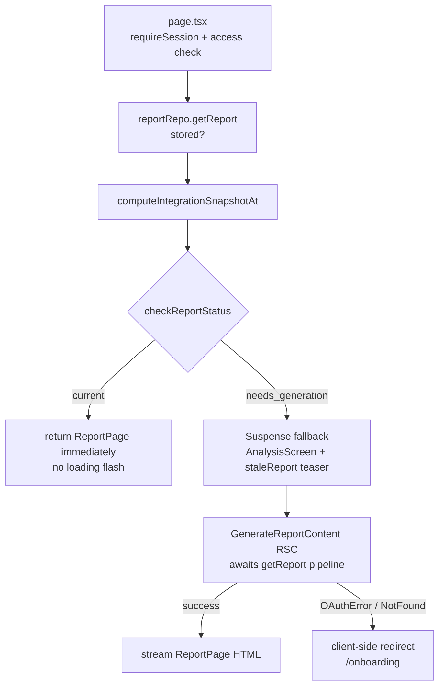
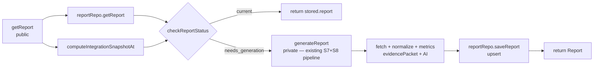

# feat: S9 — Pipeline assembly + automatic generation

## Summary

Wire the read-through cache layer, staleness detection, and loading UI so the product
delivers automatic generation on first visit and automatic regeneration on window drift
or integration change — with no "generate" button anywhere. After this slice the full
automatic product flow works end-to-end: returning users with a current report see it
instantly; users whose report is stale see a loading state while it regenerates.

---

## Problem Frame

S8 always generates on every `getReport` call — by design for S8 (KTD 7), but not the
final product behavior. S9 adds the pieces that make the product automatic:

1. **`checkReportStatus`** — determines whether generation is needed (no report, window
   drift, or integration change).
2. **Read-through `getReport`** — returns the stored report immediately when current;
   runs the pipeline only when `checkReportStatus` says generation is needed.
3. **Selection-change invalidation** — calendar selection changes must bump
   `integration.updatedAt` so staleness detection sees them.
4. **`saveReport` upsert** — enforces one row per user (the current implementation does
   a plain `insert`, growing the table; S9 corrects that).
5. **Streaming loading UI** — fast path shows the report with no loading flash; slow path
   (generation) streams a functional loading state to the browser while the pipeline runs.
6. **Single-source tier display** — the report page shows a "connect your second source"
   banner when only one source is connected, per the product's encourage-don't-force principle.

---

## Requirements

Carrying forward from `docs/plans/2026-06-20-001-feat-build-sequence-plan.md`:

- **R1** — No report exists → generate automatically; user sees loading state.
- **R2** — Window has drifted → regenerate automatically.
- **R3** — Integration changes (new connection or calendar selection change) → regenerate
  automatically.
- **R4** — Report exists and is current → display immediately, no loading state.
- **R5** — `getReport` always returns the latest report for the user; the `reports` table
  grows one row per generation (plain insert, read-latest query).
- **R6** — Loading state shown during generation or regeneration.
- **R7** — Single-source view shows what data exists plus a prompt to connect the second
  service; cross-source relationship framing is hidden until both sources are present.
- **R8** — No "generate" button; generation is entirely automatic.

---

## Key Technical Decisions

### KTD 1 — Streaming RSC pattern: status check in `page.tsx`, Suspense for slow path

The fast status check (2-3 DB reads, ~100ms) happens at the top of the page server
component before any Suspense boundary. Fast path: return `<ReportPage>` immediately —
no loading flash. Slow path (generation needed): `<Suspense
fallback={<AnalysisScreen staleReport={stored?.report ?? null} />}>` wraps a streaming
RSC that runs the full pipeline. React streams the fallback HTML immediately; the final
report HTML streams in when generation completes.

Putting the status check *before* the Suspense boundary is the correct call: it avoids
showing a loading state on the common return-visit path where the report is already current.
If the check lived inside `getReport` only, every page load would flash the loading state
while the DB reads completed.

### KTD 2 — `checkReportStatus` is a pure function; receives `windowEndExpected` as a param

No clock reads inside the function. `windowEndExpected` (UTC today as YYYY-MM-DD) is
computed by the caller. This makes test scenarios trivial — no mocking or `vi.setSystemTime`
needed. Three conditions in order: no stored report → `no_report`; stored window end ≠
`windowEndExpected` → `window_drift`; `currentIntegrationAt > stored.integrationSnapshotAt`
→ `integration_changed`; otherwise → `current`.

### KTD 3 — `computeIntegrationSnapshotAt` reads both repos unconditionally

No connection-status branching — reads both integration rows in parallel, takes the max
`updatedAt` of whichever rows exist, returns `new Date()` if neither is found. Simpler
than threading `calendarStatus`/`whoopStatus` through. Two fast indexed lookups; total
overhead is negligible.

**Change from S8:** S8's inline computation is connection-status gated (only reads
calendar integration if `calendarStatus === 'connected' && hasCalendarSelections`; only
reads WHOOP if `whoopStatus === 'connected'`). S9 drops the branching because
`computeIntegrationSnapshotAt` must be callable from `page.tsx` without connection
status context. Behaviorally benign: the access gate (`resolveReportAccess`) ensures
no report is generated for an inactive source, and the repo calls return `null`
gracefully when the integration row does not exist.

### KTD 4 — Calendar selection change: `touchIntegration(userId)` on `CalendarRepository`

When the user changes which calendars to include, `saveSelections` (DB layer) replaces
`calendar_selection` rows but does not touch `integration.updatedAt`. A separate
`touchIntegration(userId)` method bumps `integration.updatedAt` to now. `updateSelections`
(service layer) calls it after `saveSelections` succeeds. This keeps the storage-level
method focused on its own concern while the semantic invalidation signal lives at the
service layer.

### KTD 5 — `saveReport` stays as plain insert; no migration needed

`PostgresReportRepository.saveReport` keeps its current plain `insert`. `getReport`
reads with `ORDER BY generated_at DESC LIMIT 1`, so it always returns the latest row
regardless of how many exist. This means the table grows one row per generation — bounded
in practice to a few rows per user (regeneration is rare: once per day on window drift,
and on integration changes). Report history is explicitly out of scope, but this schema
naturally preserves it as a future option without any structural change.

Concurrent tab generation (two tabs opening simultaneously on a stale-report day) will
each insert a row. The second insert's row becomes the new "latest." No errors, no data
corruption — both tabs show valid reports. The duplicate AI call is the accepted cost; a
`BroadcastChannel` lock is noted in README as the fix when it matters (see Risks).

### KTD 6 — Frame A (`loading.tsx`) + Frame B (Suspense fallback) split; animation fidelity is S10

`app/report/loading.tsx` (Next.js file convention Suspense boundary) shows the animated
logo while the page's fast checks run (~100ms). `AnalysisScreen` (Suspense fallback for
the slow path) shows "Analyzing your data…" with static step labels and an indeterminate
progress indicator. If a stale report exists, its first finding appears as a teaser card.
The elaborated wireframe Frame B details (animated checklist ticking off with real counts,
accurate %-done bar, "~8s left") are S10 polish.

### KTD 7 — Concurrent regeneration: both tabs insert; second read wins; no recency guard

Two browser tabs opening simultaneously may both read `stored = null`, both call
`generateReport`, and both insert a row. The `ORDER BY generated_at DESC LIMIT 1` query
returns the second-inserted row as the new latest — no errors, no corruption, both tabs
show a valid report. If Tab 2's initial `getReport` call happens to run *after* Tab 1 has
already saved (a common case when requests are not perfectly simultaneous), Tab 2's step 1
reads Tab 1's fresh row, `checkReportStatus` returns `current`, and Tab 2 skips generation
entirely. No N-second recency guard is added — such a guard would incorrectly suppress
legitimate same-day regenerations triggered by calendar selection changes.

---

## High-Level Technical Design

### Fast-path vs. slow-path request flow



### `getReport` read-through split



### Staleness detection logic

```
stored = null                      → needs_generation (reason: no_report)
stored.report.window.end
  ≠ windowEndExpected              → needs_generation (reason: window_drift)
currentIntegrationAt
  > stored.integrationSnapshotAt   → needs_generation (reason: integration_changed)
otherwise                          → current
```

`windowEndExpected` = UTC today as `YYYY-MM-DD` (rolling 30-day window end).

---

## Scope Boundaries

### In scope

Staleness detection and read-through; selection-change invalidation; streaming loading UI
(functional, not animated fidelity); single-source tier display banner;
`computeIntegrationSnapshotAt` helper. No schema or migration changes — `saveReport`
stays as a plain insert.

### Deferred to Follow-Up Work (S10)

- Animated checklist with real data counts and ticking steps (wireframe Frame B detail).
- Progress bar with accurate percentage and time estimate.
- Teaser suppression logic for `integration_changed` regen (stale calendar-only finding
  may be misleading when WHOOP just connected; see Open Questions).
- AI prompt quality tuning (S10's primary goal).
- Prompt caching (Anthropic prefix caching).

### Outside this product's identity

Report history / versioning; multi-user; manual "generate" button.

---

## Implementation Units

### U1. `checkReportStatus` function

**Goal:** Pure function that determines whether generation is needed from the stored report,
the current integration snapshot, and today's expected window end date.

**Requirements:** R1, R2, R3, R4

**Dependencies:** None

**Files:**
- `modules/report/reportStatus.ts` — new; exports `ReportStatus` type and
  `checkReportStatus` function
- `modules/index.ts` — re-export `checkReportStatus` and `ReportStatus`
- `__tests__/reportStatus.test.ts` — new

**Approach:**

`ReportStatus` and `checkReportStatus` directional shape (authoritative, per build plan):

```
type ReportStatus =
  | { status: 'current'; report: Report }
  | { status: 'needs_generation'; reason: 'no_report' | 'window_drift' | 'integration_changed' }

function checkReportStatus(
  stored: StoredReport | null,
  currentIntegrationAt: Date,
  windowEndExpected: string,    // YYYY-MM-DD UTC
): ReportStatus
```

Evaluation order: `no_report` → `window_drift` → `integration_changed` → `current`.

**Test scenarios — `no_report`:**
- `stored = null` → `{ status: 'needs_generation', reason: 'no_report' }`

**Test scenarios — `window_drift`:**
- `stored.report.window.end = '2026-06-21'`, `windowEndExpected = '2026-06-22'` → `window_drift`
- `stored.report.window.end = '2026-06-22'`, `windowEndExpected = '2026-06-22'` → does NOT return `window_drift` (continue to next check)

**Test scenarios — `integration_changed`:**
- `currentIntegrationAt > stored.integrationSnapshotAt` → `integration_changed`
- `currentIntegrationAt === stored.integrationSnapshotAt` → does NOT return `integration_changed`
- `currentIntegrationAt < stored.integrationSnapshotAt` → does NOT return `integration_changed` (clock skew edge case)

**Test scenarios — `current`:**
- Window matches, `currentIntegrationAt <= stored.integrationSnapshotAt` → `{ status: 'current', report: stored.report }`

**Test scenarios — ordering:**
- Window drifted AND integration changed → returns `window_drift` (first check wins)

**Verification:** `npm run test` passes. `checkReportStatus` exported from `@/modules`.

---

### U2. Calendar selection invalidation

**Goal:** Ensure that when the user changes which calendars to include, the integration
`updatedAt` is bumped so S9's staleness detection fires on the next report load.

**Requirements:** R3

**Dependencies:** None

**Files:**
- `modules/calendar/calendarRepository.ts` — add `touchIntegration(userId: string): Promise<void>` to `CalendarRepository` interface
- `infrastructure/db/calendarRepository.ts` — implement: `UPDATE integration SET updatedAt = now() WHERE userId = userId AND provider = 'google_calendar'`
- `modules/calendar/calendarService.ts` — `updateSelections`: call `calendarRepo.touchIntegration(userId)` after `saveSelections` succeeds
- `__tests__/calendarService.test.ts` (or equivalent) — verify `touchIntegration` is called

**Approach:**

`touchIntegration` is a one-line update in the Drizzle implementation. Call it from
`updateSelections` service function after `saveSelections`, using the `userId` already
available in that function. If `saveSelections` throws, `touchIntegration` is not called —
acceptable, because the selections didn't change.

**Patterns to follow:** `markNeedsReconnect` in `infrastructure/db/calendarRepository.ts`
(same update-by-userId pattern).

**Test scenarios:**
- `updateSelections` with valid calendars → `calendarRepo.touchIntegration` called once
- `updateSelections` with invalid calendar IDs → `touchIntegration` NOT called (error throws
  before selections are saved)

**Verification:** TypeScript compiles. `CalendarRepository` interface includes `touchIntegration`.
After calling `updateSelections`, `integration.updatedAt` is more recent than before.

---

### U3. Read-through `getReport`

**Goal:** Restructure `reportService.ts` so `getReport` checks the stored report first and
generates only when needed. Extract `computeIntegrationSnapshotAt` as an exported helper
for `page.tsx` to use in the fast status check.

**Requirements:** R1, R2, R3, R4

**Dependencies:** U1 (`checkReportStatus`)

**Files:**
- `modules/report/reportService.ts` — split into:
  - `computeIntegrationSnapshotAt(userId, repos)` — extracted helper (exported)
  - `generateReport(userId, deps)` — private; existing S8 pipeline logic unchanged except
    it no longer recomputes `integrationSnapshotAt` when the caller passes it in
  - `getReport(userId, deps)` — public; read-through wrapper (reads stored, checks status,
    calls `generateReport` if needed)
- `modules/index.ts` — add `computeIntegrationSnapshotAt` to exports
- `__tests__/reportService.test.ts` — extend: add read-through test scenarios

**Approach:**

`computeIntegrationSnapshotAt` reads both integration rows in parallel (null-safe), takes
the max `updatedAt`, returns `new Date()` if neither exists. Signature:

```
computeIntegrationSnapshotAt(
  userId: string,
  repos: { calendarRepo: CalendarRepository; whoopRepo: WhoopRepository },
): Promise<Date>
```

`getReport` structure:

1. `reportRepo.getReport(userId)` → `stored`
2. `computeIntegrationSnapshotAt(userId, { calendarRepo, whoopRepo })` → `currentIntegrationAt`
3. `windowEndExpected = new Date().toISOString().slice(0, 10)`
4. `status = checkReportStatus(stored, currentIntegrationAt, windowEndExpected)`
5. If `status.status === 'current'` → return `status.report` immediately
6. Else → `generateReport(userId, deps)` → return

`generateReport` is the existing `getReport` body from S8 (fetch → normalize → metrics →
evidence → AI → assemble → validate → persist → return). The `integrationSnapshotAt`
computation stays inside `generateReport` as well (the extra 2 DB reads during a 30s
pipeline are negligible; no optimization needed for S9).

**Ordering invariant (critical):** Inside `generateReport`, `computeIntegrationSnapshotAt`
must be called **after** the parallel fetch — not before, and not reusing the pre-fetch
value that `page.tsx` computed for the status check. `fetchEventsForWindow` and
`fetchRawDataForWindow` both refresh expired access tokens via `updateTokens`, which sets
`integration.updatedAt = now`. If the snapshot is captured before the fetch, the persisted
`integrationSnapshotAt` will lag the actual post-refresh `updatedAt`. On the next load,
`currentIntegrationAt` (the new `updatedAt`) will exceed `stored.integrationSnapshotAt`,
triggering a spurious `integration_changed` regeneration — a full AI call on every load
that crosses a token-expiry boundary. The current S8 code already captures the snapshot
after the fetch (lines 107–119 after the fetch at lines 68–75); `generateReport` must
preserve this ordering.

**Patterns to follow:** Existing `getReport` in `modules/report/reportService.ts`; S7/S8
test structure in `__tests__/reportService.test.ts`.

**Test scenarios — fast path (current):**
- `reportRepo.getReport` returns a stored report whose window matches today and
  `integrationSnapshotAt` matches `currentIntegrationAt` → `getReport` returns
  `stored.report` immediately without calling `generateReport` (verify `aiClient.generateObject`
  is NOT called)

**Test scenarios — generation needed:**
- `stored = null` → `generateReport` is called (verify `aiClient.generateObject` IS called)
- `stored.report.window.end` is yesterday → `generateReport` called (window drift)
- `currentIntegrationAt` is newer than `stored.integrationSnapshotAt` → `generateReport` called

**Test scenarios — concurrent race:**
- First `getReport` call finds `stored = null` and generates
- A second simultaneous call (simulated by returning a fresh stored report from `reportRepo.getReport`
  on the second invocation) → returns cached; `aiClient.generateObject` called only once

**Verification:** `npm run test` passes. `computeIntegrationSnapshotAt` exported from
`@/modules`. Calling `getReport` twice in sequence with same user and no integration
changes → `aiClient.generateObject` called exactly once.

---

### U4. Streaming loading UI

**Goal:** Ship the structural fast-path/slow-path split on the report page: report renders
immediately when current; an "Analysis in progress" screen streams while generation runs.

**Requirements:** R6, R8

**Dependencies:** U1, U4

**Files:**
- `app/report/loading.tsx` — new; Next.js Suspense boundary for the route; Frame A
  (animated logo + dots; pure CSS, no JS)
- `app/report/components/AnalysisScreen.tsx` — new; `'use client'`; Frame B; receives
  `staleReport: Report | null` prop; shows step labels + indeterminate progress + teaser
  card if stale report exists
- `app/report/page.tsx` — restructured; fast status check + streaming Suspense

**Approach:**

**`loading.tsx`** — Server Component; renders the animated logo (CSS keyframe animations
from the wireframe's orbit motif: rotating dashed ring, orbiting dot, pulsing "M" center,
three pulsing dots beneath). Dark background matches the design. No JavaScript needed.
Shows for ~100ms during fast path; is never seen on cache-warm second visits.

**`AnalysisScreen`** — Client Component; receives `staleReport: Report | null` from the
RSC boundary (serializable prop). Shows:
- Smaller animated logo (CSS)
- "Analyzing your [month]…" heading (month label from current date)
- Static step list: "Retrieving your data", "Computing metrics", "Running AI analysis"
  (no animated ticking — that's S10)
- Indeterminate progress bar (CSS animation, no real progress signal)
- If `staleReport?.findings[0]` exists: a teaser card labeled "Previous insight" showing
  the finding's insight text

**`page.tsx`** restructured flow:

```
requireSession
  → access check (redirect to onboarding/calendar-setup if needed)
  → [fast] stored = reportRepo.getReport(userId)
  → [fast] integrationAt = computeIntegrationSnapshotAt(userId, repos)
  → status = checkReportStatus(stored, integrationAt, windowEndExpected)
  → if current:  return <ReportPage report={status.report} />
  → if needs_generation:
      return <Suspense fallback={<AnalysisScreen staleReport={stored?.report ?? null} />}>
               <GenerateReportContent userId={userId} />
             </Suspense>
```

**`GenerateReportContent`** — async RSC defined in `page.tsx`; calls `getReport(userId, deps)`
(the read-through version); has the same try/catch for `OAuthError` and
`IntegrationNotFoundError` with `redirect('/onboarding')` as the current page.

Note: `redirect()` from within a Suspense-streamed RSC is a client-side navigation (headers
already sent), not an HTTP 307. This is expected Next.js behavior and acceptable for the
auth failure path. See Open Questions for manual verification note.

**Patterns to follow:** `app/report/ReportPage.tsx` for component structure; existing CSS
animations in the wireframe (`docs/visual-designs/MySubscriptions Wireframes.dc.html`,
section `05 — LOADING SCREEN`) for the animation keyframe reference.

**Test scenarios:**
- `Test expectation: none for unit tests — UI structural changes; verify manually`
- Manual verification:
  - Fast path (current report): page loads with no visible loading state
  - Slow path (no stored report): `loading.tsx` frame appears briefly, then `AnalysisScreen`
    appears, then report renders
  - Slow path with stale report: `AnalysisScreen` shows the first stale finding as teaser
  - Fast path after first generation: reload shows report immediately

**Verification:** Report page renders without TypeScript errors. `loading.tsx` file exists
at `app/report/loading.tsx`. `AnalysisScreen` receives `staleReport` prop and renders
teaser card when populated.

---

### U5. Single-source tier display

**Goal:** When only one source is connected, show a banner in the report encouraging the
user to connect the second service. Cross-source framing is already absent from the data
(gated in S7/S8); this unit makes the single-source state visible and encourages completion.

**Requirements:** R7

**Dependencies:** None (independent UI unit)

**Files:**
- `app/report/components/ConnectSecondSourceBanner.tsx` — new
- `app/report/ReportPage.tsx` — add banner when `report.connectedSources.length === 1`
- `__tests__/ReportPage.test.tsx` (or equivalent) — add test scenarios

**Approach:**

`ConnectSecondSourceBanner` receives `connectedSources: ConnectedSource[]` and renders a
simple card when exactly one source is connected. Content varies:
- Calendar only: "Add WHOOP to unlock recovery correlations."
- Health only: "Add Google Calendar to unlock schedule correlations."

The banner links to `/onboarding` (the connection flow). Minimal styling — the elaborate
"connect second source" CTA is S10 polish.

Render the banner at the end of `SummarySection` (or below it in `ReportPage`) so the
user sees the report content first, then the prompt.

**Test scenarios:**
- `connectedSources = ['calendar']` → banner renders with "Add WHOOP" copy
- `connectedSources = ['health']` → banner renders with "Add Google Calendar" copy
- `connectedSources = ['calendar', 'health']` → banner NOT rendered
- `connectedSources = []` → banner NOT rendered (page gate already redirects; defensive)

**Verification:** `npm run test` passes. Report page with one connected source shows the
banner. Report page with both sources shows no banner.

---

## Open Questions

1. **Redirect from streaming RSC** — `redirect('/onboarding')` inside `GenerateReportContent`
   becomes a client-side navigation (not a 307) because headers are already flushed with
   the streaming fallback. This is expected Next.js behavior but should be manually verified
   with a test account that has an expired OAuth token, to confirm the user actually navigates
   to onboarding rather than seeing an uncaught error.

2. **Teaser suppression for `integration_changed` regen** — when the regen reason is
   `integration_changed` (e.g., user just connected WHOOP), the stale report is a
   calendar-only report and its top finding won't survive into the new cross-source report.
   Showing it as a teaser may be misleading. Deferred to S10 where teaser copy is tuned.
   For S9, show the teaser whenever a stale report exists, regardless of regen reason.

3. **Synchronous pipeline latency** — Build-plan Decision 3 ("measure when S7 and S8
   exist") is overdue. Before declaring S9 done, run an end-to-end request with real data
   and measure wall-clock time against the Vercel Hobby cap (60 s) and Pro cap (300 s).
   Optimization strategy lives in S10; the measurement obligation is S9.

---

## Risks & Dependencies

- **`redirect()` in streaming RSC** — client-side navigation instead of 307 for auth
  failures; acceptable but must be manually verified (see Open Questions #1).
- **Concurrent tab generation** — two tabs opening simultaneously on a stale-report day
  both run the full AI pipeline independently. Each inserts a row; the second becomes
  the new latest. Cost: one wasted AI call per concurrent open. Accepted for MVP; a
  `BroadcastChannel` lock (noted in README) would eliminate it.
- **`computeIntegrationSnapshotAt` always reads both repos** — adds 2 indexed DB reads
  on every report page load (including fast path where the report is current). At scale
  this matters, but for MVP it's negligible. Profile only if latency data shows it's
  load-bearing.
- **`integrationSnapshotAt` ordering in `generateReport`** — both `fetchEventsForWindow`
  and `fetchRawDataForWindow` call `updateTokens` on token expiry, setting
  `integration.updatedAt = now`. If `computeIntegrationSnapshotAt` inside `generateReport`
  is called before the fetch rather than after, the persisted snapshot will lag the
  post-refresh `updatedAt`, causing a spurious `integration_changed` regeneration on the
  next load. This silently fires a full AI call on any load that crosses a token-expiry
  boundary. **The snapshot computation must remain after the parallel fetch** — as it is
  in the current S8 code and must stay in `generateReport`.
- **`loading.tsx` flash on fast path** — the Next.js file-convention boundary shows
  `loading.tsx` while the page server component runs. The fast check is ~100ms (session
  validation + 3 DB reads). On fast connections + warm caches this may be imperceptible;
  on cold starts it's a brief flash. Acceptable for S9.

---

## Sources & Research

- `docs/plans/2026-06-20-001-feat-build-sequence-plan.md` — S9 goal, `checkReportStatus`
  shape, `ReportStatus` type, `ReportRepository`, concurrent regeneration guard, tier
  gating as safety boundary, staleness trigger table
- `docs/plans/2026-06-22-002-feat-s8-ai-insight-generation-plan.md` — KTD 7 (S8
  always-generate stopgap), `integrationSnapshotAt` semantics, `saveReport` interface
- `docs/visual-designs/MySubscriptions Wireframes.dc.html` — loading screen (05), Frame
  A (animated logo), Frame B (analysis in progress), report screen tier display (06),
  confirmed flows (B: analysis content by connection tier; D: re-analyze shows loading
  screen again)
- `context/project-overview.md` — Report model (generation triggers), connection tiers
  (encourage don't force), single-source view + connect-second prompt
- `modules/report/reportService.ts` — current `getReport` (S8 always-generate); structure
  to split into `generateReport` + read-through `getReport`
- `infrastructure/db/reportRepository.ts` — current plain `insert`; `saveReport` to change
- `infrastructure/db/calendarRepository.ts` — `updateTokens` and `markNeedsReconnect`
  patterns for `touchIntegration`
- `infrastructure/db/schema.ts` — current `reports` table definition with non-unique index
- `app/report/page.tsx` — current call site; to be restructured for streaming
- `app/report/components/AnalysisSection.tsx` — confirmed tier-gating via null-checks (no
  cross-source metrics appear when only one source is connected); display gap is the
  missing connect-second-source banner
